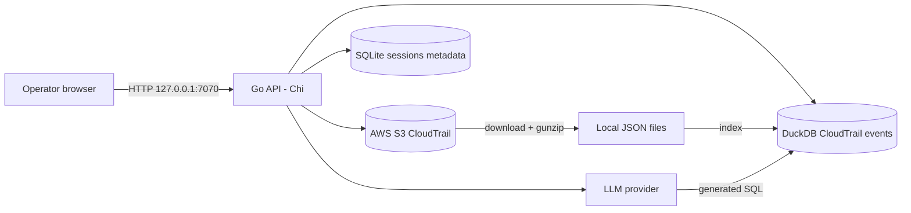

# 01 — Requirements

> **Audience + purpose:** New engineers and open-source contributors who want to understand *what this tool actually does* and *why* — written as requirements reverse-engineered from the shipped code, with a `file:line` citation behind every claim so you can read the implementation yourself.

This document describes the behavior **as built**, not as aspired. Where a requirement is partially met, capped, or only defensive, that is stated plainly. Numbers (test coverage, route lists, dependency versions) come from the frozen [`.ground-truth.md`](.ground-truth.md) and are not re-estimated here.

## Table of contents

- [1. What this system is](#1-what-this-system-is)
- [2. Requirement ID scheme](#2-requirement-id-scheme)
- [3. Functional requirements (FR)](#3-functional-requirements-fr)
  - [3.1 Configuration & startup](#31-configuration--startup)
  - [3.2 AWS credentials & identity](#32-aws-credentials--identity)
  - [3.3 S3 / CloudTrail discovery](#33-s3--cloudtrail-discovery)
  - [3.4 Log download & extraction (sessions)](#34-log-download--extraction-sessions)
  - [3.5 Indexing (DuckDB)](#35-indexing-duckdb)
  - [3.6 Natural-language query (NLQ)](#36-natural-language-query-nlq)
  - [3.7 Investigate, dashboard, findings, lookups, prompts](#37-investigate-dashboard-findings-lookups-prompts)
  - [3.8 LLM summarization](#38-llm-summarization)
  - [3.9 Account-name resolution](#39-account-name-resolution)
  - [3.10 Frontend](#310-frontend)
- [4. Non-functional requirements (NFR)](#4-non-functional-requirements-nfr)
- [5. Security requirements (SEC)](#5-security-requirements-sec)
- [6. Explicit non-goals & known limitations](#6-explicit-non-goals--known-limitations)
- [7. Traceability matrix](#7-traceability-matrix)
- [8. Sibling documents](#8-sibling-documents)

---

## 1. What this system is

CloudTrail Security Insights is a **single-user, local** tool that downloads AWS CloudTrail logs from S3 to local disk, indexes them into DuckDB, and lets the operator query them — either through handcoded security scenarios/dashboards or through natural-language questions translated to DuckDB SQL by a large language model (Bedrock, Anthropic, OpenAI, or a local Ollama). The backend is Go (Chi router) serving an HTTP API; the frontend is a React 19 SPA embedded into the same binary via `go:embed`. App metadata lives in SQLite; CloudTrail event data is queried out of DuckDB.

For the component breakdown behind these requirements, see [04-HIGH-LEVEL-DESIGN.md](04-HIGH-LEVEL-DESIGN.md); for the API contract, see [07-API-FLOW.md](07-API-FLOW.md); for the security posture, see [10-SECURITY.md](10-SECURITY.md).

---

## 2. Requirement ID scheme

- **FR-*** — Functional requirements: observable features the code implements.
- **NFR-*** — Non-functional requirements: performance, reliability, operability, portability constraints the code enforces.
- **SEC-*** — Security requirements: defenses the code actively applies.

Each requirement cites the **implementing** `file:line`. Requirements marked **(defensive only)** are guards that reduce risk but do not by themselves make a behavior safe; requirements marked **(capped/hardcoded)** note a value baked into source rather than configurable.

---

## 3. Functional requirements (FR)

### 3.1 Configuration & startup

**FR-CFG-1 — Three-tier configuration hierarchy.** Configuration is loaded as defaults → `config.json` file → environment variables → validation, in that order. On first run with no `config.json`, a default file is written. — `internal/config/config.go:230-269`

**FR-CFG-2 — Defaults provided for all settings.** Port 7070, host `127.0.0.1`, data dir `./data`, log level `info`, 60s query timeout, 16 download workers, auth method `imds`, Bedrock region `us-east-1`, default model `us.anthropic.claude-sonnet-4-20250514-v1:0` (disabled by default), LLM provider `bedrock`, session spend cap $5.00. — `internal/config/config.go:193-221`

**FR-CFG-3 — Config validation rejects invalid values.** Port must be 1–65535; data dir non-empty; log level ∈ {debug, info, warn, error}; query/monitor/concurrency intervals ≥ 1; S3 mode ∈ {single, control_tower}; auth method ∈ {imds, session_credentials, sso, static}. Invalid config fails startup. — `internal/config/config.go:296-352`

**FR-CFG-4 — Blocking and non-blocking startup checks.** Startup validates (blocking) that the data dir is writable and SQLite is openable, and (non-blocking) reports credential availability and DuckDB CLI presence. Blocking failures exit; non-blocking issues are reported in health status. — `internal/startup/validator.go:58-85`

**FR-CFG-5 — Schema migrations run at startup.** All `migrations/*.sql` files run in alphabetical order, each idempotent (`IF NOT EXISTS`), followed by a defensive column backfill for older databases. — `internal/database/sqlite.go:60-104`, `internal/database/sqlite.go:117-132`

**FR-CFG-6 — Crashed sessions recovered on boot.** Sessions left in `downloading`/`extracting`/`verifying` after a crash are transitioned to `interrupted` at startup. — `internal/features/sessions/queries.go:121-144`, called from `cmd/analyzer/main.go:121-131`

**FR-CFG-7 — Health endpoint.** `GET /api/health` returns status, version, uptime, startup check results, and whether the frontend was embedded. — `cmd/analyzer/main.go:148-157`

**FR-CFG-8 — Graceful shutdown.** On SIGINT/SIGTERM the server cancels active download pipelines (`Service.Shutdown`), then shuts down the HTTP server with a 10s timeout. — `cmd/analyzer/main.go:341-375`

### 3.2 AWS credentials & identity

**FR-AUTH-1 — Four credential methods.** AWS config is built from one of: `session_credentials` (env vars), `imds` (EC2 instance role), `sso` (shared-config profile), or `static` (keys in config). — `internal/features/settings/service.go:49-87`

**FR-AUTH-2 — Apply temporary STS credentials at runtime.** `POST /api/settings/apply-session-credentials` sets `AWS_*` env vars on the running process (not persisted to disk) and notifies auth-change observers. Credentials must be re-applied after restart. — `internal/features/settings/handler.go:357-413`

**FR-AUTH-3 — Validate credentials without saving.** `POST /api/settings/validate-credentials` tests the configured auth method and returns per-source attempt results. — `internal/features/settings/handler.go:339-350`, `internal/features/settings/service.go:480-516`

**FR-AUTH-4 — Caller identity.** `GET /api/settings/caller-identity` calls STS GetCallerIdentity and returns account ID, ARN, and user ID. — `internal/features/settings/handler.go:415-426`

### 3.3 S3 / CloudTrail discovery

**FR-S3-1 — Bucket access validation.** `POST /api/settings/validate-bucket` runs HeadBucket and returns a valid/invalid result. — `internal/features/settings/service.go:93-120`

**FR-S3-2 — Bucket structure detection.** `POST /api/settings/detect-structure` scans the top-level prefixes (up to 20 returned in a single `ListObjectsV2` page, `MaxKeys=20`) to classify the bucket as single-account (`AWSLogs/`) or Control Tower (org ID at root), reducing misclassification when an unrelated prefix sorts first. — `internal/features/settings/service.go:225-320`

**FR-S3-3 — Member account discovery.** Control Tower / single-account member accounts are discovered by listing S3 prefixes, paginated so large orgs are not truncated. — `internal/features/settings/service.go:159-209`

**FR-S3-4 — Region discovery.** `POST /api/settings/discover-regions` lists CloudTrail regions available for an account under `.../CloudTrail/`. — `internal/features/settings/service.go:356-411`

**FR-S3-5 — Log presence verification.** `POST /api/settings/verify-logs` checks whether log files exist for the requested date range (sampling the start date). — `internal/features/settings/service.go:419-473`

**FR-S3-6 — Bedrock model listing.** `POST /api/settings/bedrock-models` merges ListFoundationModels and ListInferenceProfiles (paginated) and detects Cross-Region Inference (CRIS) profiles by `us.`/`eu.`/`ap.` prefix. — `internal/features/settings/service.go:660-800`

### 3.4 Log download & extraction (sessions)

**FR-SESS-1 — Session CRUD.** Sessions can be listed (`GET /api/sessions/`, newest first), created (`POST /api/sessions/`), fetched by UUID (`GET /api/sessions/{id}`), and deleted (`DELETE /api/sessions/{id}`, which also removes local files). — `internal/features/sessions/handler.go:30-33`, `internal/features/sessions/handler.go:38-138`

**FR-SESS-2 — Session creation reads bucket/region/mode from config.** A create request supplies account, org, log region, and date range; bucket/region/mode come from saved settings. New sessions start in state `pending`. — `internal/features/sessions/models.go:40-48`, `internal/features/sessions/service.go:32-99`

**FR-SESS-3 — Date range bounded to 90 days.** `ValidateDateRange` requires start ≤ end and a span ≤ 90 days, format `YYYY-MM-DD`. — `internal/features/settings/service.go:832-853`

**FR-SESS-4 — Asynchronous download pipeline.** `POST /api/sessions/{id}/process` validates the UUID, registers a progress channel, and starts the pipeline in a detached goroutine, returning `202 Accepted` immediately. — `internal/features/processor/handler.go:35-76`

**FR-SESS-5 — Four-phase pipeline.** Processing runs listing → disk estimate → pipelined download+extract → verify, with a session state machine (`pending → downloading → verifying → query-ready` or `partially-verified`; state strings use hyphens — see the `SessionState` constants). — `internal/features/processor/service.go:119-285`, `internal/features/sessions/models.go:8-18`

**FR-SESS-6 — Pipelined, concurrent download+extract with resume.** A worker pool (`MaxDownloadConcurrency`, default 16) downloads each `.json.gz` and immediately gunzips it in the same goroutine; existing `.json` or correctly-sized `.gz` files are skipped (idempotent resume). — `internal/features/processor/service.go:286-373`

**FR-SESS-7 — Delivery-date partitioning honored.** S3 listing iterates day-by-day using CloudTrail's delivery-date partition layout for both standard and Control Tower modes. (Known boundary limitation documented under §6.) — `internal/features/processor/downloader.go:35-92`, `internal/features/processor/downloader.go:219-239`

**FR-SESS-8 — Atomic writes.** Downloads and extractions write to a temp file then atomically rename to the final path. — `internal/features/processor/downloader.go:172-217`, `internal/features/processor/extractor.go:111-152`

**FR-SESS-9 — Disk pre-check.** Required space is estimated at 2.5× S3 size and compared to available space via `statfs` (falling back to 100 GB if `statfs` fails). — `internal/features/processor/service.go:506-538`

**FR-SESS-10 — Verification pass.** After download, each `.json` file found under the session directory is parsed to confirm it is valid JSON; failures are recorded in `sessions.failed_files`. A session with failures ends in `partially-verified`. — `internal/features/processor/verifier.go:17-82`, `internal/features/processor/service.go:575-593`

**FR-SESS-11 — Progress via SSE and REST.** `GET /api/sessions/{id}/progress` streams Server-Sent Events; `GET /api/sessions/{id}/progress/snapshot` returns a polled snapshot with speed/files-per-sec/ETA. Idle sessions return an idle state. — `internal/features/processor/handler.go:100-201`

**FR-SESS-12 — Cancellation.** `POST /api/sessions/{id}/cancel` cancels the active pipeline context and immediately marks the session `interrupted`. — `internal/features/processor/handler.go:78-99`, `internal/features/processor/service.go:433-457`

### 3.5 Indexing (DuckDB)

**FR-IDX-1 — Incremental index build.** `POST /api/nlquery/index` kicks off a background incremental build (30-minute context timeout) and returns `202`. The builder scans files, computes the delta from a SQLite checkpoint, batches by ~100 MB, and runs CREATE/INSERT via the DuckDB CLI. — `internal/features/nlquery/handler.go:239-263`, `internal/features/nlquery/indexer.go:132-287`

**FR-IDX-2 — Micro-batch streaming index.** During S3 sync, extracted file paths are buffered and auto-flushed to DuckDB at a 10 MB threshold so data is queryable within seconds of extraction. — `internal/features/nlquery/indexer.go:523-549`, wired in `cmd/analyzer/main.go:229-232`

**FR-IDX-3 — Write serialization.** Index writes (manual build and micro-batch flush) are serialized through a single mutex (`writeMu`) to reduce the risk of DuckDB file corruption from concurrent writers. — `internal/features/nlquery/indexer.go:67-84`

**FR-IDX-4 — Secondary indexes on hot columns.** After a successful sync, indexes are created on `eventName`, `eventSource`, and `errorCode`. — `cmd/analyzer/main.go:235-248`

**FR-IDX-5 — Index status and progress.** `GET /api/nlquery/index/status` reports indexed/age/size; `GET /api/nlquery/index/progress` streams build progress via SSE; `POST /api/nlquery/index/cancel` cancels. — `internal/features/nlquery/handler.go:61-63`

### 3.6 Natural-language query (NLQ)

**FR-NLQ-1 — Natural language to SQL to results.** `POST /api/nlquery/execute` takes a prompt, generates DuckDB SQL via the configured LLM, executes it against the CloudTrail data, and returns SQL + columns + rows. Query failures are surfaced as fields on a `200` response, not HTTP error codes. — `internal/features/nlquery/handler.go:380-447`, `internal/features/nlquery/service.go:82-116`

**FR-NLQ-2 — Pluggable LLM providers.** Bedrock, Anthropic, OpenAI, and Ollama are supported behind a common `LLMProvider` interface. — `internal/features/nlquery/provider.go:25-28`, `:63-625`

**FR-NLQ-3 — Schema-aware system prompt.** The generated prompt embeds the (escaped) data path, the `unnest(Records)`/`read_json` query pattern, DuckDB syntax rules, and the note that variant fields (e.g. `requestParameters`) are JSON strings, not structs. — `internal/features/nlquery/service.go:415-474`

**FR-NLQ-4 — Indexed query rewrite.** When a DuckDB index exists, an `unnest(...read_json(...))` query is rewritten to read from the prebuilt `events` table, re-applying the configured account scope. — `internal/features/nlquery/service.go:146-185`

**FR-NLQ-5 — Result-set bound.** A free-form generated query is wrapped in an outer `SELECT * FROM (<query>) LIMIT 1000` so a missing inner `LIMIT` does not return unbounded rows (a query whose own `LIMIT` is smaller still wins). — `internal/features/nlquery/service.go:251-265`

**FR-NLQ-6 — User-friendly error classification.** DuckDB stderr is mapped to actionable hints (Binder/Catalog/Syntax/timeout cases) plus raw detail. — `internal/features/nlquery/service.go:391-413`

**FR-NLQ-7 — Lock-conflict retry.** DuckDB lock errors are retried up to 5 times at 400 ms intervals before returning a timeout message. — `internal/features/nlquery/service.go:267-385`

**FR-NLQ-8 — Pre-flight cost estimate.** `POST /api/nlquery/estimate` computes an estimated cost (≈4 chars/token heuristic) with spend-cap awareness, without calling the LLM. — `internal/features/nlquery/handler.go:198-226`, `internal/features/nlquery/cost_estimator.go:49-113`

**FR-NLQ-9 — Session spend tracking.** `GET /api/nlquery/spend` returns the in-process spend snapshot; `DELETE /api/nlquery/spend` resets it. Spend is reset on restart and tracks **estimated** (not billed) cost. — `internal/features/nlquery/handler.go:58-59`, `internal/features/nlquery/session_spend.go:12-81`

### 3.7 Investigate, dashboard, findings, lookups, prompts

**FR-INV-1 — Interactive investigation scenarios.** `GET /api/investigate/scenarios` lists handcoded scenarios (the `scenarios` slice has 40 entries); `POST /api/investigate/run` dispatches a scenario ID + optional parameter + toolbar filters (time window, account scope) to a handcoded SQL builder and executes it. Scenario SQL does **not** go through the LLM. — `internal/features/nlquery/investigate.go:41-170` (handler + scenario list), `:241-411` (`buildSQL`)

**FR-INV-2 — Uniform toolbar filters.** Each scenario embeds the same filtered events expression (time range + account scope matched against both `recipientAccountId` and `userIdentity.accountId`), so toolbar context applies consistently. — `internal/features/nlquery/investigate.go:193-223`

**FR-DASH-1 — Security dashboard.** `GET /api/dashboard` runs 7 hardcoded read-only panels (summary stats, top API calls, identity types, hourly volume, top source IPs, top errors, top services) concurrently. — `internal/features/nlquery/dashboard.go:15-39`

**FR-DASH-2 — Security findings.** `GET /api/dashboard/findings` runs the handcoded finding summary queries concurrently; `GET /api/dashboard/findings/{id}` drills into a finding's detail query. — `internal/features/nlquery/dashboard.go:148-223`, `internal/features/nlquery/findings.go:28-116`

> **Count note:** `BuildFindingQueries` returns a map of **18** handcoded findings (counted directly from the map literal: `root-account-usage`, `cloudtrail-changes`, `unauthorized-api-calls`, `failed-console-logins`, `iam-policy-changes`, `permission-boundary-changes`, `suspicious-cross-account`, `security-group-changes`, `role-assumption-patterns`, `access-key-creation`, `ec2-instance-sensitive-calls`, `lambda-sensitive-operations`, `uba-activity-by-hour`, `uba-high-error-rate`, `uba-human-user-write-ops`, `vpc-changes`, `resource-creation-deletion`, `container-serverless-data-exfil`). The implementing factory is `BuildFindingQueries` at `internal/features/nlquery/findings.go:28-116`.

**FR-LK-1 — Autocomplete lookups.** `GET /api/lookups` returns access keys (≤100), top source IPs (≤50), top identities (≤50), accounts, and roles (≤50), scoped to the selected member-account subset. — `internal/features/nlquery/lookups.go:12-108`

**FR-PR-1 — Prompt templates.** `GET /api/prompts/` lists pre-built security investigation templates grouped by category; `GET /api/prompts/{id}` returns a single rendered template; `GET /api/prompts/system-prompt` returns the system prompt with config placeholders substituted. — `internal/features/prompts/handler.go:28-131`, `internal/features/prompts/templates.go:25-358`

### 3.8 LLM summarization

**FR-SUM-1 — Constrained result summarization.** `POST /api/nlquery/summarize` sends up to 50 result rows to the LLM under a strict system prompt that forbids inventing facts, attributing intent, or using outside knowledge, and returns structured JSON (tldr, findings, entities, suggested pivots) or fallback prose. — `internal/features/nlquery/handler.go:134-186`, `internal/features/nlquery/summarize.go:30-182`

**FR-SUM-2 — Hallucination detection.** The summary is scanned for ARNs, IPv4 addresses, 12-digit account IDs, and access-key prefixes (`AKIA`/`ASIA`) not present in the source rows; suspicious tokens are flagged in the response. (Counts/prose are deliberately allowed.) — `internal/features/nlquery/summarize.go:291-336`

### 3.9 Account-name resolution

**FR-ACC-1 — Resolve account IDs to names.** `GET /api/accounts/resolve?ids=...` returns names for the given account IDs from a cache with read-time precedence: manual override > Organizations > unresolved. — `internal/features/accounts/handler.go:77-98`, `internal/features/accounts/resolver.go:140-159`, `:486-496`

**FR-ACC-2 — Organizations refresh.** `POST /api/accounts/refresh` calls AWS Organizations ListAccounts and upserts names; an unforced refresh is TTL-gated to 24h. — `internal/features/accounts/resolver.go:375-449`

**FR-ACC-3 — Permanent vs transient failure handling.** Permanent errors (AccessDenied, not-in-org) set a sticky-failure flag; transient errors (throttle/timeout/5xx) remain retryable. The flag is cleared when credentials change. — `internal/features/accounts/resolver.go:101-108`, `:223-228`

**FR-ACC-4 — Manual overrides.** `PUT /api/accounts/manual/{id}` sets (or, with empty name, clears) a manual mapping; `DELETE` removes it; `GET /api/accounts/manual` lists overrides. — `internal/features/accounts/handler.go:117-176`, `internal/features/accounts/resolver.go:173-216`

**FR-ACC-5 — Discoverable accounts for the toolbar.** `GET /api/accounts/discoverable` returns the union of synced accounts (from the sessions table) and configured member accounts, each enriched with name and a `has_data` flag. — `internal/features/accounts/resolver.go:267-333`

### 3.10 Frontend

**FR-UI-1 — Single embedded SPA, seven views.** A React 19 SPA (embedded into the binary via `go:embed`) routes to Dashboard, Investigate, S3 Sync, S3 Config, Credentials, LLM Config, and System views. — `web/src/App.tsx:11-50`, `cmd/analyzer/frontend.go:8-9`

**FR-UI-2 — Live progress streaming.** The UI consumes the sync SSE stream (`useSyncProgress`, which closes on `error`/`done` without reconnecting) and the index SSE stream (`useIndexProgress`, which reconnects with capped exponential backoff, 1s→15s, while a build is in progress). — `web/src/features/logviewer/hooks.ts:83-134`, `:241-342`

**FR-UI-3 — Cost transparency in UI.** A debounced cost banner polls `/api/nlquery/estimate`, and a header chip polls `/api/nlquery/spend` every 5s. — `web/src/comm/CostBanner.tsx:41-118`, `web/src/comm/SessionSpendChip.tsx:25-63`

**FR-UI-4 — Result export.** Result tables export to CSV/JSON; CSV export neutralizes spreadsheet formula injection (a leading `=`/`+`/`-`/`@`/TAB/CR string cell is prefixed with `'`). — `web/src/features/query/tableExport.ts:1-84`

---

## 4. Non-functional requirements (NFR)

**NFR-PERF-1 — Concurrent S3 download.** Download concurrency is configurable (`MaxDownloadConcurrency`, default 16) with a tuned HTTP client (large connection pool = concurrency×4, TLS 1.2+, compression disabled). — `internal/features/processor/service.go:404-432`, `internal/config/config.go:201`

**NFR-PERF-2 — Parallel read-only panels.** Dashboard (7) and findings queries run concurrently via `WaitGroup`; an individual panel failure returns partial data rather than failing the whole request. — `internal/features/nlquery/dashboard.go:15-39`, `:148-186`

**NFR-PERF-3 — Index-accelerated queries.** When available, the DuckDB index replaces JSON re-parsing for free-form queries. (capped/hardcoded: `maxObjectSize` = 256 MB per file.) — `internal/features/nlquery/service.go:146-185`, `internal/features/nlquery/indexer.go`

**NFR-REL-1 — Idempotent, resumable sync.** Resume is idempotent at three levels (skip existing `.json`, skip correctly-sized `.gz`, skip already-extracted). — `internal/features/processor/service.go:286-373`

**NFR-REL-2 — Crash recovery.** In-flight sessions are reset to `interrupted` on boot (FR-CFG-6). — `internal/features/sessions/queries.go:121-144`

**NFR-REL-3 — Panic isolation.** A recovery middleware turns handler panics into `500` JSON responses with logged stack traces, so a single panicking handler does not take down the process. — `internal/middleware/logging.go:122-150`

**NFR-REL-4 — Conservative server timeouts.** ReadHeaderTimeout 10s, ReadTimeout 30s, IdleTimeout 120s; WriteTimeout is 0 (disabled) because SSE streams can run for ~a minute and manage their own deadlines. — `cmd/analyzer/main.go:326-338`

**NFR-OPS-1 — Structured JSON logging.** Each request is logged via `slog` as JSON (method, path, status, duration, component) at the configured level. — `internal/middleware/logging.go:57-73`, `cmd/analyzer/main.go:73-76`

**NFR-OPS-2 — Single-binary deployment.** `make build` produces one binary with the frontend embedded; `deploy.sh` provisions a systemd service on Amazon Linux 2023. — `Makefile:1-109`, `deploy.sh:1-478` (systemd unit written at `deploy.sh:380-422`)

**NFR-OPS-3 — Reproducible toolchain pins.** The Go toolchain (`go 1.26` / `toolchain go1.26.4`) and DuckDB v1.2.2 are pinned; both download paths verify the DuckDB archive's SHA-256 before use, via different mechanisms — `deploy.sh` compares against a hardcoded checksum map, while the in-app Go auto-installer fetches the `.sha256` digest published next to the release. — `go.mod:1-52`, `deploy.sh:29-32`, `:197-200`, `internal/startup/validator.go:472-495`

**NFR-PORT-1 — Cross-platform builds.** `make build-all` builds linux/arm64 and linux/amd64; the DuckDB auto-installer handles both architectures. — `Makefile`, `internal/startup/validator.go:359-451`

**NFR-COST-1 — Cost estimate accuracy is approximate.** Token counting uses a 4-chars/token heuristic (no real tokenizer) and spend tracking is estimate-based, not billed. This is a stated tolerance, not a precise guarantee. — `internal/features/nlquery/cost_estimator.go:100`, `internal/features/nlquery/session_spend.go:12-81`

**NFR-DATA-1 — Two-store separation.** SQLite is the source of truth for sessions/metadata (WAL mode, foreign keys on); DuckDB is query-only for events. — `internal/database/sqlite.go:22-56`

**NFR-TEST-1 — Test coverage is partial (stated honestly).** Per [`.ground-truth.md`](.ground-truth.md): middleware 81.8%, database 70.0%, startup 44.0%, nlquery 31.8%, accounts 31.5%, render 22.7%; and **0%** for `cmd/analyzer`, `config`, `processor`, `prompts`, `sessions`, `settings`, and the entire frontend (0 test files). Treat the download pipeline, configuration loader, and UI as effectively untested. — `.ground-truth.md`

---

## 5. Security requirements (SEC)

> **Scope note:** This section documents the security *defenses the code applies*. It does **not** claim the system is "secure" or "compliant." The live review under `reports/2026-06-24-comprehensive/` records 2 Critical findings (a `read_json` arbitrary-file-read residual risk and a `CreateSession`/`os.RemoveAll` directory-delete concern). See [10-SECURITY.md](10-SECURITY.md) for the full posture.

**SEC-NET-1 — Loopback-only bind by default.** The server binds `127.0.0.1` by default so it is not reachable from the LAN unless the operator changes `Host`. — `internal/config/config.go:24-27`, `:196`

**SEC-NET-2 — DNS-rebinding defense (trusted-host allowlist).** A trusted-host middleware runs first in the chain and rejects (403) any request whose `Host` header is not loopback or in the configured allowlist; an empty `Host` is rejected; a `*` entry disables the check. — `internal/middleware/trustedhost.go:21-39`, `internal/config/config.go:58-96`, ordering at `cmd/analyzer/main.go:139-145`

**SEC-NET-3 — Defensive HTTP headers.** Responses set `X-Content-Type-Options: nosniff`, `X-Frame-Options: DENY`, and `Referrer-Policy: no-referrer`. (CSP is intentionally omitted because the React bundle uses inline styles — documented gap.) — `internal/middleware/logging.go:104-117`

**SEC-NET-4 — Development-scoped CORS.** CORS allows only `localhost:5173` (Vite dev) and `localhost:7070` (the app). — `internal/middleware/logging.go:77-102`

**SEC-IN-1 — Strict JSON decoding.** POST/PUT bodies are limited to 1 MiB, must be `application/json`, reject unknown fields, and reject trailing tokens. — `internal/render/decode.go:14-57`

**SEC-IN-2 — Prompt size bound.** Free-form NLQ prompts are capped at 8000 chars (≈2000 tokens) after the concurrency/spend gates and before the paid model call. — `internal/features/nlquery/handler.go:67-75`, `:380-447`

**SEC-IN-3 — UUID validation on path params.** Session IDs are validated against a canonical UUID regex before any DB or filesystem use. — `internal/render/decode.go:18-25`

**SEC-IN-4 — Path-segment safety validation.** Path-bearing config fields (bucket, account ID, org ID, log region, member accounts) are validated against `/`, `\`, `..`, leading `.`, null bytes, and control chars before being interpolated into filesystem/S3 paths. — `internal/features/settings/handler.go:600-616`, used in `UpdateSettings` at `:137-282`

**SEC-SQL-1 — Read-only SQL allowlist (defense in depth).** `ValidateReadSQL` strips comments and string literals, rejects multi-statement queries, requires the first keyword to be `SELECT`/`WITH`, and rejects a denylist of file-reading/DDL/DML tokens (`read_csv`, `read_parquet`, `read_blob`, `attach`, `install`, `create`, `drop`, `insert`, etc.). `read_json` is intentionally **not** banned (documented residual risk). — `internal/features/nlquery/safesql.go:33-112`

**SEC-SQL-2 — SQL literal escaping for interpolated config.** Config-derived values interpolated into a `read_json('...')` literal or `IN (...)` list are passed through `escapeSQLLiteral`/`quoteSQLLiteral` (doubling single quotes) at the dashboard/investigate/lookups/findings/indexer/service call sites. — `internal/features/nlquery/safesql.go:162-182`.

**SEC-SQL-3 — Account ID shape validation.** Account IDs used in scope predicates are validated as 12 digits (`isValidAccountID`) before quoting. — `internal/features/nlquery/lookups.go:119-135`

**SEC-FS-1 — Path-traversal (zip-slip) guard on downloads.** Both the download-only and pipelined download+extract paths route writes through a single chokepoint (`downloadSingleFile`) that rejects keys with a leading `/` or any `..` segment before writing under `{dataDir}/s3/{bucket}`. — `internal/features/processor/downloader.go:172-217`, `:250-261`

**SEC-FS-2 — Decompression-bomb guard.** Gzip extraction uses `io.LimitReader` to cap each file at 256 MB and the whole run at 4 GB. — `internal/features/processor/extractor.go:16-29`, `:111-152`

**SEC-CRED-1 — Session credentials kept in process env, not written to `config.json`.** Session (STS) credentials are applied to process environment variables only; on startup, any stale STS tokens found in a legacy `config.json` are scrubbed and the file rewritten. (Note: `static` long-lived keys, by contrast, are stored in `config.json` by design — see FR-AUTH-1.) — `internal/features/settings/handler.go:357-413`, `cmd/analyzer/main.go:40-58`

**SEC-CRED-2 — Credential scrubbing for subprocesses.** Before invoking the DuckDB/Ollama subprocesses, all `AWS_*` credential env vars are stripped (region preserved). — `internal/features/nlquery/subprocess.go:32-57`

**SEC-CRED-3 — Secret redaction in responses.** `GET /api/settings/` redacts the secret access key (`********`); query error strings are redacted to remove config-derived values (bucket, account IDs) before returning to the client. — `internal/features/settings/handler.go:71-125`, `internal/features/nlquery/handler.go:442`

**SEC-RATE-1 — Single-flight LLM gate.** Only one LLM call may run at a time across the process; concurrent attempts get `429`. — `internal/features/nlquery/handler.go:84-96`

**SEC-RATE-2 — Session spend cap.** Paid providers are blocked with `429` once estimated session spend reaches the configured cap (default $5.00); Ollama is exempt. — `internal/features/nlquery/handler.go:102-127`, `internal/config/config.go:172-177`

**SEC-SUP-1 — Verified, opt-in binary auto-install.** Auto-download of DuckDB (and the Ollama installer) is gated behind `AllowAutoInstall` (default false); when enabled, downloads verify SHA-256 before extracting/executing, and the Ollama installer is written to a temp file rather than piped into a shell. — `internal/config/config.go:36-42`, `internal/startup/validator.go:222-279`, `:407-410`, `:472-495`, `internal/features/nlquery/provider.go:354-625`

**SEC-FILE-1 — Restrictive file permissions.** `config.json` is written `0600`; data/config directories are created `0700`. — `internal/config/config.go:283-289`, `internal/startup/validator.go:89-127`

> **SEC residual / not-implemented (stated honestly):** There is **no authentication or authorization** on the API surface — all endpoints are open to any client that passes the trusted-host check (`internal/features/sessions/handler.go` and peers register no auth middleware). This is by design for a loopback single-user tool, but it is a hard boundary: do not expose the port to a network without an authenticating reverse proxy. See §6 and [10-SECURITY.md](10-SECURITY.md).

---

## 6. Explicit non-goals & known limitations

These are deliberately **not** requirements; the code does not implement them, and the docs should not imply otherwise.

- **No API authentication/authorization.** The trusted-host check is the only gate; there is no user auth. (`cmd/analyzer/main.go:137-145` registers no auth middleware.)
- **No multi-user / multi-tenant support.** Spend tracking is per-process in memory and resets on restart. — `internal/features/nlquery/session_spend.go:12-81`
- **CloudTrail delivery-date boundary gap.** Events near UTC midnight may be delivered into the next S3 day partition, so a tight sync window can miss boundary events. — `internal/features/processor/downloader.go:22-34`
- **Off-hours finding is hardcoded UTC.** The off-hours UBA finding uses UTC 00:00–06:59 with no per-timezone config. — fact base for `internal/features/nlquery/findings.go` (offHoursStartUTC/EndUTC constants)
- **Index schema is fixed.** New top-level CloudTrail fields not in `recordsSchema` are dropped at index time and require a manual schema update. — fact base for `internal/features/nlquery/indexer.go`
- **`read_json` is allowlisted.** A hallucinated non-data path in a generated `read_json` call could read a local JSON file; mitigated only by DuckDB `-readonly`. — `internal/features/nlquery/safesql.go:28-32`
- **Cost figures are estimates, not bills.** See NFR-COST-1.
- **Large parts of the codebase are untested.** See NFR-TEST-1.

---

## 7. Traceability matrix

| Requirement | Implementing file:line |
|---|---|
| FR-CFG-1 | internal/config/config.go:230-269 |
| FR-CFG-2 | internal/config/config.go:193-221 |
| FR-CFG-3 | internal/config/config.go:296-352 |
| FR-CFG-4 | internal/startup/validator.go:58-85 |
| FR-CFG-5 | internal/database/sqlite.go:60-104, :117-132 |
| FR-CFG-6 | internal/features/sessions/queries.go:121-144; cmd/analyzer/main.go:121-131 |
| FR-CFG-7 | cmd/analyzer/main.go:148-157 |
| FR-CFG-8 | cmd/analyzer/main.go:341-375 |
| FR-AUTH-1 | internal/features/settings/service.go:49-87 |
| FR-AUTH-2 | internal/features/settings/handler.go:357-413 |
| FR-AUTH-3 | internal/features/settings/handler.go:339-350; service.go:480-516 |
| FR-AUTH-4 | internal/features/settings/handler.go:415-426 |
| FR-S3-1 | internal/features/settings/service.go:93-120 |
| FR-S3-2 | internal/features/settings/service.go:225-320 |
| FR-S3-3 | internal/features/settings/service.go:159-209 |
| FR-S3-4 | internal/features/settings/service.go:356-411 |
| FR-S3-5 | internal/features/settings/service.go:419-473 |
| FR-S3-6 | internal/features/settings/service.go:660-800 |
| FR-SESS-1 | internal/features/sessions/handler.go:30-33, :38-138 |
| FR-SESS-2 | internal/features/sessions/models.go:40-48; service.go:32-99 |
| FR-SESS-3 | internal/features/settings/service.go:832-853 |
| FR-SESS-4 | internal/features/processor/handler.go:35-76 |
| FR-SESS-5 | internal/features/processor/service.go:119-285 |
| FR-SESS-6 | internal/features/processor/service.go:286-373 |
| FR-SESS-7 | internal/features/processor/downloader.go:35-92, :219-239 |
| FR-SESS-8 | internal/features/processor/downloader.go:172-217; extractor.go:111-152 |
| FR-SESS-9 | internal/features/processor/service.go:506-538 |
| FR-SESS-10 | internal/features/processor/verifier.go:17-82; service.go:575-593 |
| FR-SESS-11 | internal/features/processor/handler.go:100-201 |
| FR-SESS-12 | internal/features/processor/handler.go:78-99; service.go:433-457 |
| FR-IDX-1 | internal/features/nlquery/handler.go:239-263; indexer.go:132-287 |
| FR-IDX-2 | internal/features/nlquery/indexer.go:523-549; cmd/analyzer/main.go:229-232 |
| FR-IDX-3 | internal/features/nlquery/indexer.go:67-84 |
| FR-IDX-4 | cmd/analyzer/main.go:235-248 |
| FR-IDX-5 | internal/features/nlquery/handler.go:61-63 |
| FR-NLQ-1 | internal/features/nlquery/handler.go:380-447; service.go:82-116 |
| FR-NLQ-2 | internal/features/nlquery/provider.go:25-28, :63-625 |
| FR-NLQ-3 | internal/features/nlquery/service.go:415-474 |
| FR-NLQ-4 | internal/features/nlquery/service.go:146-185 |
| FR-NLQ-5 | internal/features/nlquery/service.go:251-265 |
| FR-NLQ-6 | internal/features/nlquery/service.go:391-413 |
| FR-NLQ-7 | internal/features/nlquery/service.go:267-385 |
| FR-NLQ-8 | internal/features/nlquery/handler.go:198-226; cost_estimator.go:49-113 |
| FR-NLQ-9 | internal/features/nlquery/handler.go:58-59; session_spend.go:12-81 |
| FR-INV-1 | internal/features/nlquery/investigate.go:41-170, :241-411 |
| FR-INV-2 | internal/features/nlquery/investigate.go:193-223 |
| FR-DASH-1 | internal/features/nlquery/dashboard.go:15-39 |
| FR-DASH-2 | internal/features/nlquery/dashboard.go:148-223; findings.go:28-116 |
| FR-LK-1 | internal/features/nlquery/lookups.go:12-108 |
| FR-PR-1 | internal/features/prompts/handler.go:28-131; templates.go:25-358 |
| FR-SUM-1 | internal/features/nlquery/handler.go:134-186; summarize.go:30-182 |
| FR-SUM-2 | internal/features/nlquery/summarize.go:291-336 |
| FR-ACC-1 | internal/features/accounts/handler.go:77-98; resolver.go:140-159, :486-496 |
| FR-ACC-2 | internal/features/accounts/resolver.go:375-449 |
| FR-ACC-3 | internal/features/accounts/resolver.go:101-108, :223-228 |
| FR-ACC-4 | internal/features/accounts/handler.go:117-176; resolver.go:173-216 |
| FR-ACC-5 | internal/features/accounts/resolver.go:267-333 |
| FR-UI-1 | web/src/App.tsx:11-50; cmd/analyzer/frontend.go:8-9 |
| FR-UI-2 | web/src/features/logviewer/hooks.ts:83-134, :241-342 |
| FR-UI-3 | web/src/comm/CostBanner.tsx:41-118; SessionSpendChip.tsx:25-63 |
| FR-UI-4 | web/src/features/query/tableExport.ts:1-84 |
| NFR-PERF-1 | internal/features/processor/service.go:404-432; config.go:201 |
| NFR-PERF-2 | internal/features/nlquery/dashboard.go:15-39, :148-186 |
| NFR-PERF-3 | internal/features/nlquery/service.go:146-185 |
| NFR-REL-1 | internal/features/processor/service.go:286-373 |
| NFR-REL-2 | internal/features/sessions/queries.go:121-144 |
| NFR-REL-3 | internal/middleware/logging.go:122-150 |
| NFR-REL-4 | cmd/analyzer/main.go:326-338 |
| NFR-OPS-1 | internal/middleware/logging.go:57-73; cmd/analyzer/main.go:73-76 |
| NFR-OPS-2 | Makefile:1-109; deploy.sh:1-478 |
| NFR-OPS-3 | go.mod:1-52; deploy.sh:29-32, :197-200; internal/startup/validator.go:472-495 |
| NFR-PORT-1 | Makefile; internal/startup/validator.go:359-451 |
| NFR-COST-1 | internal/features/nlquery/cost_estimator.go:100; session_spend.go:12-81 |
| NFR-DATA-1 | internal/database/sqlite.go:22-56 |
| NFR-TEST-1 | .ground-truth.md |
| SEC-NET-1 | internal/config/config.go:24-27, :196 |
| SEC-NET-2 | internal/middleware/trustedhost.go:21-39; config.go:58-96; main.go:139-145 |
| SEC-NET-3 | internal/middleware/logging.go:104-117 |
| SEC-NET-4 | internal/middleware/logging.go:77-102 |
| SEC-IN-1 | internal/render/decode.go:14-57 |
| SEC-IN-2 | internal/features/nlquery/handler.go:67-75, :380-447 |
| SEC-IN-3 | internal/render/decode.go:18-25 |
| SEC-IN-4 | internal/features/settings/handler.go:600-616, :137-282 |
| SEC-SQL-1 | internal/features/nlquery/safesql.go:33-112 |
| SEC-SQL-2 | internal/features/nlquery/safesql.go:162-182 |
| SEC-SQL-3 | internal/features/nlquery/lookups.go:119-135 |
| SEC-FS-1 | internal/features/processor/downloader.go:172-217, :250-261 |
| SEC-FS-2 | internal/features/processor/extractor.go:16-29, :111-152 |
| SEC-CRED-1 | internal/features/settings/handler.go:357-413; cmd/analyzer/main.go:40-58 |
| SEC-CRED-2 | internal/features/nlquery/subprocess.go:32-57 |
| SEC-CRED-3 | internal/features/settings/handler.go:71-125; nlquery/handler.go:442 |
| SEC-RATE-1 | internal/features/nlquery/handler.go:84-96 |
| SEC-RATE-2 | internal/features/nlquery/handler.go:102-127; config.go:172-177 |
| SEC-SUP-1 | internal/config/config.go:36-42; startup/validator.go:222-279, :407-410, :472-495; nlquery/provider.go:354-625 |
| SEC-FILE-1 | internal/config/config.go:283-289; startup/validator.go:89-127 |

---

## 8. Sibling documents

- [02-USER-STORIES.md](02-USER-STORIES.md) — the user stories these requirements satisfy
- [04-HIGH-LEVEL-DESIGN.md](04-HIGH-LEVEL-DESIGN.md) — component & module design behind these requirements
- [05-LOW-LEVEL-DESIGN.md](05-LOW-LEVEL-DESIGN.md) — implementation-level design detail
- [07-API-FLOW.md](07-API-FLOW.md) — the HTTP contract for the FR-* endpoints
- [10-SECURITY.md](10-SECURITY.md) — full security posture and the live review findings referenced in §5
