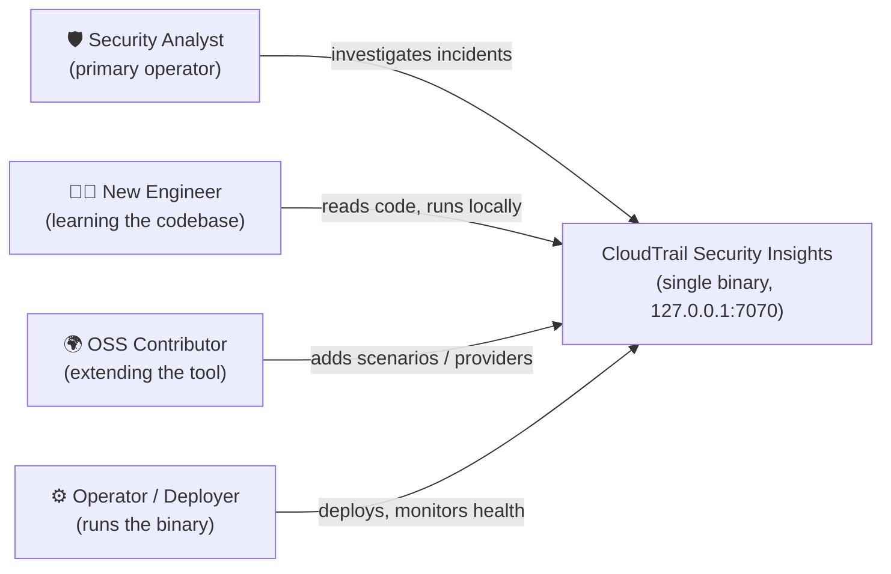
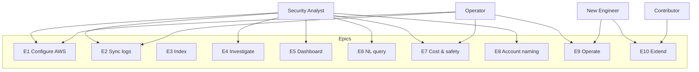
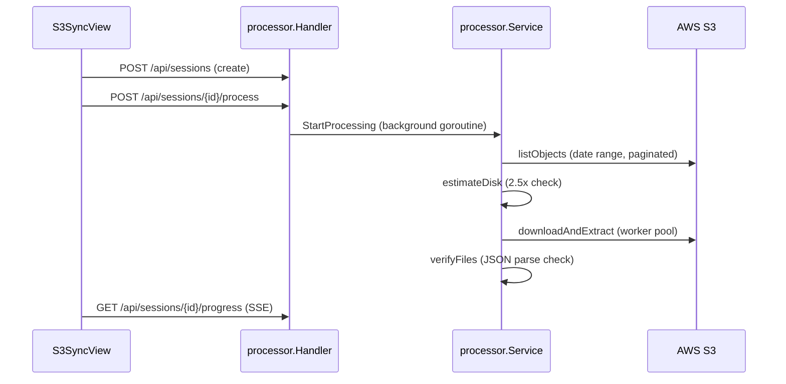
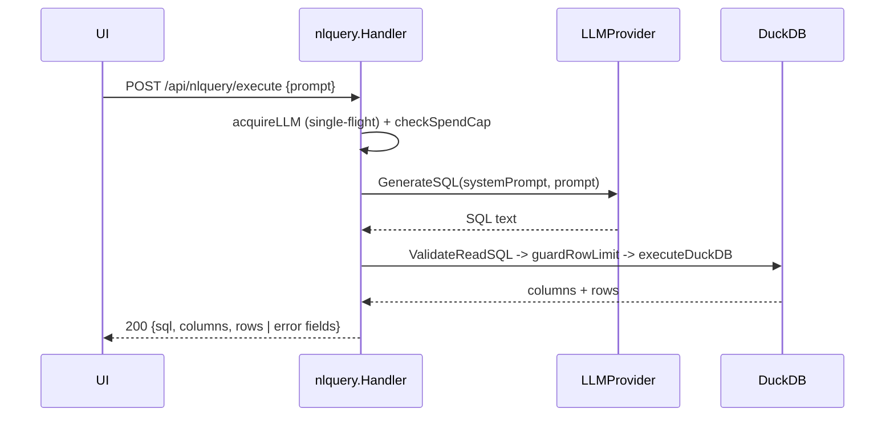

# 02 — User Stories

**Audience + purpose:** New engineers and open-source contributors orienting to the codebase, plus the security analyst who actually runs this single-user tool. This document maps real user needs to the features and HTTP endpoints that satisfy them, cites the satisfying code by `file:line`, and honestly marks each story **Built**, **Partial**, or **Backlog** based on what the source actually does today.

## Table of Contents

- [How to read this](#how-to-read-this)
- [Personas](#personas)
- [Persona-to-feature map](#persona-to-feature-map)
- [Epic 1 — Configure & connect to AWS](#epic-1--configure--connect-to-aws)
- [Epic 2 — Sync CloudTrail logs from S3](#epic-2--sync-cloudtrail-logs-from-s3)
- [Epic 3 — Index for fast queries](#epic-3--index-for-fast-queries)
- [Epic 4 — Investigate with pre-built scenarios](#epic-4--investigate-with-pre-built-scenarios)
- [Epic 5 — Dashboard & security findings](#epic-5--dashboard--security-findings)
- [Epic 6 — Natural-language queries (LLM)](#epic-6--natural-language-queries-llm)
- [Epic 7 — Cost control & safety](#epic-7--cost-control--safety)
- [Epic 8 — Account naming & multi-account scope](#epic-8--account-naming--multi-account-scope)
- [Epic 9 — Operate & observe the tool](#epic-9--operate--observe-the-tool)
- [Epic 10 — Extend the tool (contributor stories)](#epic-10--extend-the-tool-contributor-stories)
- [Backlog summary](#backlog-summary)
- [Sibling documents](#sibling-documents)

## How to read this

Each story uses the form **As a `<persona>`, I want `<capability>`, so that `<value>`**, followed by:

- **Status** — one of:
  - **Built** — the capability is implemented end-to-end and reachable from the UI or API.
  - **Partial** — implemented with a documented limitation, a hard-coded value, or a gap (e.g. no tests, single-user-only).
  - **Backlog** — not implemented; inferred need with no satisfying code.
- **Satisfied by** — the feature/endpoint and a `file:line` citation in the real code.

All counts below were verified against source on 2026-06-24, not estimated:

- **40** investigate scenarios (`internal/features/nlquery/investigate.go:101-169`, the `scenarios` slice)
- **17** dashboard security findings (`internal/features/nlquery/findings.go:28-116`, the `BuildFindingQueries` map)
- **38** pre-built NLQ prompt templates across **8** categories (`internal/features/prompts/templates.go:25` `Templates`, `:14-23` `Categories`)
- **4** auth methods, **4** LLM providers (see Epic 1 and Epic 6)

> The Phase-1 fact base cited "45+/28 scenarios" and "47 templates"; the verified figures are **40 scenarios** and **38 templates**. This doc uses the verified counts.

## Personas

| Persona | Who they are | Primary goal |
|---|---|---|
| **Security Analyst** | The single user the tool is built for; investigates CloudTrail activity across an AWS Organization. | Answer "who did what, from where, when" without standing up infrastructure. |
| **New Engineer** | Just joined; needs to understand handler → service → models and run it locally. | Build, run, and trace a request end-to-end. |
| **OSS Contributor** | External developer adding a scenario, an LLM provider, or a finding. | Extend the tool following existing patterns. |
| **Operator / Deployer** | Installs the binary on Amazon Linux 2023, watches health. | Keep the service running and observable. |

> **Important:** This is a sample/reference implementation intended for educational and demonstration purposes. It is not intended for production use without additional security review, hardening, and compliance validation. The spend tracker, auth, and concurrency gates are scoped to a single local user (see [Epic 7](#epic-7--cost-control--safety)).

## Persona-to-feature map

---

## Epic 1 — Configure & connect to AWS

**Story 1.1 — As a security analyst, I want to choose how I authenticate to AWS (IMDS, pasted session credentials, SSO profile, or static keys), so that I can use the credential source available in my environment.**
- **Status:** Built
- **Satisfied by:** `loadAWSConfig` switches on `cfg.Auth.Method` for `session_credentials`, `imds`, `sso`, and `static` (`internal/features/settings/service.go:49`); the UI exposes all four methods in `CredentialsView` (`web/src/features/settings/CredentialsView.tsx:29`).

**Story 1.2 — As a security analyst, I want to paste short-lived STS credentials into the UI, so that I can work without persisting secrets to disk.**
- **Status:** Built
- **Satisfied by:** `ApplySessionCredentials` sets `AWS_*` into the process environment only and explicitly does not persist them (`internal/features/settings/handler.go:357`). On restart the tool scrubs any stale session credentials that an older config leaked to `config.json` (`cmd/analyzer/main.go:44-58`). Pasted credentials are short-lived and must be re-applied after a restart.

**Story 1.3 — As a security analyst, I want to verify my credentials before running anything, so that I get a clear pass/fail instead of a cryptic error mid-query.**
- **Status:** Built
- **Satisfied by:** `ValidateCredentials` (`POST /api/settings/validate-credentials`) tests the configured method and returns per-source attempts (`internal/features/settings/handler.go:339`); `ResolveCredentials` dispatches to `tryIMDS`/`trySessionCredentials`/`trySSO`/`tryStatic` (`internal/features/settings/service.go:480`). `GetCallerIdentity` (`GET /api/settings/caller-identity`) confirms the active principal via STS (`internal/features/settings/handler.go:415`).

**Story 1.4 — As a security analyst, I want the tool to auto-detect whether my bucket is single-account or Control Tower (org-wide), so that I don't have to know the S3 layout by hand.**
- **Status:** Built
- **Satisfied by:** `DetectStructure` (`POST /api/settings/detect-structure`) scans all top-level prefixes and classifies single-account vs Control Tower, returning `org_id` and accounts (`internal/features/settings/handler.go:428`; logic in `DetectBucketStructure`, `internal/features/settings/service.go:225`). UI: `S3ConfigView` (`web/src/features/settings/S3ConfigView.tsx:23`).

**Story 1.5 — As a security analyst, I want to test S3 access and discover which CloudTrail regions have logs, so that I configure a sync that will actually find data.**
- **Status:** Built
- **Satisfied by:** `ValidateBucket` performs `HeadBucket` (`internal/features/settings/handler.go:284`); `DiscoverRegions` (`POST /api/settings/discover-regions`) lists regions under `…/CloudTrail/` (`internal/features/settings/handler.go:460`); `VerifyLogs` confirms files exist for a sample date (`internal/features/settings/handler.go:524`).

**Story 1.6 — As an operator, I want configuration to load from defaults, a `config.json` file, and environment variables in a predictable order, so that I can override settings without editing files.**
- **Status:** Built
- **Satisfied by:** `LoadConfig` applies a 3-tier hierarchy (defaults → `config.json` → env vars → validation) and writes a default `config.json` on first run (`internal/config/config.go:230`); `config.json` is saved mode `0600` (`internal/config/config.go:271`).

---

## Epic 2 — Sync CloudTrail logs from S3

**Story 2.1 — As a security analyst, I want to create a sync for a specific account, region, and date range, so that I only download the logs I need.**
- **Status:** Built
- **Satisfied by:** `CreateSession` (`POST /api/sessions/`) validates `account_id`, `log_region`, `start_date`, `end_date` and reads bucket/region/mode from saved config (`internal/features/sessions/handler.go:52`; service `internal/features/sessions/service.go:32`). Date range is validated `start <= end`, duration `<= 90 days` (`internal/features/settings/service.go:832`). UI: `S3SyncView` (`web/src/features/logviewer/S3SyncView.tsx:11`).

**Story 2.2 — As a security analyst, I want a live progress bar with speed and ETA while logs download, so that I know the sync is working and how long it will take.**
- **Status:** Built
- **Satisfied by:** `StreamProgress` streams Server-Sent Events (`GET /api/sessions/{id}/progress`, `internal/features/processor/handler.go:124`); `GetProgress` is a REST polling fallback with `Speed`, `FilesPerSec`, `ETASeconds` (`internal/features/processor/handler.go:100`; snapshot math in `Service.updateSnapshot`, `internal/features/processor/service.go:79`). UI hook `useSyncProgress` consumes the SSE stream (`web/src/features/logviewer/hooks.ts:83`).

**Story 2.3 — As a security analyst, I want to cancel a running sync, so that I can stop a download that's targeting the wrong scope.**
- **Status:** Built
- **Satisfied by:** `CancelProcess` (`POST /api/sessions/{id}/cancel`) cancels the pipeline context and marks the session `interrupted` immediately for UI feedback (`internal/features/processor/handler.go:78`; `Service.CancelProcessing`, `internal/features/processor/service.go:433`).

**Story 2.4 — As a security analyst, I want syncs to resume instead of re-downloading, so that an interrupted job doesn't waste bandwidth.**
- **Status:** Built
- **Satisfied by:** Idempotent resume at three levels: skip if `.json` already extracted, skip `.gz` download when on-disk size matches, and atomic temp-then-rename writes (`Service.downloadAndExtract`, `internal/features/processor/service.go:286`; `downloadSingleFile`, `internal/features/processor/downloader.go:172`). Crashed in-flight sessions are recovered to `interrupted` on startup via `MarkInterrupted` (`internal/features/sessions/queries.go:121`, called from `cmd/analyzer/main.go:121-131`).

**Story 2.5 — As a security analyst, I want the downloaded files verified as valid JSON, so that a query later doesn't fail on a corrupt file.**
- **Status:** Built
- **Satisfied by:** `verifyFiles` walks the session directory, parses each `.json`, and records failures into `sessions.failed_files` (`internal/features/processor/verifier.go:17`; `validateJSONFile`, `:66`). Sessions with failures end in `partially_verified` rather than `query_ready` (`Service.StartProcessing`, `internal/features/processor/service.go:119`).

**Story 2.6 — As an operator, I want the tool to refuse to fill my disk, so that a large sync fails fast instead of taking the host down.**
- **Status:** Built
- **Satisfied by:** `estimateDisk` requires `2.5x` the S3 size and compares against `Statfs` available bytes (`internal/features/processor/service.go:506`); extraction enforces a per-file `256 MB` and global `4 GB` decompression cap via `io.LimitReader` (`internal/features/processor/extractor.go:111`). The `2.5x` multiplier and `4 GB` cap are hard-coded heuristics.

**Story 2.7 — As an operator, I want sync to be safe against malicious S3 keys, so that a crafted key can't write outside the data directory.**
- **Status:** Built
- **Satisfied by:** `hasUnsafeKeySegment` rejects keys with a leading `/` or `..` segment at the single write chokepoint before any file is created (`internal/features/processor/downloader.go:172` and `:250`).

> **Known limitation (Partial):** CloudTrail partitions S3 objects by delivery date (UTC day written), not event time, so events near UTC midnight may land in the next day's prefix; the sync window may need widening for boundary completeness. This is documented inline, not auto-corrected (`internal/features/processor/downloader.go:22-34`).

---

## Epic 3 — Index for fast queries

**Story 3.1 — As a security analyst, I want my synced logs indexed into DuckDB, so that queries run fast instead of re-parsing JSON every time.**
- **Status:** Built
- **Satisfied by:** `BuildIndex` (`POST /api/nlquery/index`) kicks off an incremental build and returns `202` (`internal/features/nlquery/handler.go:239`); `BuildIndexIncremental` scans files, computes the delta from a SQLite checkpoint, batches by size, and creates indexes on `event_name`/`event_source`/`error_code` (`internal/features/nlquery/indexer.go:132`).

**Story 3.2 — As a security analyst, I want data to become queryable while a sync is still running, so that I don't have to wait for the whole download.**
- **Status:** Built
- **Satisfied by:** `MicroBatchIndexer` buffers extracted file paths and auto-flushes to DuckDB at a `10 MB` threshold, wired to the processor's `OnFileExtracted` callback (`internal/features/nlquery/indexer.go:523`; callback wiring in `cmd/analyzer/main.go:229-232`).

**Story 3.3 — As a security analyst, I want to watch index-build progress and cancel it, so that a long build doesn't block me.**
- **Status:** Built
- **Satisfied by:** `StreamIndexProgress` (`GET /api/nlquery/index/progress`, SSE) and `CancelIndex` (`POST /api/nlquery/index/cancel`) (`internal/features/nlquery/handler.go:62-63`). UI hook `useIndexProgress` reconnects with exponential backoff (`web/src/features/logviewer/hooks.ts:248`).

**Story 3.4 — As a security analyst, I want queries to keep working even if the index is being written concurrently, so that I don't hit corruption or hard failures.**
- **Status:** Built
- **Satisfied by:** Index writes are serialized via `writeMu`, and reads retry up to 5 times at `400 ms` on DuckDB lock conflicts before returning a friendly timeout (`executeDuckDB`, `internal/features/nlquery/service.go:267`; constants `duckDBLockRetries`/`duckDBLockRetryDelay`).

> **Known limitation (Partial):** The index schema marks 9 CloudTrail variant fields as JSON strings (`recordsSchema` in `internal/features/nlquery/indexer.go`). New top-level CloudTrail fields not in that schema are silently dropped at index time and require a manual schema update.

---

## Epic 4 — Investigate with pre-built scenarios

**Story 4.1 — As a security analyst, I want a library of ready-made investigations (IAM activity, access-denied, IP/identity/role lookups, cross-account, GuardDuty-aligned findings), so that I can answer common questions without writing SQL.**
- **Status:** Built
- **Satisfied by:** **40** scenarios defined in the `scenarios` slice (`internal/features/nlquery/investigate.go:101-169`), listed via `ListScenarios` (`GET /api/investigate/scenarios`) and run via `RunScenario` (`POST /api/investigate/run`, `internal/features/nlquery/investigate.go:41`). Each scenario's SQL is hand-coded and does **not** go through the LLM. UI: `InvestigateView` (`web/src/features/query/InvestigateView.tsx:88`).

**Story 4.2 — As a security analyst, I want to scope every investigation by a time window and a set of accounts from a toolbar, so that filters apply uniformly across all scenarios.**
- **Status:** Built
- **Satisfied by:** `buildFilteredEventsExpr` applies `eventTime` and account filters (matching both `recipientAccountId` and `userIdentity.accountId`) to a shared events expression used by every scenario (`internal/features/nlquery/investigate.go:193`). UI: `InvestigateToolbar` with presets and an account picker (`web/src/features/query/InvestigateToolbar.tsx:79`).

**Story 4.3 — As a security analyst, I want autocomplete for access keys, IPs, identities, accounts, and roles, so that I can fill scenario parameters without copying values by hand.**
- **Status:** Built
- **Satisfied by:** `GetLookups` (`GET /api/lookups`) returns five distinct/top-N lists scoped to the selected accounts (`internal/features/nlquery/lookups.go:12`).

**Story 4.4 — As a security analyst, I want to click a value in a result table and pivot to a related investigation, so that I can follow a lead without retyping.**
- **Status:** Built
- **Satisfied by:** `detectSeedType` classifies ARN/access-key/account/IP/user/role (`web/src/features/query/seedDetection.ts:31`); clicking a cell or entity sets the toolbar seed and reorders scenarios in `InvestigateView` (`web/src/features/query/InvestigateView.tsx:88`). The seed is deliberately kept out of the URL to avoid leaking identifiers into browser history/Referer (`web/src/features/query/useToolbarState.ts:15`).

**Story 4.5 — As a security analyst, I want to export investigation results to CSV or JSON, so that I can attach evidence to a ticket.**
- **Status:** Built
- **Satisfied by:** `tableExport` writes CSV (RFC 4180) and JSON, neutralizing spreadsheet formula injection by prefixing `=+-@` cells (`web/src/features/query/tableExport.ts:1`).

> **Known limitation (Partial):** Only the `account` parameter type is shape-checked (`isValidAccountID`) before interpolation; access-key/IP/identity/role params rely on SQL literal escaping (`quoteSQLLiteral`) as defense-in-depth, not on input validation (`internal/features/nlquery/investigate.go`).

---

## Epic 5 — Dashboard & security findings

**Story 5.1 — As a security analyst, I want an at-a-glance dashboard (event volume, identity types, top APIs/IPs/errors/services, hourly activity), so that I can triage a window quickly.**
- **Status:** Built
- **Satisfied by:** `GetDashboard` (`GET /api/dashboard`) runs 7 panels in parallel from a single shared events expression (`internal/features/nlquery/dashboard.go:15` and `:39`). UI: `DashboardView` charts via Recharts (`web/src/features/dashboard/DashboardView.tsx:114`).

**Story 5.2 — As a security analyst, I want a list of security findings with counts (root usage, logging disabled, unauthorized calls, IAM/permission changes, off-hours activity, data-exfil patterns, etc.), so that I see risky activity without composing queries.**
- **Status:** Built
- **Satisfied by:** **17** findings, each with a summary and a detail query (`BuildFindingQueries`, `internal/features/nlquery/findings.go:28-116`); served by `GetFindings` (`GET /api/dashboard/findings`) and `GetFindingDetail` (`GET /api/dashboard/findings/{id}`, `internal/features/nlquery/dashboard.go:148` and `:188`).

**Story 5.3 — As a security analyst, I want a finding row to expand into the underlying events and the exact SQL used, so that I can verify and reproduce a result.**
- **Status:** Built
- **Satisfied by:** `GetFindingDetail` returns the detail rows plus the SQL string and a classified error hint (`internal/features/nlquery/dashboard.go:188`); the UI truncates the table to 20 rows with a "more exist" note (`web/src/features/dashboard/DashboardView.tsx:508-512`).

> **Known limitation (Partial):** The off-hours user-behavior finding uses hard-coded UTC `00:00–06:59` (`offHoursStartUTC`/`offHoursEndUTC` in `internal/features/nlquery/findings.go`); there is no per-organization timezone config, so non-UTC orgs see false positives until the constants are edited.

---

## Epic 6 — Natural-language queries (LLM)

**Story 6.1 — As a security analyst, I want to ask a question in plain English and get back SQL plus results, so that I can answer ad-hoc questions the scenarios don't cover.**
- **Status:** Built
- **Satisfied by:** `Execute` (`POST /api/nlquery/execute`) generates SQL via the LLM, guards the row count, and runs it (`internal/features/nlquery/handler.go:380`; service `Execute`, `internal/features/nlquery/service.go:82`). Query failures are returned as `200` with `error`/`error_hint`/`error_detail` fields (not HTTP error codes).

**Story 6.2 — As a security analyst, I want to choose my LLM provider (AWS Bedrock, Anthropic API, OpenAI-compatible, or local Ollama), so that I can use what I have access to — including a free local model.**
- **Status:** Built
- **Satisfied by:** The `LLMProvider` interface (`internal/features/nlquery/provider.go:25`) with `BedrockProvider` (`:63`), `AnthropicProvider` (`:216`), `OpenAIProvider` (`:286`), and `OllamaProvider` (`:354`). The Bedrock default model is Claude Sonnet 4 (`internal/features/nlquery/provider.go:89`). UI: `LLMConfigView` (`web/src/features/settings/LLMConfigView.tsx:44`).

**Story 6.3 — As a security analyst, I want to pick a Bedrock model from those actually available in my region (including cross-region inference profiles), so that I don't guess a model ID my role can't call.**
- **Status:** Built
- **Satisfied by:** `ListBedrockModels` (`POST /api/settings/bedrock-models`) merges `ListFoundationModels` + `ListInferenceProfiles` and detects CRIS by prefix (`internal/features/settings/service.go:660`).

**Story 6.4 — As a security analyst, I want an AI summary of a result set that won't invent facts, so that I get a fast read-out I can trust.**
- **Status:** Built
- **Satisfied by:** `Summarize` (`POST /api/nlquery/summarize`) sends up to `MaxSummarizeRows` (50) rows with a strict no-invention system prompt and structured JSON output (`internal/features/nlquery/summarize.go:134`, prompt `:30`). `validateSummary` flags hallucinated ARNs/IPs/account-IDs/access-keys not present in the source rows (`internal/features/nlquery/summarize.go:291`). UI: `SummaryPanel` (`web/src/features/query/SummaryPanel.tsx:157`).

**Story 6.5 — As a security analyst, I want curated prompt templates for common investigations, so that I can start from a known-good question.**
- **Status:** Built
- **Satisfied by:** **38** templates in 8 categories (`internal/features/prompts/templates.go:25` `Templates`, `:14` `Categories`), served by `ListPrompts` / `GetPrompt` with `{placeholder}` substitution from config (`internal/features/prompts/handler.go:48` and `:83`). UI: `PreBuiltView` (`web/src/features/query/PreBuiltView.tsx:34`).

> **Known limitation (Partial):** The cost estimator and spend cap use estimated tokens (4-chars/token heuristic, `internal/features/nlquery/cost_estimator.go:100`) and estimated cost, because provider responses don't surface token counts; spend tracking is "session estimated-to-date," not billing-accurate (see Epic 7).

> **Known limitation (Partial):** The hallucination validator allows numeric counts not present verbatim in rows by design, so a close-but-wrong count could pass (`internal/features/nlquery/summarize.go:291`).

---

## Epic 7 — Cost control & safety

**Story 7.1 — As a security analyst, I want a pre-flight cost estimate before I spend money on an LLM call, so that I'm not surprised by the bill.**
- **Status:** Built
- **Satisfied by:** `Estimate` (`POST /api/nlquery/estimate`) computes cost without calling the LLM and enriches it with spend-cap awareness (`internal/features/nlquery/handler.go:198`; `EstimateCost`, `internal/features/nlquery/cost_estimator.go:49`). UI: debounced `CostBanner` (`web/src/comm/CostBanner.tsx:41`).

**Story 7.2 — As an operator, I want a per-session spend cap that blocks paid LLM calls once exceeded, so that a runaway loop can't rack up cost.**
- **Status:** Partial
- **Satisfied by:** `checkSpendCap` rejects with `429` when the cap is exceeded, exempting free Ollama (`internal/features/nlquery/handler.go:102`); spend tracked by `SessionSpend` (`internal/features/nlquery/session_spend.go:12`). **Limitation:** the tracker is in-process, resets on restart, is not persistent, and records *estimated* cost — it is a single-user POC control, not a billing-accurate safeguard.

**Story 7.3 — As an operator, I want concurrent paid-LLM calls blocked, so that the single-user tool can't fan out parallel Bedrock requests.**
- **Status:** Built
- **Satisfied by:** A single-flight `atomic.Bool` gate (`acquireLLM`/`releaseLLM`) returns `429` on a second concurrent request to `/execute` and `/summarize` (`internal/features/nlquery/handler.go:84`).

**Story 7.4 — As an operator, I want generated SQL restricted to read-only SELECTs, so that an LLM or crafted prompt can't mutate or read arbitrary files.**
- **Status:** Built
- **Satisfied by:** `ValidateReadSQL` strips comments/strings, rejects multi-statement queries, enforces a `SELECT`/`WITH` first keyword, and denies a banned-token list (`read_csv`, `attach`, `insert`, `create`, `drop`, …) (`internal/features/nlquery/safesql.go:65`). Free-form queries are also wrapped in an outer `LIMIT 1000` guard (`guardRowLimit`, `internal/features/nlquery/service.go:251`).

**Story 7.5 — As an operator, I want AWS credentials kept out of DuckDB/Ollama subprocesses, so that a query engine can't exfiltrate them.**
- **Status:** Built
- **Satisfied by:** `scrubbedEnv` strips `AWS_ACCESS_KEY_ID`, `AWS_SECRET_ACCESS_KEY`, `AWS_SESSION_TOKEN`, profile and container/web-identity vars before launching subprocesses, while preserving `AWS_REGION` (`internal/features/nlquery/subprocess.go:32`).

**Story 7.6 — As an operator, I want DNS-rebinding protection and a strict request decoder, so that a browser can't be tricked into driving the local API.**
- **Status:** Built
- **Satisfied by:** `TrustedHost` middleware runs first and rejects untrusted `Host` headers with `403` (`internal/middleware/trustedhost.go:21`; allowlist logic `TrustedHostAllowed`, `internal/config/config.go:58`). `DecodeStrictJSON` caps bodies at 1 MiB, requires `application/json`, and disallows unknown fields (`internal/render/decode.go:30`). `SecurityHeaders` sets `nosniff`/`DENY`/`no-referrer` (`internal/middleware/logging.go:109`).

> **Note on tracking:** Spend and concurrency controls are intentionally single-user and in-memory. See [08-TECH-STACK.md](08-TECH-STACK.md) for the operational/deploy posture and [10-SECURITY.md](10-SECURITY.md) for the security posture; the live security review (2 Critical findings) is cross-referenced in [10-SECURITY.md](10-SECURITY.md).

---

## Epic 8 — Account naming & multi-account scope

**Story 8.1 — As a security analyst, I want 12-digit account IDs resolved to friendly names, so that results are readable.**
- **Status:** Built
- **Satisfied by:** The `Resolver` caches names from AWS Organizations and manual overrides with read-time precedence (manual > org > unresolved) (`internal/features/accounts/resolver.go:51`; `mergeEntry`, `:486`). `Resolve` (`GET /api/accounts/resolve`) returns names for comma-separated IDs (`internal/features/accounts/handler.go:77`). UI: `AccountLabel` + `useAccountNames` batching cache (`web/src/comm/AccountLabel.tsx:18`, `web/src/comm/accountNames.ts:91`).

**Story 8.2 — As a security analyst, I want to set a name manually when Organizations isn't reachable, so that the log-archive role's lack of `ListAccounts` doesn't leave me with bare IDs.**
- **Status:** Built
- **Satisfied by:** `UpsertManual`/`DeleteManual` (`PUT`/`DELETE /api/accounts/manual/{id}`) with 12-digit validation (`internal/features/accounts/handler.go:133` and `:162`; `SetManual`, `internal/features/accounts/resolver.go:173`). The resolver distinguishes permanent failures (e.g. AccessDenied → sticky) from transient ones (`isPermanentOrgError`, `:101`). UI: `AccountNamesSection` (`web/src/features/settings/AccountNamesSection.tsx:36`).

**Story 8.3 — As a security analyst, I want name resolution to retry automatically after I apply new credentials, so that I don't get stuck on a stale permission failure.**
- **Status:** Built
- **Satisfied by:** Applying credentials fires the `OnAuthChanged` observer (`internal/features/settings/handler.go:42`), which calls `OnCredentialsChanged` to clear the resolver's sticky-failure flag (`internal/features/accounts/resolver.go:223`); the frontend drops `unresolved` cache entries via `retryUnresolved` (`web/src/comm/accountNames.ts:137`).

**Story 8.4 — As a security analyst, I want to select multiple member accounts and have every surface (dashboard, findings, investigate, lookups, NLQ) honor that scope, so that I see one consistent subset.**
- **Status:** Built
- **Satisfied by:** `memberAccountScope` builds an `AND r.recipientAccountId IN (...)` fragment with validated, quoted IDs, used uniformly across surfaces (`internal/features/nlquery/lookups.go:119`); the NLQ index path re-applies the same scope after rewriting to the shared index (`rewriteForIndex`/`indexScopeWhere`, `internal/features/nlquery/service.go:146` and `:210`). The toolbar account picker is in `InvestigateToolbar` (`web/src/features/query/InvestigateToolbar.tsx:79`) and `ListDiscoverable` (`internal/features/accounts/handler.go:39`).

---

## Epic 9 — Operate & observe the tool

**Story 9.1 — As an operator, I want a single binary I can deploy with embedded UI, so that there's no separate frontend to host.**
- **Status:** Built
- **Satisfied by:** The frontend is embedded via `go:embed` (`cmd/analyzer/frontend.go:8-9`); `FrontendEmbedded` reports whether a real build was embedded vs the dev placeholder (`cmd/analyzer/frontend.go:23`). `make build` builds the UI and links the binary (`Makefile:1-109`).

**Story 9.2 — As an operator, I want a one-command install on Amazon Linux 2023 with a systemd service, so that the tool restarts on boot and runs as a dedicated user.**
- **Status:** Built
- **Satisfied by:** `deploy.sh` installs Go/Node/DuckDB (SHA-256 verified), builds, creates the `cloudtrail-analyzer` systemd service under user `cloudtrail`, and excludes secrets from the deploy rsync (`deploy.sh:1-478`, exclusions `:266-287`).

**Story 9.3 — As an operator, I want a health endpoint reporting startup checks, version, and uptime, so that I can confirm the service is ready.**
- **Status:** Built
- **Satisfied by:** `GET /api/health` returns startup status, version, uptime, and `frontend_embedded` (`cmd/analyzer/main.go:148-157`); startup runs blocking checks (data dir writable, SQLite reachable) and non-blocking checks (credentials, DuckDB) via `Validate` (`internal/startup/validator.go:58`). UI: `SystemView` + `useHealth` (`web/src/features/settings/SystemView.tsx:5`, `web/src/features/settings/hooks.ts:52`).

**Story 9.4 — As an operator, I want DuckDB auto-installed only when I opt in, with checksum verification, so that I'm not silently pulling binaries from the internet.**
- **Status:** Built
- **Satisfied by:** `checkDuckDB` auto-installs only when `allowAutoInstall` is true (defaults false/fail-closed); `installDuckDB` downloads DuckDB v1.2.2 and verifies SHA-256 before extracting (`internal/startup/validator.go:222` and `:359`; checksum `verifyDuckDBChecksum`, `:472`).

**Story 9.5 — As an operator, I want graceful shutdown that stops in-flight syncs cleanly, so that SIGTERM doesn't corrupt mid-batch writes.**
- **Status:** Built
- **Satisfied by:** `signal.NotifyContext` cancels pipelines via `processorHandler.Service().Shutdown()` then `server.Shutdown` with a 10s timeout (`cmd/analyzer/main.go:341-371`; `Service.Shutdown`, `internal/features/processor/service.go:459`).

**Story 9.6 — As an operator, I want structured request logs and panic recovery, so that I can debug issues without the server crash-looping.**
- **Status:** Built
- **Satisfied by:** `StructuredLogger` emits JSON request logs (`internal/middleware/logging.go:57`); `Recoverer` turns panics into `500` JSON with a stack trace (`internal/middleware/logging.go:122`).

**Story 9.7 — As a new engineer, I want to run the API and UI together in dev mode, so that I can iterate without rebuilding the binary.**
- **Status:** Built
- **Satisfied by:** `make dev` runs the Go API (`:7070`) and Vite (`:5173`) with a proxy (`Makefile:1-109`; `web/vite.config.ts`); CORS allows `localhost:5173` in dev (`internal/middleware/logging.go:77`).

---

## Epic 10 — Extend the tool (contributor stories)

**Story 10.1 — As a contributor, I want to add a new investigation scenario, so that analysts get a new ready-made query.**
- **Status:** Built (extension point)
- **Satisfied by:** Add a `Scenario` entry to the `scenarios` slice (`internal/features/nlquery/investigate.go:101-169`) and a matching `case` branch in `buildSQL` (`internal/features/nlquery/investigate.go:241`); reuse `buildFilteredEventsExpr` so the toolbar filters apply automatically. SQL must pass `ValidateReadSQL` and use `quoteSQLLiteral` for any parameter.

**Story 10.2 — As a contributor, I want to add a new dashboard finding, so that the dashboard surfaces a new risk pattern.**
- **Status:** Built (extension point)
- **Satisfied by:** Add a `FindingQuery` (summary + detail SQL) to the `BuildFindingQueries` map (`internal/features/nlquery/findings.go:28-116`), escaping the data path via `escapeSQLLiteral`. The dashboard and detail endpoints pick it up automatically (`internal/features/nlquery/dashboard.go:148`).

**Story 10.3 — As a contributor, I want to add a new LLM provider, so that the tool supports another model backend.**
- **Status:** Built (extension point)
- **Satisfied by:** Implement the `LLMProvider` interface (`internal/features/nlquery/provider.go:25`) and register it in `NewProvider`; follow the error-hint pattern of `BedrockProvider` (`internal/features/nlquery/provider.go:63`). Add a rate-card entry in `pricing.go` (`defaultRates`, `internal/features/nlquery/pricing.go:33`) so estimates work.

**Story 10.4 — As a contributor, I want a new schema column persisted via an idempotent migration, so that upgrades are safe to re-run.**
- **Status:** Built (extension point)
- **Satisfied by:** Add `migrations/NNN_*.sql` using `IF NOT EXISTS`; `RunMigrations` executes `migrations/*.sql` alphabetically and `ensureSessionColumns` backfills older databases (`internal/database/sqlite.go:60` and `:117`).

**Story 10.5 — As a new engineer, I want a frontend test harness so I can add UI tests, so that frontend regressions get caught.**
- **Status:** Backlog
- **Satisfied by:** *No satisfying code.* A vitest config exists but there are **0 frontend test files** and **0% frontend coverage** (per `.ground-truth.md`). Several Go packages also have 0% coverage (`cmd/analyzer`, `internal/config`, `internal/features/processor`, `prompts`, `sessions`, `settings`). See [09-TEST-COVERAGE.md](09-TEST-COVERAGE.md).

**Story 10.6 — As an analyst, I want per-organization timezone configuration for off-hours findings, so that non-UTC orgs don't get false positives.**
- **Status:** Backlog
- **Satisfied by:** *No satisfying code.* Off-hours window is the hard-coded UTC constant pair in `internal/features/nlquery/findings.go`; there is no config knob.

**Story 10.7 — As an analyst, I want persistent, billing-accurate spend tracking, so that the cap survives restarts and reflects real usage.**
- **Status:** Backlog
- **Satisfied by:** *No satisfying code.* `SessionSpend` is in-process, estimate-based, and resets on restart (`internal/features/nlquery/session_spend.go:12`).

**Story 10.8 — As an analyst, I want multi-user authentication on the API, so that the tool can be shared safely.**
- **Status:** Backlog
- **Satisfied by:** *No satisfying code.* The API is unauthenticated by design for a single local user; the only network-layer control is the `TrustedHost` allowlist (`internal/middleware/trustedhost.go:21`). See [10-SECURITY.md](10-SECURITY.md).

---

## Backlog summary

| Story | Need | Why not built |
|---|---|---|
| 10.5 | Frontend (and broader Go) test coverage | 0 frontend test files; several Go packages at 0% (`.ground-truth.md`). |
| 10.6 | Per-org timezone for off-hours findings | Hard-coded UTC constants in `findings.go`. |
| 10.7 | Persistent, billing-accurate spend cap | `SessionSpend` is in-memory + estimate-based (`session_spend.go:12`). |
| 10.8 | Multi-user auth | Single-user POC; API unauthenticated, guarded only by `TrustedHost`. |
| 2.7 (partial) | UTC-midnight delivery-date boundary auto-widen | Documented limitation, not auto-corrected (`downloader.go:22-34`). |
| 3.4 (partial) | Auto-evolving index schema | New CloudTrail fields dropped until `recordsSchema` updated (`indexer.go`). |

---

## Sibling documents

- [01-REQUIREMENTS.md](01-REQUIREMENTS.md) — functional/non-functional requirements
- [03-USER-JOURNEYS.md](03-USER-JOURNEYS.md) — end-to-end flows these stories appear in
- [04-HIGH-LEVEL-DESIGN.md](04-HIGH-LEVEL-DESIGN.md) — architecture these stories map to
- [07-API-FLOW.md](07-API-FLOW.md) — endpoint contracts cited above
- [08-TECH-STACK.md](08-TECH-STACK.md) — deploy/run details behind Epic 9
- [09-TEST-COVERAGE.md](09-TEST-COVERAGE.md) — coverage gaps behind Story 10.5
- [10-SECURITY.md](10-SECURITY.md) — security posture and the live review cross-reference
