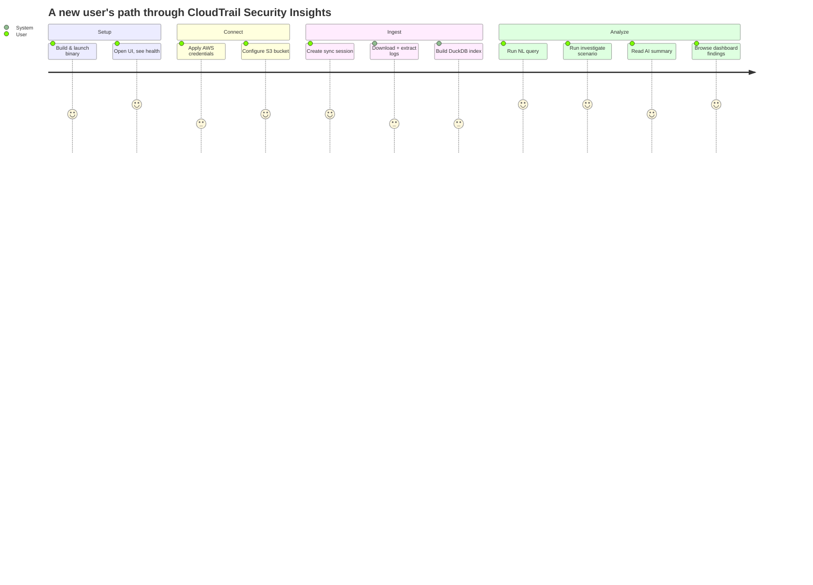
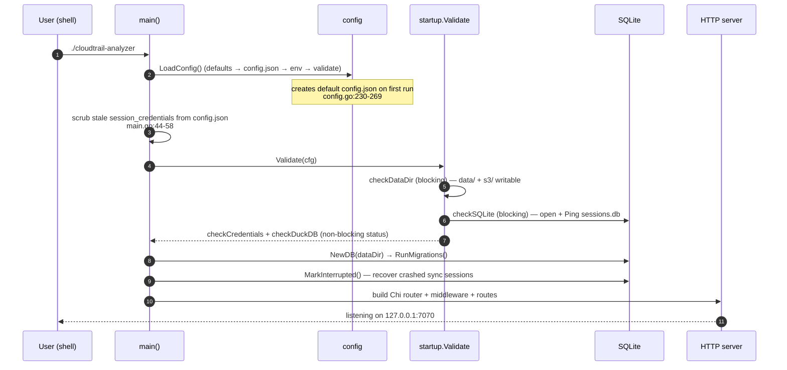
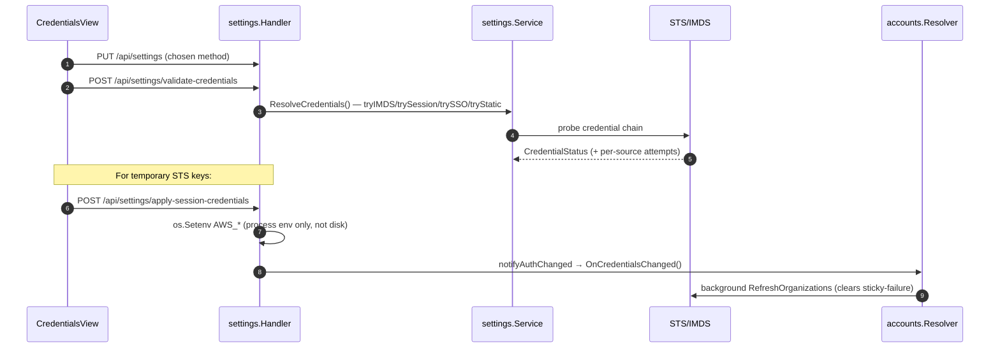
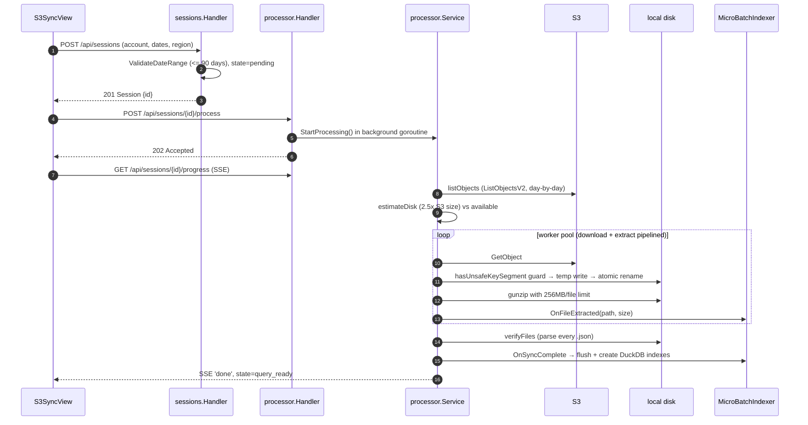
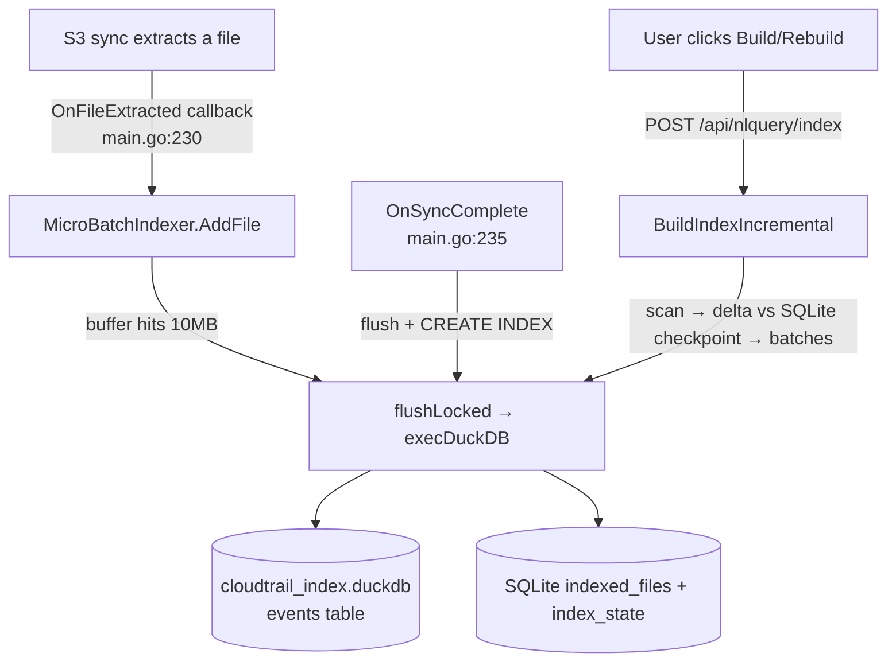
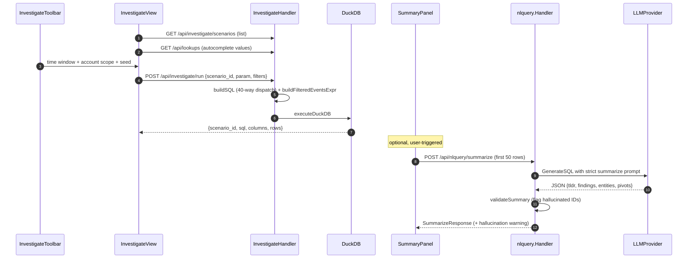
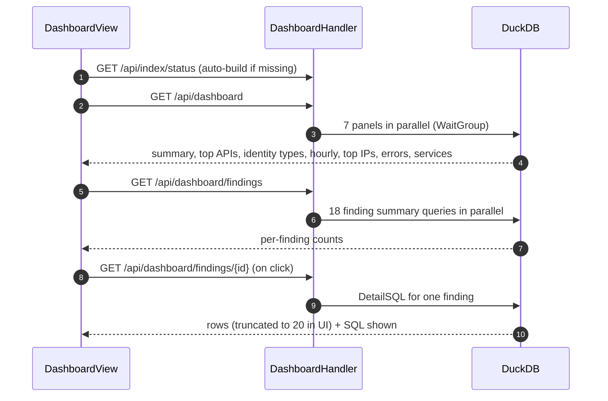

# 03 — User Journeys

**Audience + purpose:** For new engineers and open-source contributors. This doc walks the end-to-end journeys a user takes through CloudTrail Security Insights — from first launch to running an investigation — and grounds every step in real commands, HTTP endpoints, and code paths (`file:line`) so you can follow the request from the browser through the Go backend to DuckDB and AWS.

> Citations use repo-relative paths (e.g. `cmd/analyzer/main.go:148`). Counts, coverage, and route lists come from the frozen [.ground-truth.md](.ground-truth.md) — they are not re-estimated here.

---

## Table of contents

1. [The big picture](#1-the-big-picture)
2. [Journey A — First-run setup (build & launch)](#2-journey-a--first-run-setup-build--launch)
3. [Journey B — Configure credentials & S3 bucket](#3-journey-b--configure-credentials--s3-bucket)
4. [Journey C — Sync CloudTrail logs from S3](#4-journey-c--sync-cloudtrail-logs-from-s3)
5. [Journey D — Build / refresh the DuckDB index](#5-journey-d--build--refresh-the-duckdb-index)
6. [Journey E — Run a natural-language query](#6-journey-e--run-a-natural-language-query)
7. [Journey F — Investigate a scenario (and AI summary)](#7-journey-f--investigate-a-scenario-and-ai-summary)
8. [Journey G — View the security dashboard](#8-journey-g--view-the-security-dashboard)
9. [Cross-cutting concerns every journey touches](#9-cross-cutting-concerns-every-journey-touches)
10. [Where to go next](#10-where-to-go-next)

---

## 1. The big picture

There are seven views in the SPA, routed in `web/src/App.tsx:11-50` and listed in the sidebar groups Security / Data / Settings (`web/src/arc/Sidebar.tsx:43-112`). Most journeys follow the same shape: a React view calls a `/api/*` endpoint, a Chi handler validates and delegates to a feature `Service`, and the service either talks to AWS (S3 / Bedrock / STS / Organizations), runs a DuckDB subprocess, or reads/writes SQLite.



The order matters: you cannot analyze data you have not synced, and credentials gate the sync. The journeys below are written in that dependency order.

See [04-HIGH-LEVEL-DESIGN.md](04-HIGH-LEVEL-DESIGN.md) for the component map and [06-DATA-FLOW.md](06-DATA-FLOW.md) for the SQLite/DuckDB split.

---

## 2. Journey A — First-run setup (build & launch)

**Goal:** Get a running binary serving the UI on `127.0.0.1:7070`.

### Commands

The `Makefile:1-110` is the entry point for local work:

```bash
make install   # install Go + Node dependencies
make dev       # run Go API (:7070) + Vite frontend (:5173) together
make build     # build single binary with embedded frontend → dist/cloudtrail-analyzer
make test      # Go tests + vitest
```

In **dev mode** (`make dev`) the Vite dev server on `:5173` serves the React app and proxies `/api` to the Go backend on `:7070` (proxy noted in `web/vite.config.ts`). In **production** (`make build`) the frontend is built and embedded into the Go binary via `go:embed` (`cmd/analyzer/frontend.go:8-9`), so a single binary serves both API and UI.

For a server install, `deploy.sh:1-478` does the same end-to-end on Amazon Linux 2023: installs Go 1.26.4, Node 20, and DuckDB 1.2.2 (SHA-256 verified), builds the binary, and registers a systemd service.

### What happens at startup

`main()` (`cmd/analyzer/main.go:32-376`) orchestrates the boot sequence:



Key facts to know as a contributor:

- **Config is 3-tier:** defaults → `config.json` → environment variables, then validated (`internal/config/config.go:230-269`). On first run a default `config.json` is written to the working directory (`SaveConfig`, mode `0600`, `config.go:271-293`). Defaults: port `7070`, host `127.0.0.1`, auth method `imds`, Bedrock region `us-east-1`, Claude Sonnet 4, all disabled by default (`DefaultConfig`, `config.go:192-221`).
- **Two startup checks are blocking:** data-dir writability (`checkDataDir`, `validator.go:89-127`) and SQLite access (`checkSQLite`, `validator.go:129-157`). If either fails the process exits. Credential and DuckDB checks are non-blocking — they populate status but do not stop the server (`Validate`, `validator.go:58-85`).
- **DuckDB may auto-install** on first run if missing and the install is opted in: `checkDuckDB` downloads v1.2.2 from GitHub, verifies SHA-256 **before** writing the binary, and updates `PATH` (`validator.go:222-279`, install at `validator.go:359-451`). It defaults to fail-closed — no silent download.
- **Frontend embed check:** `FrontendEmbedded()` (`frontend.go:23-32`) returns true only if `dist/index.html` was embedded. In dev mode this is false and `main.go:85-97` logs a warning — that is expected because Vite serves the UI.
- **Health endpoint** confirms the app is up: `GET /api/health` returns status, version, uptime, the startup check results, and `frontend_embedded` (`cmd/analyzer/main.go:148-157`). The System view polls it via `useHealth` (`web/src/features/settings/hooks.ts:52-79`).

### First thing the user sees

`SystemView` (`web/src/features/settings/SystemView.tsx:5`) fetches `/api/health` and renders version, uptime, and the startup checks as status badges. This is where a user confirms credentials/DuckDB are "ok" vs "unconfigured" before going further.

---

## 3. Journey B — Configure credentials & S3 bucket

**Goal:** Give the app a way to reach AWS and tell it which bucket holds the CloudTrail logs.

There are **four auth methods** (`imds | session_credentials | sso | static`), all resolved by one switch in `internal/features/settings/service.go:49-87` (`loadAWSConfig`). The same loader is exported as `LoadAWSConfig` (`service.go:44-47`) so the accounts resolver and processor reuse it.

### B.1 — Apply credentials



Code paths:

- The view is `CredentialsView` (`web/src/features/settings/CredentialsView.tsx:29`) — master/detail with one form per method.
- `ValidateCredentials` (`internal/features/settings/handler.go:339-350`) tests the configured method without persisting; it dispatches to `tryIMDS` / `trySessionCredentials` / `trySSO` / `tryStatic` (`service.go:518-641`).
- `ApplySessionCredentials` (`handler.go:357-413`) sets `AWS_*` in the process environment **only** — short-lived STS tokens are not persisted to disk (the handler zeroes the credential fields before saving config), and the user must re-apply them after a restart. It then calls registered auth-changed observers.
- The auth-changed observer (`OnAuthChanged`, `handler.go:42-44`) is wired in `main.go:193-203` to clear the resolver's sticky-failure flag and retry an AWS Organizations refresh — so account-name lookups start working as soon as valid credentials arrive.

> **Security note:** `main.go:44-58` proactively scrubs stale `session_credentials` tokens out of `config.json` on startup. STS tokens must not live on disk; this is defensive cleanup for older insecure configs.

### B.2 — Point at the S3 bucket

`S3ConfigView` (`web/src/features/settings/S3ConfigView.tsx:23`) drives bucket setup:

1. Pre-fills the account from `GET /api/settings/caller-identity` (STS `GetCallerIdentity`, `service.go:126-149`).
2. `POST /api/settings/detect-structure` auto-detects single-account vs Control Tower by scanning bucket root prefixes (`DetectBucketStructure`, `service.go:225-320`; it scans the top-level prefixes returned in one `ListObjectsV2` page — up to `MaxKeys: 20`, `service.go:238` — rather than only the first, to avoid misclassifying when an unrelated prefix sorts ahead of the real CloudTrail prefix).
3. For Control Tower, `GET /api/settings/accounts` lists member accounts (`ListControlTowerAccounts`, `service.go:159-209`, paginated).
4. Optional sanity check: `POST /api/settings/verify-logs` confirms files actually exist for the chosen date sample (`VerifyLogs`, `service.go:419-473`).
5. `PUT /api/settings` persists via the `saveFn` callback. The handler validates every path-bearing field (bucket, account_id, org_id, log_region, member accounts) with `isSafePathSegment` (`handler.go:600-616`) before save — defense against path traversal (N91).

> **Account names:** `AccountNamesSection` (`web/src/features/settings/AccountNamesSection.tsx:36`) lets you map 12-digit IDs to friendly names. The resolver applies read-time precedence **manual > organizations > unresolved** (`mergeEntry`, `internal/features/accounts/resolver.go:486-496`). If the principal's role lacks `organizations:ListAccounts`, org resolution fails gracefully and the UI surfaces a banner suggesting manual mappings (`Status`, `resolver.go:335-360`).

---

## 4. Journey C — Sync CloudTrail logs from S3

**Goal:** Download `.json.gz` CloudTrail files from S3 and extract them to local `.json`.

The view is `S3SyncView` (`web/src/features/logviewer/S3SyncView.tsx:11`): pick a date range + account scope, create a session, start it, and watch live progress.



### Step-by-step with citations

1. **Create session.** `CreateSession` handler (`internal/features/sessions/handler.go:52-94`) requires `account_id`, `log_region`, `start_date`, `end_date`. The service reads bucket/region/mode from saved config, validates the range (≤ 90 days, `ValidateDateRange`, `settings/service.go:832-853`), assigns a UUID, and inserts state `pending` (`sessions/service.go:32-99`, `queries.Create` `queries.go:9-36`).
2. **Start processing.** `StartProcess` (`processor/handler.go:35`) validates the UUID, registers a buffered progress channel, and launches `Service.StartProcessing` in a **detached** `context.Background()` goroutine, returning `202` immediately.
3. **Listing.** `listObjects` (`processor/downloader.go:35`) pages `ListObjectsV2` day-by-day over the date range. Note the documented caveat: CloudTrail partitions by **delivery date** (UTC day written to S3), not event time, so events near UTC midnight may land in the next day's prefix (`downloader.go:22-34`).
4. **Disk check.** `estimateDisk` (`service.go:506`) requires 2.5× the S3 size (compressed + extracted + overhead); `getAvailableDiskSpace` uses `statfs` with a 100 GB fallback (`service.go:519`).
5. **Pipelined download + extract.** `downloadAndExtract` (`service.go:286`) runs a worker pool (concurrency from `cfg.MaxDownloadConcurrency`, default 16) where each worker downloads then immediately extracts. It is **idempotent / resumable**: skips files whose `.json` already exists, and skips `.gz` downloads when the size matches.
6. **Path-traversal guard.** Every write goes through `downloadSingleFile` (`downloader.go:172`), which rejects keys starting with `/` or containing `..` via `hasUnsafeKeySegment` (`downloader.go:250`) — the single write chokepoint (zip-slip guard, N25).
7. **Decompression-bomb guard.** `extractSingleFileWithLimit` (`extractor.go:111`) enforces a 256 MB per-file cap via `io.LimitReader`, and this is the cap that applies in the live sync path — the pipelined `downloadAndExtract` calls it with `maxPerFileBytes` per file (`service.go:340`). The 256 MB per-file cap is deliberately synced with DuckDB's `maxObjectSize` (`extractor.go:16-25`). A separate 4 GB run-total cap exists in `extractFiles` (`extractor.go:34`), but that function is the non-pipelined batch extractor and is not the one driven during a normal sync, so the run-total cap does not gate the streaming pipeline today.
8. **Verify.** `verifyFiles` (`verifier.go:17`) walks the session dir, parses every `.json`, sums disk bytes, and records any unparseable files in `sessions.failed_files`.
9. **Final state.** `query_ready` on success, or `partially_verified` if some files failed (`StartProcessing`, `service.go:119`). On cancel it goes to `interrupted`; on fatal error, `failed` (`terminate`, `service.go:552`).

### Live progress

The UI prefers SSE: `useSyncProgress` opens an `EventSource` to `GET /api/sessions/{id}/progress` (`web/src/features/logviewer/hooks.ts:83-134`), handled by `StreamProgress` (`processor/handler.go:124`). If the connection drops or a proxy strips streaming, `S3SyncView` also polls the REST fallback `GET /api/sessions/{id}/progress/snapshot` every 2 s (`GetProgress`, `handler.go:100`), which returns speed/files-per-sec/ETA from the in-memory snapshot.

**Cancel** is `POST /api/sessions/{id}/cancel` → `CancelProcessing` (`service.go:433`): it cancels the context, marks the session `interrupted` immediately so the UI reflects it, and clears the snapshot. On `SIGINT/SIGTERM`, `Service.Shutdown` (`service.go:459`) cancels all active pipelines before `server.Shutdown` so SSE readers unblock (`main.go:360-366`).

---

## 5. Journey D — Build / refresh the DuckDB index

**Goal:** Turn the extracted `.json` files into a queryable DuckDB `events` table so queries don't re-parse JSON every time.

There are **two paths into the index**, both serialized through one mutex (`Indexer.writeMu`) to avoid DuckDB corruption:



- **Automatic, streaming:** during sync, `OnFileExtracted` feeds `MicroBatchIndexer.AddFile` (`main.go:230-232`), which auto-flushes at 10 MB (`indexer.go:523-549`) so data is queryable within seconds. On completion `OnSyncComplete` flushes the buffer and creates B-tree indexes on `eventName`, `eventSource`, `errorCode` (`main.go:235-249`).
- **Manual / incremental:** `BuildIndex` handler (`nlquery/handler.go:239-263`) kicks off `BuildIndexIncremental` (`indexer.go:132-287`) in the background with a 30-minute timeout and returns `202`. It scans the filesystem, computes the delta against the SQLite `indexed_files` checkpoint, groups into ~100 MB batches, runs `CREATE TABLE` on the first batch and `INSERT` thereafter, and checkpoints each batch (cancellation-aware between batches).

### What the user sees

`S3SyncView` and `DashboardView` both render index state. `useIndexStatus` polls `GET /api/nlquery/index/status` (`hooks.ts:221-239`) for `indexed`, file/byte counts, and age. During a build, `useIndexProgress` opens an SSE stream to `GET /api/nlquery/index/progress` with exponential backoff 1–15 s (`hooks.ts:248-342`). The dashboard auto-suggests a build if no index exists yet (`DashboardView.tsx:135`).

> **Schema caveat for contributors:** the index table marks 7 variant CloudTrail fields (`addendum`, `additionalEventData`, `requestParameters`, `resources`, `responseElements`, `serviceEventDetails`, `tlsDetails`) as JSON **strings**, not structs (`recordsSchema`, `indexer.go:419-430`, used in `buildBatchSQL`, `indexer.go:432-456`). New top-level CloudTrail fields not in that schema are silently dropped at index time and require a manual schema update.

---

## 6. Journey E — Run a natural-language query

**Goal:** Ask a question in English, have an LLM write DuckDB SQL, run it, and see results.

This is the headline feature. The reachable entry point in the current SPA is `LLMConfigView`'s test harness (`web/src/features/settings/LLMConfigView.tsx:44`), which `POST`s to `/api/nlquery/execute` (`LLMConfigView.tsx:123`). (`PreBuiltView`, `web/src/features/query/PreBuiltView.tsx:34`, also calls `/api/nlquery/execute`, but it is not wired into `App.tsx` — the `pre-built-queries` route renders `InvestigateView` instead, so `PreBuiltView` is currently unreferenced. Treat it as a secondary/legacy view, not a live journey.)

```mermaid
sequenceDiagram
    autonumber
    participant UI as Query view
    participant H as nlquery.Handler
    participant S as nlquery.Service
    participant LLM as LLMProvider (Bedrock/...)
    participant SQL as ValidateReadSQL
    participant DDB as DuckDB subprocess

    UI->>H: POST /api/nlquery/estimate (debounced cost preview)
    H-->>UI: cost estimate + spend-cap awareness
    UI->>H: POST /api/nlquery/execute {prompt}
    H->>H: acquireLLM (single-flight gate, else 429)
    H->>H: checkSpendCap (else 429); bound prompt <= 8000 chars
    H->>S: Execute(ctx, prompt)
    S->>LLM: GenerateSQL(systemPrompt, userPrompt)
    LLM-->>S: SQL (code fences stripped)
    S->>S: guardRowLimit (wrap in outer LIMIT 1000)
    S->>SQL: ValidateReadSQL (allowlist: SELECT/WITH, deny DDL/DML)
    S->>S: rewriteForIndex (use events table if indexed) + account scope
    S->>DDB: duckdb -readonly -nullvalue -csv (retry on lock, 5x@400ms)
    DDB-->>S: CSV → columns/rows (null sentinel → nil)
    S-->>H: ExecuteResponse {sql, columns, rows | error+hint+detail}
    H->>H: record spend; redact error strings
    H-->>UI: 200 (errors are response fields, not 5xx)
```

### The defensive pipeline (read this if you touch nlquery)

1. **Cost pre-flight.** `CostBanner` debounces 350 ms and calls `POST /api/nlquery/estimate` (`comm/CostBanner.tsx:41-118`); the handler (`nlquery/handler.go:198-226`) tokenizes with a 4-chars/token heuristic (`cost_estimator.go`), looks up the rate card (`pricing.go:78-125`), and enriches with current spend vs cap.
2. **Concurrency + spend gates.** `Execute` handler (`handler.go:380-447`) calls `acquireLLM` (atomic single-flight, returns `429` if a query is in flight, `handler.go:84`) and `checkSpendCap` (`handler.go:102`, exempts free Ollama). Prompt is bounded to `MaxPromptChars = 8000`.
3. **Generate SQL.** `generateSQL` (`service.go:118-133`) builds the system prompt (`buildSystemPrompt`, `service.go:415`) — which tells the model the data path, the `unnest(Records) … read_json(...)` pattern, and that variant fields are JSON not STRUCT — then calls the provider and strips code fences. `BedrockProvider` (`provider.go:63-212`) defaults to Claude Sonnet 4 and maps several specific `InvokeModel` failures to actionable hints — expired tokens, access denied / missing `bedrock:InvokeModel`, model-not-found, throttling, and on-demand-vs-CRIS — plus a generic fallback (`provider.go:98-128`).
4. **Guard the row count.** `guardRowLimit` (`service.go:251-265`) wraps the query in `SELECT * FROM (<query>) LIMIT 1000` so a hallucinated missing-LIMIT can't stream unbounded rows (N29).
5. **Validate the SQL.** `ValidateReadSQL` (`safesql.go:65-112`) strips comments/string literals, rejects multi-statement queries, requires a leading `SELECT`/`WITH`, and denies a banned-token list (`insert`, `create`, `drop`, `attach`, `read_csv`, …).
6. **Use the index if present.** `rewriteForIndex` (`service.go:146-185`) swaps the raw `read_json` preamble for `SELECT r FROM events` and **re-applies the account scope** so a single-account question stays single-account even against the global index (H5).
7. **Execute.** `executeDuckDB` (`service.go:267-385`) runs `duckdb -readonly -nullvalue <sentinel> -csv`, retries up to 5× at 400 ms on lock conflicts (H11), and maps the null sentinel back to Go `nil`. The subprocess environment is scrubbed of AWS credentials (`scrubbedEnv`, `subprocess.go:32-57`, N23).
8. **Surface errors safely.** `classifyDuckDBError` (`service.go:391-413`) turns DuckDB stderr into a friendly hint; the handler redacts config-derived values (bucket, account IDs) before returning. Note: **query failures return HTTP 200** with `error`/`error_hint`/`error_detail` fields, not a 5xx.

> **Provider choice:** four providers implement `LLMProvider` (`provider.go:25-28`): Bedrock, Anthropic, OpenAI, and Ollama (local, free). Ollama can auto-install only when the operator opts in via `allow_auto_install` (default `false`, same fail-closed gate as DuckDB); otherwise a missing Ollama binary returns setup guidance rather than fetching an installer (`OllamaProvider.ensureRunning`, `provider.go:413-467`). Configure providers in `LLMConfigView`; Bedrock additionally lists models (including CRIS inference profiles) via `POST /api/settings/bedrock-models` (`settings/service.go:660-800`).

---

## 7. Journey F — Investigate a scenario (and AI summary)

**Goal:** Run a hand-built, parameterized security query (no LLM in the loop), then optionally ask the LLM to summarize the results.

`InvestigateView` (`web/src/features/query/InvestigateView.tsx:88`) is the workbench: a scenario picker, a parameter input, a result table, and a right-side AI summary panel. Unlike Journey E, **scenario SQL is hand-coded and does not go through the LLM** — only the optional summary does.



### Citations

- **Scenario list + run.** `ListScenarios` and `RunScenario` are registered at `GET /api/investigate/scenarios` and `POST /api/investigate/run` (`cmd/analyzer/main.go:263-264`). `RunScenario` (`investigate.go:41-83`) dispatches the `scenario_id` through `buildSQL` (`investigate.go:241`), a 40-case switch covering the hand-coded scenario templates (IAM, access-denied, IP/identity/role, compute, cross-account, data access, console login, and a large set of GuardDuty-aligned `gd-*` findings).
- **Uniform filters.** Every scenario embeds `buildFilteredEventsExpr` (`investigate.go:193-223`), which applies the toolbar's time window and account scope identically — matching both `recipientAccountId` and `userIdentity.accountId` for cross-account perspective. All user strings are escaped via `quoteSQLLiteral` (`safesql.go:180`).
- **Toolbar & autocomplete.** `InvestigateToolbar` (`web/src/features/query/InvestigateToolbar.tsx:79`) fetches `GET /api/accounts/discoverable` for the account picker and `GET /api/lookups` (`GetLookups`, `lookups.go:28-108`) populates access-key / IP / identity / role dropdowns. The seed type is auto-detected by `detectSeedType` (`web/src/features/query/seedDetection.ts:31-65`).
- **URL state vs privacy.** `useToolbarState` (`web/src/features/query/useToolbarState.ts:78-145`) persists time + accounts to the URL (`ts`/`te`/`accts`) for bookmarking but **deliberately omits the seed** so ARNs/IPs/keys don't leak into history or the Referer header (N81).
- **AI summary.** `SummaryPanel` (`web/src/features/query/SummaryPanel.tsx:157`) posts the first 50 rows to `POST /api/nlquery/summarize`. The handler (`handler.go:134-186`) caps rows at `MaxSummarizeRows = 50` and runs the same `acquireLLM` + `checkSpendCap` gates. `Summarize` (`summarize.go:134-182`) uses a strict prompt forbidding invented facts/intent, then `validateSummary` (`summarize.go:291-336`) extracts ARNs, IPv4s, 12-digit account IDs, and access-key prefixes from the prose and flags any not present in the source rows as a `HallucinationWarning`.

> **Pivoting:** clicking a result cell (`ExpandableCell`) or a summary entity sets the toolbar seed and re-orders scenarios to bubble matches to the top — a purely visual reorder; the user must still confirm a param before running (`InvestigateView` notes).

---

## 8. Journey G — View the security dashboard

**Goal:** Get an at-a-glance security overview without writing any query.

`DashboardView` (`web/src/features/dashboard/DashboardView.tsx:114`) renders summary stats, an hourly-volume chart, an identity-type pie, and a grid of security findings grouped by category and ordered by severity.



Citations:

- Routes: `GET /api/dashboard`, `GET /api/dashboard/findings`, `GET /api/dashboard/findings/{id}` (`cmd/analyzer/main.go:253-255`).
- `GetDashboard` (`dashboard.go:39-146`) runs **7 panels concurrently** via `sync.WaitGroup`; a single panel's error is captured on that panel rather than failing the whole dashboard (partial data is returned).
- `GetFindings` (`dashboard.go:148-186`) runs the **18** security finding summary queries concurrently from the `BuildFindingQueries` factory (`findings.go:28-116`), which pairs a `SummarySQL` (counts) with a `DetailSQL` (rows) per finding — covering root-account usage, CloudTrail tampering, unauthorized calls, IAM/permission changes, cross-account activity, network/resource changes, and user-behavior analytics.
- All dashboard queries read from one table expression (`buildEventsExpr`, `dashboard.go:232`) so every panel shares the same account scope; when multiple member accounts are selected, `memberAccountScope` (`lookups.go:119-135`) appends `AND r.recipientAccountId IN (...)` uniformly (N33).

> **Known limitation:** the off-hours user-behavior finding uses a hard-coded UTC window (00:00–06:59); there is no per-org timezone config, so non-UTC orgs may see false positives (`findings.go`, off-hours constants). Track this if you operate outside UTC.

---

## 9. Cross-cutting concerns every journey touches

These apply across all journeys; they are the reasons a request might be rejected or behave defensively.

| Concern | Mechanism | Where |
|---|---|---|
| **DNS-rebinding defense** | `TrustedHost` middleware runs first; rejects unlisted `Host` with 403 | `internal/middleware/trustedhost.go:21-39`, `config.go:58-96` |
| **Request body cap** | `DecodeStrictJSON` limits bodies to 1 MiB, rejects unknown fields | `internal/render/decode.go:30-57` |
| **SQL injection (config paths)** | `escapeSQLLiteral` / `quoteSQLLiteral` double-quote every interpolated value | `safesql.go:167-182` (H6) |
| **AWS creds kept out of subprocess** | `scrubbedEnv` strips `AWS_*` before DuckDB/Ollama exec | `subprocess.go:32-57` (N23) |
| **Single-flight LLM + spend cap** | atomic gate + per-session spend tracker, `429` on contention/cap | `handler.go:84-132`, `session_spend.go:12-81` |
| **Path traversal on writes/config** | `hasUnsafeKeySegment` (S3 keys), `isSafePathSegment` (config fields) | `downloader.go:250`, `settings/handler.go:600-616` |
| **Error responses** | uniform `APIError {code, message, details}`; sensitive detail logged, not echoed | `internal/render/render.go:10-40` |
| **Crash recovery** | in-flight sync sessions marked `interrupted` on next boot | `main.go:121-131`, `sessions/queries.go:121-144` |

> **Storage split worth internalizing:** SQLite is the source of truth for session state, query/chat history, account-name cache, and index checkpoints; DuckDB is **query-only** for CloudTrail events (`internal/database/sqlite.go`, migrations `001`–`003`). See [06-DATA-FLOW.md](06-DATA-FLOW.md).

---

## 10. Where to go next

- **How it's wired together:** [04-HIGH-LEVEL-DESIGN.md](04-HIGH-LEVEL-DESIGN.md)
- **What lives where (SQLite vs DuckDB, schemas):** [06-DATA-FLOW.md](06-DATA-FLOW.md)
- **Security posture & known findings:** [10-SECURITY.md](10-SECURITY.md)
- **Test coverage reality (it is thin — see ground truth):** frontend has **0 test files** and several Go feature packages sit at **0%** coverage per [.ground-truth.md](.ground-truth.md). Sync (`processor`) and config loading are notably untested — exercise these journeys manually when changing them.

> **Honest gap:** these journeys are reconstructed from source, not from an end-to-end automated test suite (none exists for the full path). The request/response shapes and code paths are cited from real files, but there is no test asserting, e.g., that a `query_ready` session reliably produces a queryable index on every platform — verify in your own environment before relying on it.
