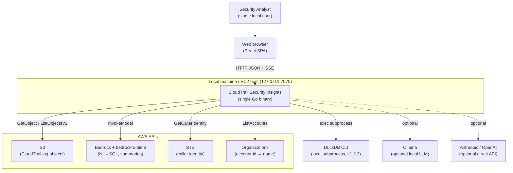
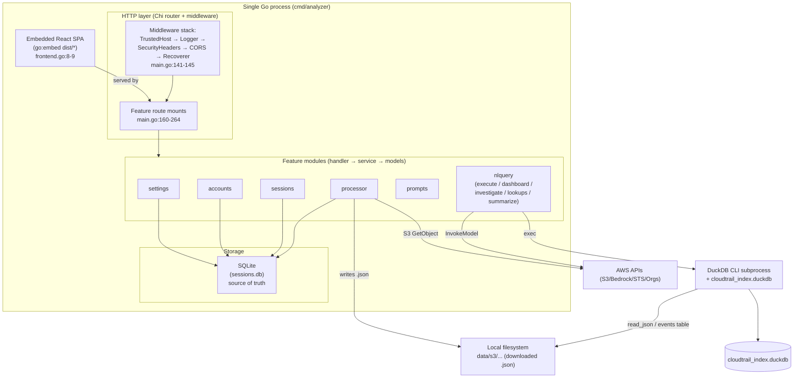
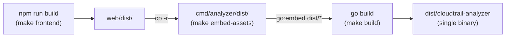
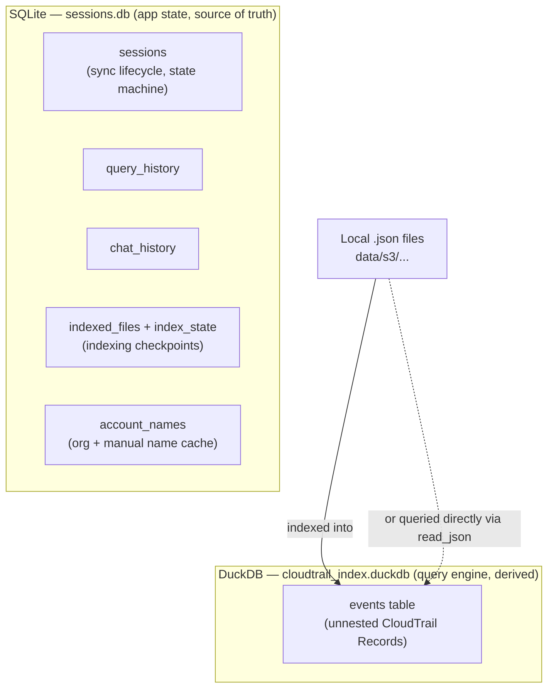
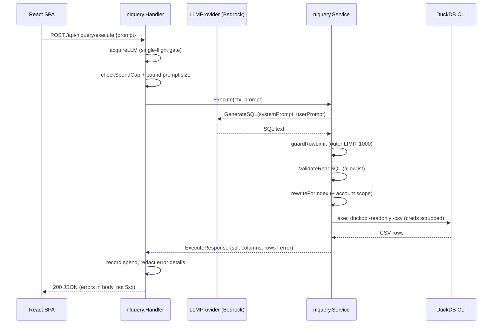
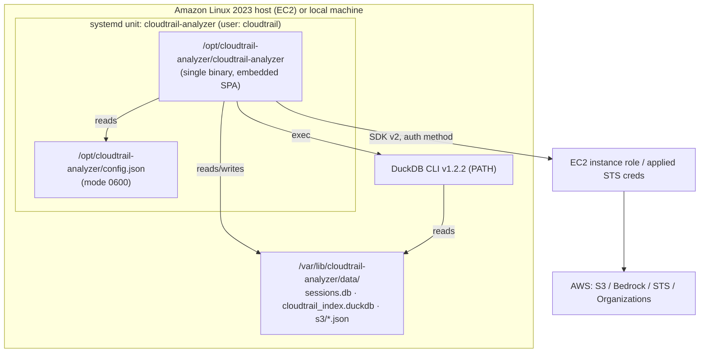

# 04 — High-Level Design

**Audience + purpose:** New engineers and open-source contributors who want a C4-style mental model of CloudTrail Security Insights — what the major subsystems are, how they connect, and how the single-binary deployment is assembled — before diving into code.

---

## Table of contents

1. [What this system is](#1-what-this-system-is)
2. [C4 Level 1 — System context](#2-c4-level-1--system-context)
3. [C4 Level 2 — Containers (single process, logical components)](#3-c4-level-2--containers-single-process-logical-components)
4. [The single-binary `go:embed` model](#4-the-single-binary-goembed-model)
5. [Storage split: SQLite vs DuckDB](#5-storage-split-sqlite-vs-duckdb)
6. [Major subsystems](#6-major-subsystems)
7. [How a request flows through the system](#7-how-a-request-flows-through-the-system)
8. [External AWS dependencies](#8-external-aws-dependencies)
9. [C4 deployment view](#9-c4-deployment-view)
10. [Cross-cutting concerns](#10-cross-cutting-concerns)
11. [Known limitations honest list](#11-known-limitations-honest-list)
12. [Where to go next](#12-where-to-go-next)

---

## 1. What this system is

CloudTrail Security Insights is a **local, single-user** tool that downloads AWS CloudTrail logs from S3, indexes them into DuckDB, and lets you query them — either with handcoded security scenarios or with natural-language questions translated to SQL by an LLM.

The whole application ships as **one Go binary** that serves both the HTTP API and an embedded React single-page app (`cmd/analyzer/frontend.go:8-9`). It binds to `127.0.0.1` by default so the tool is not reachable from the LAN unless the operator explicitly opts in (`cmd/analyzer/main.go:323-326`).

Real shape of the codebase (frozen counts, see [.ground-truth.md](.ground-truth.md)):

- **58 Go files, 13,601 LOC**, across **12 Go packages**
- **35 frontend TS/TSX files, 7,777 LOC** (React 19 + Vite + Tailwind)
- **3 SQL migrations**
- Go test coverage is uneven: strong in `internal/middleware` (81.8%) and `internal/database` (70.0%); **0%** in six packages — `cmd/analyzer`, `internal/config`, `internal/features/processor`, `internal/features/prompts`, `internal/features/sessions`, `internal/features/settings` — plus the frontend.

---

## 2. C4 Level 1 — System context

Who and what the system talks to.

Key context facts:

- The browser talks to the binary over HTTP JSON plus Server-Sent Events (SSE) for live progress (`cmd/analyzer/main.go:148-264`).
- DuckDB is **not** an in-process library here — it is the DuckDB **CLI invoked as a subprocess** with AWS credentials scrubbed from its environment (`internal/features/nlquery/subprocess.go:32-57`).
- The LLM provider is pluggable: AWS Bedrock (default), the Anthropic API, OpenAI-compatible endpoints, or local Ollama (`internal/features/nlquery/provider.go:25-41`, `provider.go:63-624`).

External AWS APIs actually called (per `go.mod` and [.ground-truth.md](.ground-truth.md)): **S3, Bedrock + bedrockruntime, STS, Organizations** (`go.mod:8-16`).

---

## 3. C4 Level 2 — Containers (single process, logical components)

Everything runs inside one OS process. "Containers" here are the logical layers within that process, not Docker containers.

Each feature module follows the same **handler → service → models** pattern described below. Handlers parse/validate HTTP and render JSON; services hold business logic; models are plain structs. The router wiring lives entirely in `main()` (`cmd/analyzer/main.go:137-264`).

For an endpoint-by-endpoint map see [07-API-FLOW.md](07-API-FLOW.md) (sibling doc); for module internals see [05-LOW-LEVEL-DESIGN.md](05-LOW-LEVEL-DESIGN.md).

---

## 4. The single-binary `go:embed` model

The production artifact is one binary with the compiled React app baked in. This avoids shipping a separate static-file server or asset bundle.

### Build-time assembly

- `make build` runs `frontend` → `embed-assets` → `go build` in order (`Makefile:22-29`).
- `embed-assets` copies `web/dist` into `cmd/analyzer/dist`, then re-touches a `.gitkeep` so the working tree stays clean (`Makefile:52-60`).
- The embed directive `//go:embed dist/*` binds those assets at compile time (`cmd/analyzer/frontend.go:8-9`).

### Runtime detection of "did the build actually embed the SPA?"

The embed directive matches at least the committed `.gitkeep`, so a build that skipped `npm run build` still compiles — it just silently produces an API-only binary. The code defends against this footgun:

- `FrontendEmbedded()` returns true only if `dist/index.html` exists in the embed (`cmd/analyzer/frontend.go:23-32`).
- At startup, if it returns false, `main()` logs a prominent warning explaining that this is expected in dev mode but a broken artifact in a production build (`cmd/analyzer/main.go:91-100`).
- The result is also surfaced in `/api/health` as `frontend_embedded` (`cmd/analyzer/main.go:148-157`).

### Two serving modes

| Mode | How the UI is served | Trigger |
|---|---|---|
| **Production** | Binary serves embedded `dist/` via `http.FileServer`, with SPA fallback to `index.html` for unknown non-`/api/` paths (`cmd/analyzer/main.go:273-305`) | `dist/index.html` present in embed |
| **Dev** | Vite dev server on `:5173` serves the UI and proxies `/api` → `:7070`; the binary serves a placeholder page (`cmd/analyzer/main.go:306-321`, `make dev` at `Makefile:12-20`) | `dist/index.html` absent |

The Vite dev proxy (`/api` → `localhost:7070`) is configured in `web/vite.config.ts` (per the `frontend-app` fact base).

---

## 5. Storage split: SQLite vs DuckDB

The system deliberately uses **two** embedded databases for two different jobs. This is one of the more important architectural choices to internalize.

| Aspect | SQLite | DuckDB |
|---|---|---|
| Role | App metadata & state — **source of truth** | Analytical query engine over event data — **derived/queryable** |
| Access | In-process driver `modernc.org/sqlite` (`go.mod:21`), opened in `internal/database/sqlite.go:22-56` | **External CLI subprocess** (`internal/features/nlquery/subprocess.go`), v1.2.2 |
| Contents | sessions, query/chat history, indexed-file checkpoints, account-name cache | `events` table built from unnested CloudTrail records, or `read_json()` directly over raw `.json` |
| Concurrency | WAL mode + foreign keys enabled (`internal/database/sqlite.go`) | Single-writer; writes serialized via `writeMu`, reads retry on lock conflict (`internal/features/nlquery/service.go:267-385`) |
| Schema evolution | 3 SQL migrations run alphabetically + defensive column backfill (`internal/database/sqlite.go:60-104`, `:117-132`) | Fixed `recordsSchema` in `indexer.go`; new CloudTrail top-level fields are dropped at index time unless schema is updated manually |

Why split this way: SQLite is great for small, transactional, frequently-mutated app state; DuckDB is purpose-built for fast analytical scans over large semi-structured JSON. Sessions and history live in SQLite precisely because DuckDB here is treated as a rebuildable, query-only store.

The SQLite schema is created by 3 migrations:
- `001_initial.sql` — `sessions`, `query_history`, `chat_history` (`migrations/001_initial.sql:1-43`)
- `002_indexed_files.sql` — `indexed_files`, singleton `index_state` (`migrations/002_indexed_files.sql:1-23`)
- `003_account_cache.sql` — `account_names` with composite PK on (account_id, source) (`migrations/003_account_cache.sql:1-13`)

See [06-DATA-FLOW.md](06-DATA-FLOW.md) for how data moves through these stores, and [05-LOW-LEVEL-DESIGN.md](05-LOW-LEVEL-DESIGN.md) for per-table schema details.

---

## 6. Major subsystems

### processor — download & extract pipeline

Downloads CloudTrail `.json.gz` objects from S3, extracts them to `.json`, verifies them, and updates the session state machine. Download and extract are **pipelined** in the same worker goroutines to eliminate idle time (`internal/features/processor/service.go:286`). Defenses:

- Path-traversal (zip-slip) guard at the single write chokepoint (`internal/features/processor/downloader.go:172`, `:250`).
- Decompression-bomb limits: 256 MB per file, 4 GB per run (`internal/features/processor/extractor.go:111`).
- Resume is idempotent at multiple levels (skip if `.json` exists, skip `.gz` if already on disk with matching size).

Progress is streamed to the UI over SSE (`internal/features/processor/handler.go:124`) with a REST snapshot fallback (`handler.go:100`).

### nlquery — the query brain

The largest subsystem. It generates SQL from natural language, executes it against DuckDB, and powers the analytical surfaces:

- **Execute** — free-form NL → LLM → SQL → DuckDB (`internal/features/nlquery/service.go:82`, `handler.go:380`).
- **Dashboard** — 7 parallel hardcoded panels (`internal/features/nlquery/dashboard.go:15`).
- **Findings** — 18 hardcoded security checks, each a summary + detail query (`internal/features/nlquery/findings.go:28`).
- **Investigate** — 40 handcoded parameterized scenarios (`internal/features/nlquery/investigate.go:99-170`).
- **Lookups** — autocomplete sources for the toolbar (`internal/features/nlquery/lookups.go:12`).
- **Summarize** — LLM summary of result rows with a hallucination validator (`internal/features/nlquery/summarize.go:134`, `:291`).

Cross-cutting safety in nlquery: an SQL allowlist (`ValidateReadSQL`, `safesql.go:65-112`), SQL-literal escaping for all config-derived path interpolation (`safesql.go:167-182`), a single-flight LLM concurrency gate, and a per-session spend cap (`handler.go:84`, `:102`). See [10-SECURITY.md](10-SECURITY.md) for the full posture.

### sessions / settings / accounts / prompts — supporting modules

- **sessions** — session lifecycle CRUD over SQLite; a 9-state machine (`pending`, `downloading`, `extracting`, `verifying`, `query-ready`, `partially-verified`, `failed`, `interrupted`, `deleted`) typically running `pending` → `query-ready`/`failed` (`internal/features/sessions/models.go:8-18`, `service.go:32-99`).
- **settings** — config get/update, credential resolution across 4 auth methods, bucket/structure/region discovery, Bedrock model listing (`internal/features/settings/service.go:27-36`).
- **accounts** — resolves 12-digit account IDs to friendly names with read-time precedence `manual > org > unresolved`, plus permanent-vs-transient failure handling for the Organizations API (`internal/features/accounts/resolver.go:51-82`, `:375-449`).
- **prompts** — 38 pre-built investigation templates and the system prompt with `{placeholder}` substitution (`internal/features/prompts/templates.go:26-358`, `system_prompt.go:5-104`).

### Cross-module wiring via callbacks

The processor and nlquery indexer are decoupled through callbacks set in `main()`: `OnFileExtracted` feeds the micro-batch indexer, and `OnSyncComplete` flushes the buffer and creates B-tree indexes on `eventName`, `eventSource`, `errorCode` (`cmd/analyzer/main.go:230-249`). This is how data becomes queryable within seconds of extraction starting.

---

## 7. How a request flows through the system

### Natural-language query (the headline path)

Note the deliberate design: query failures return **HTTP 200** with `error`/`error_hint`/`error_detail` fields populated, not a 5xx (`internal/features/nlquery/service.go:82-116`, `handler.go:380-447`).

### S3 sync (background pipeline with live progress)

`POST /api/sessions/{id}/process` returns **202 Accepted** immediately and runs the pipeline in a detached goroutine; the UI watches `GET /api/sessions/{id}/progress` over SSE (`internal/features/processor/handler.go:35`, `:124`). On `SIGINT`/`SIGTERM`, `main()` cancels active pipelines **before** `server.Shutdown` so SSE readers unblock instead of hanging for the full timeout (`cmd/analyzer/main.go:357-373`).

---

## 8. External AWS dependencies

All AWS access uses **AWS SDK for Go v2** (`go.mod:8-16`). Credentials resolve through one of four auth methods selected in config: `imds`, `session_credentials`, `sso`, or `static` (`internal/features/settings/service.go:49-87`; mirrored in the processor at `internal/features/processor/service.go:595`).

| AWS API | SDK package (`go.mod`) | Used for |
|---|---|---|
| S3 | `service/s3 v1.100.1` (`go.mod:14`) | List + download CloudTrail objects; bucket/structure discovery |
| Bedrock runtime | `service/bedrockruntime v1.50.6` (`go.mod:12`) | `InvokeModel` for NL→SQL and summaries (default model Claude Sonnet 4) |
| Bedrock (control plane) | `service/bedrock v1.60.0` (`go.mod:11`) | List foundation models + inference profiles for the model picker |
| STS | `service/sts v1.42.1` (`go.mod:15`) | `GetCallerIdentity` for the account/identity display |
| Organizations | `service/organizations v1.51.3` (`go.mod:13`) | `ListAccounts` to resolve account-id → name |

Operational note from [.ground-truth.md](.ground-truth.md): a log-archive role often **lacks** `organizations:ListAccounts`, so the accounts resolver falls back to manual name overrides — this is expected and handled gracefully (`internal/features/accounts/resolver.go:101-138`), not a bug.

DuckDB CLI is downloaded at install time (deploy.sh) or auto-installed on first run (opt-in) from GitHub releases **v1.2.2**, with the download SHA-256-verified before extraction (`internal/startup/validator.go:222-279`, `:359-451`).

---

## 9. C4 deployment view

The reference deployment is `deploy.sh` → systemd on Amazon Linux 2023 (`deploy.sh:1-478`).

Deployment facts (all from `deploy.sh`):

- Idempotent installer pins **Go 1.26.4**, **Node 20**, **DuckDB 1.2.2** — Go and DuckDB downloads are SHA-256-verified (`deploy.sh:29-32`, `:197-200`). The Go version must match the `go.mod` toolchain pin (`go.mod:5`) or the build can silently download a different toolchain.
- Builds the frontend and Go binary, installs to `/opt/cloudtrail-analyzer`, data dir `/var/lib/cloudtrail-analyzer/data`, runs as a dedicated `cloudtrail` user under systemd.
- The rsync to the deploy dir excludes `config.json`, `.env`, `.aws`, `.git`, credentials, and `*.db` so an operator's local secrets do not leak into the deployed tree (`deploy.sh:268-287`).
- `make build-all` cross-compiles for both `linux/arm64` (Graviton) and `linux/amd64` (`Makefile:31-40`).

For the versioned build/runtime stack behind this deployment see [08-TECH-STACK.md](08-TECH-STACK.md).

---

## 10. Cross-cutting concerns

These apply across the subsystems; they are summarized here and detailed in [10-SECURITY.md](10-SECURITY.md).

- **Bind to localhost by default** — server listens on `cfg.Host` (default `127.0.0.1`) (`cmd/analyzer/main.go:323-326`).
- **DNS-rebinding defense** — `TrustedHost` middleware runs **first** and rejects any request whose `Host` header is not in the allowlist (`internal/middleware/trustedhost.go:21-39`, `internal/config/config.go:58-96`).
- **Defensive HTTP headers** — `nosniff`, `X-Frame-Options: DENY`, `no-referrer`. CSP is intentionally omitted because the React bundle uses inline styles (`internal/middleware/logging.go:109-117`).
- **Strict JSON decoding** — 1 MiB body cap, unknown-field rejection (`internal/render/decode.go:30-57`).
- **Credential scrubbing for subprocesses** — AWS credential env vars are stripped before spawning DuckDB/Ollama (`internal/features/nlquery/subprocess.go:32-57`).
- **Paid-API guardrails** — single-flight LLM gate plus per-session spend cap on `nlquery` (`internal/features/nlquery/handler.go:84`, `:102`).
- **Structured logging + panic recovery** — JSON slog and a `Recoverer` that turns panics into 500s (`internal/middleware/logging.go:57-73`, `:122-150`).

---

## 11. Known limitations (honest list)

Stated plainly so contributors aren't surprised:

- **Test coverage is thin in places.** Six packages and the entire frontend sit at **0%** (see [.ground-truth.md](.ground-truth.md)) — including `cmd/analyzer`, `processor`, `sessions`, and `settings`. The frontend has a vitest config but **0 test files**.
- **DuckDB is a subprocess, not a library.** Every query pays process-spawn cost and depends on the CLI being on `PATH` at the pinned version (1.2.2).
- **No multi-user model.** Spend tracking is in-process and resets on restart; there is no authentication on the API beyond localhost binding and `TrustedHost` (`internal/features/nlquery/session_spend.go:12-81`).
- **Index schema is partly hardcoded.** New CloudTrail top-level fields are silently dropped at index time until `recordsSchema` is updated by hand.
- **Off-hours UBA finding is hardcoded to UTC 00:00–06:59** with no per-org timezone config (`internal/features/nlquery/findings.go`).
- **2 Critical security findings are tracked** in `reports/2026-06-24-comprehensive/` (a `read_json` file-read and a `CreateSession os.RemoveAll` directory delete) — this doc records posture only; see [10-SECURITY.md](10-SECURITY.md).

---

## 12. Where to go next

- [01-REQUIREMENTS.md](01-REQUIREMENTS.md) — what the system is supposed to do
- [05-LOW-LEVEL-DESIGN.md](05-LOW-LEVEL-DESIGN.md) — inside each feature module + per-table schemas
- [06-DATA-FLOW.md](06-DATA-FLOW.md) — how a CloudTrail event moves from S3 to a query result
- [07-API-FLOW.md](07-API-FLOW.md) — AWS APIs called and HTTP API exposed, endpoint by endpoint
- [08-TECH-STACK.md](08-TECH-STACK.md) — versioned build/runtime stack behind the deployment
- [09-TEST-COVERAGE.md](09-TEST-COVERAGE.md) — file-level test coverage and gaps
- [10-SECURITY.md](10-SECURITY.md) — full security posture and findings
