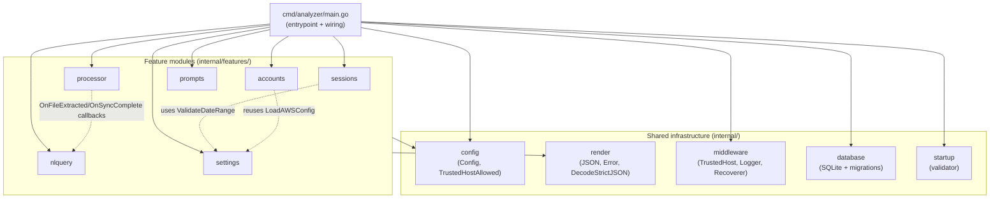
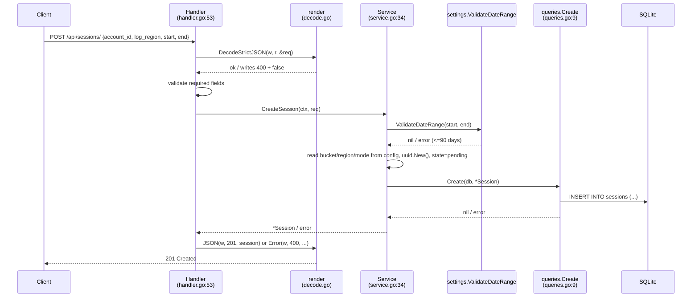
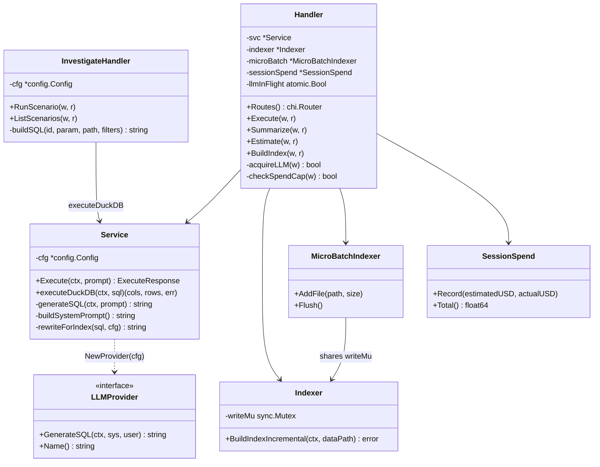
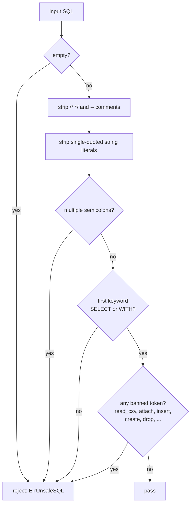
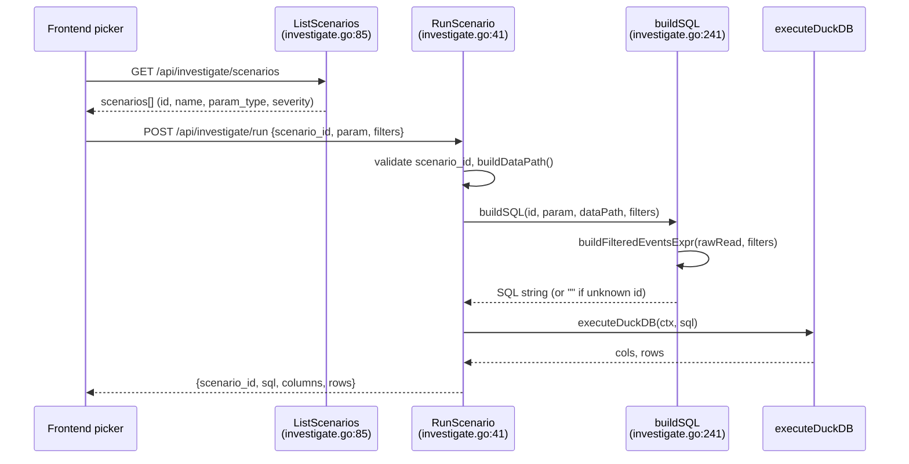
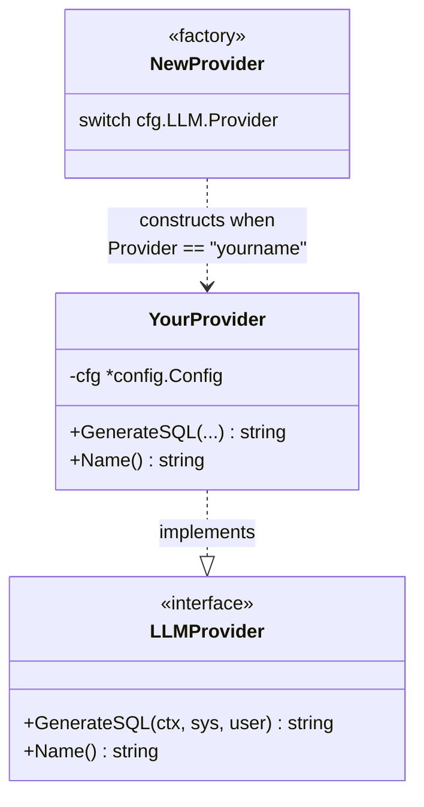

# 05 — Low-Level Design

> **Audience + purpose:** New engineers and open-source contributors who want to read or extend the code. This document goes one level below [04-HIGH-LEVEL-DESIGN.md](04-HIGH-LEVEL-DESIGN.md): it covers per-package internals, the key Go interfaces and contracts, the `handler → service → models` pattern, and two concrete "how to extend" walkthroughs grounded in real code (`file:line`). All claims are cited against source; where the upstream fact base disagreed with the code, the code wins and the discrepancy is flagged.

## Table of contents

1. [Package map and the feature-module pattern](#1-package-map-and-the-feature-module-pattern)
2. [The handler → service → models contract](#2-the-handler--service--models-contract)
3. [Shared infrastructure packages](#3-shared-infrastructure-packages)
4. [The `nlquery` package internals](#4-the-nlquery-package-internals)
5. [The `LLMProvider` interface](#5-the-llmprovider-interface)
6. [Defense-in-depth: SQL safety contract](#6-defense-in-depth-sql-safety-contract)
7. [Walkthrough: add a new Investigate scenario](#7-walkthrough-add-a-new-investigate-scenario)
8. [Walkthrough: add a new LLM provider](#8-walkthrough-add-a-new-llm-provider)
9. [Cross-cutting contracts and gotchas](#9-cross-cutting-contracts-and-gotchas)
10. [Sibling documents](#10-sibling-documents)

---

## 1. Package map and the feature-module pattern

The backend is one Go module (`cloudtrail-analyzer`, see `go.mod:1`) split into 12 packages (per [`.ground-truth.md`](.ground-truth.md) — 58 Go files, 13,601 LOC). Packages fall into two groups: **shared infrastructure** under `internal/` and **feature modules** under `internal/features/`.



Each feature module follows the same three-file shape:

| File | Role | Example |
|---|---|---|
| `handler.go` | HTTP layer — decode request, validate shape, call service, render response. Holds no business logic. | `internal/features/sessions/handler.go:14` |
| `service.go` | Business logic — orchestrates queries, filesystem, AWS calls. Stateful (holds `*sql.DB`, `*config.Config`). | `internal/features/sessions/service.go:18` |
| `models.go` (+ `queries.go`) | Domain types and SQL data access. Plain structs with JSON tags; pure functions. | `internal/features/sessions/models.go:20`, `internal/features/sessions/queries.go:9` |

The wiring happens centrally in `main()` (`cmd/analyzer/main.go:32-376`), which constructs each handler, mounts its routes on the Chi router, and connects cross-module callbacks. Feature packages do **not** import each other's `handler` types; coupling is limited to (a) reusing a service function (e.g. `accounts` reuses `settings.LoadAWSConfig`) or (b) callbacks wired in `main`.

---

## 2. The handler → service → models contract

The clearest small example of the pattern is the `sessions` package. Trace a session create through all three layers:



Key contracts visible in this flow:

- **Handlers do not touch the database directly.** `CreateSession` handler (`internal/features/sessions/handler.go:53-94`) only decodes, validates the four required fields, and delegates to `Service.CreateSession` (`internal/features/sessions/service.go:34-99`).
- **The service owns config reads.** Bucket, region, and mode are *not* in the request body — they are read from saved config at creation time (`internal/features/sessions/service.go:32-99`; see also `CreateSessionRequest` having only 5 fields, `internal/features/sessions/models.go:40-48`).
- **Queries are pure SQL helpers.** `queries.Create` (`internal/features/sessions/queries.go:9-36`) formats timestamps as RFC3339 UTC and runs one `INSERT`. The scan/parse helpers (`scanSession`, `parseSessionTime` at `internal/features/sessions/queries.go:146-183`) tolerate both RFC3339 (written by Go) and SQLite's default `YYYY-MM-DD HH:MM:SS` format.

> **Note on state transitions:** Nine session states are defined (`internal/features/sessions/models.go:5-18`). The pipeline's actual happy-path transitions are `pending → downloading → verifying → query-ready` (`internal/features/processor/service.go:152`, `:228`, `:253`). `extracting` is defined but is **not set** as a live transition by the current pipeline — extraction runs inline within the download phase, and `StateExtracting` is only swept defensively at startup by `MarkInterrupted` (`internal/features/sessions/queries.go:127-144`). The state machine is **not enforced**: any caller can invoke `UpdateState` (`internal/features/sessions/queries.go:88-102`) directly, so transition correctness is the caller's responsibility.

---

## 3. Shared infrastructure packages

These packages have no business logic; they are the spine every feature module leans on.

### `render` — the response contract

Every handler emits responses through three functions, so the wire format is uniform:

- `render.JSON(w, status, data)` (`internal/render/render.go:18-24`) — success responses.
- `render.Error(w, status, code, message, details)` (`internal/render/render.go:28-40`) — error responses serialized as the `APIError` schema (`internal/render/render.go:10-15`): machine `Code`, human `Message`, optional structured `Details`.
- `render.DecodeStrictJSON(w, r, out)` (`internal/render/decode.go:30-57`) — the **input gate** for every `POST`/`PUT`. It requires `Content-Type: application/json`, caps the body at 1 MiB (`MaxRequestBodyBytes`, `internal/render/decode.go:16`), disallows unknown fields, and rejects trailing junk. It returns `bool` — `false` means an error was already written, so the canonical handler line is `if !render.DecodeStrictJSON(w, r, &req) { return }` (e.g. `internal/features/nlquery/investigate.go:43`).

`render.IsValidUUID(s)` (`internal/render/decode.go:23-25`) validates path-param IDs before any DB lookup (used for session IDs throughout the `sessions` and `processor` handlers).

### `middleware` — the request pipeline

`main` mounts the middleware stack in a specific order (`cmd/analyzer/main.go:137-145`):

```
TrustedHost → StructuredLogger → SecurityHeaders → CORS → Recoverer
```

- `TrustedHost` (`internal/middleware/trustedhost.go:21-39`) runs **first** — it rejects DNS-rebinding by validating the `Host` header against `config.TrustedHostAllowed` (`internal/config/config.go:58-96`), returning 403 before any handler runs.
- `StructuredLogger` (`internal/middleware/logging.go:57-73`) wraps the `ResponseWriter` in a `responseWriter` (`internal/middleware/logging.go:16-44`) to capture the status code. **Important contract:** this wrapper implements `http.Flusher` (`internal/middleware/logging.go:48-52`) so Server-Sent Events still stream — a wrapper that omits `Flush()` silently breaks SSE.
- `Recoverer` (`internal/middleware/logging.go:122-150`) converts panics into 500 JSON errors and logs the stack with the request ID.

### `config` — three-tier load + security helpers

`LoadConfig()` (`internal/config/config.go:230-269`) layers: defaults (`DefaultConfig`, `internal/config/config.go:192-221`) → `config.json` file (created on first run) → environment overrides (via `envconfig`) → validation. `SaveConfig` (`internal/config/config.go:271-293`) writes back with mode `0600`. The `Config` struct (`internal/config/config.go:22-52`) is the single shared type passed to every handler.

### `database` — SQLite + migrations

`NewDB(dataDir)` (`internal/database/sqlite.go:22-56`) opens `{dataDir}/sessions.db`, enables WAL mode and foreign keys, and pings. `RunMigrations()` (`internal/database/sqlite.go:60-104`) executes `migrations/*.sql` alphabetically (all idempotent with `IF NOT EXISTS`), then `ensureSessionColumns()` (`internal/database/sqlite.go:117-132`) backfills columns added in later schema versions, ignoring "duplicate column" errors. There are 3 migrations (`migrations/001_initial.sql`, `002_indexed_files.sql`, `003_account_cache.sql`).

> **Architectural choice:** SQLite is the source of truth for session state, query history, indexed-file checkpoints, and the account-name cache. DuckDB is query-only over the CloudTrail JSON. See [04-HIGH-LEVEL-DESIGN.md](04-HIGH-LEVEL-DESIGN.md) for the rationale.

---

## 4. The `nlquery` package internals

`nlquery` is the largest and most intricate package. It does five distinct things, all on top of one DuckDB-subprocess execution path:



### The single execution chokepoint: `executeDuckDB`

Every read path — free-form NLQ, the 7 dashboard panels, the 18 findings, the 40 investigate scenarios, and the 5 lookups — converges on `Service.executeDuckDB` (`internal/features/nlquery/service.go:267-385`). Its contract:

1. **Validate** the SQL via `ValidateReadSQL` (`internal/features/nlquery/safesql.go:65-112`) — see §6.
2. **Rewrite for index** via `rewriteForIndex` (`internal/features/nlquery/service.go:146-185`) when a prebuilt DuckDB index exists, re-applying account scope (the H5 cross-account guard).
3. **Run** `duckdb -nullvalue <sentinel> -csv` as a subprocess (the `-readonly` flag is added only when querying the prebuilt index file; the `:memory:` path runs without it), with the AWS-credential environment stripped via `scrubbedEnv()` (`internal/features/nlquery/subprocess.go:32-57`).
4. **Retry** up to 5 times at 400 ms on DuckDB lock conflicts (when a concurrent index build holds the file).
5. **Parse** CSV and map the NULL sentinel back to Go `nil`.

### The free-form NLQ path

`Service.Execute` (`internal/features/nlquery/service.go:82-116`):

```
generateSQL (LLM)  →  guardRowLimit (outer LIMIT 1000)  →  executeDuckDB  →  classifyDuckDBError
```

- `generateSQL` (`internal/features/nlquery/service.go:118-133`) builds the system prompt (`buildSystemPrompt`, `internal/features/nlquery/service.go:415-474`), instantiates a provider via `NewProvider`, calls `GenerateSQL`, and strips code fences.
- `guardRowLimit` (`internal/features/nlquery/service.go:251-265`) wraps the LLM output in `SELECT * FROM (<query>) LIMIT 1000` so a hallucinated missing `LIMIT` cannot stream unbounded rows.
- `classifyDuckDBError` (`internal/features/nlquery/service.go:391-413`) turns DuckDB stderr into a user-facing hint + raw detail.

The HTTP wrapper `Handler.Execute` (`internal/features/nlquery/handler.go:380-447`) layers the operational guards before the service ever runs: `acquireLLM` (single-flight, `internal/features/nlquery/handler.go:84-91`), `checkSpendCap` (`internal/features/nlquery/handler.go:102-127`), a `MaxPromptChars = 8000` bound (`internal/features/nlquery/handler.go:75`), a pre-flight `EstimateCost`, `SessionSpend.Record`, and `redactErrorString` on the way out.

> **Contract surprise — errors are 200 OK:** `ExecuteResponse` (`internal/features/nlquery/handler.go:371-378`) surfaces query failures in `error`/`error_hint`/`error_detail` fields with HTTP 200; it does **not** return 4xx/5xx for a failed *query*. Operational failures do return error codes: a busy LLM slot and a reached spend cap return **429** (`acquireLLM`/`checkSpendCap`), while an oversized prompt returns **413** (`MaxPromptChars` guard, `internal/features/nlquery/handler.go:405-409`).

---

## 5. The `LLMProvider` interface

The provider abstraction is the cleanest extension seam in the codebase. The interface is two methods (`internal/features/nlquery/provider.go:25-28`):

```go
type LLMProvider interface {
    GenerateSQL(ctx context.Context, systemPrompt, userPrompt string) (string, error)
    Name() string
}
```

The factory `NewProvider(cfg)` (`internal/features/nlquery/provider.go:30-41`) switches on `cfg.LLM.Provider` and defaults to Bedrock:

| `cfg.LLM.Provider` value | Implementation | Location | Default model |
|---|---|---|---|
| `"anthropic"` | `AnthropicProvider` | `internal/features/nlquery/provider.go:216-282` | `claude-sonnet-4-20250514` |
| `"openai"` | `OpenAIProvider` | `internal/features/nlquery/provider.go:286-350` | `gpt-4o` |
| `"ollama"` | `OllamaProvider` | `internal/features/nlquery/provider.go:354-625` | `codellama:7b` (free, local) |
| anything else (default) | `BedrockProvider` | `internal/features/nlquery/provider.go:63-212` | `us.anthropic.claude-sonnet-4-20250514-v1:0` (`provider.go:89`) |

Notable per-provider behaviors verified in source:

- **Bedrock** sends the Anthropic Messages format (`anthropic_version: bedrock-2023-05-31`, `max_tokens: 2048`, `internal/features/nlquery/provider.go:77-90`) and maps 7 AWS error substrings across 5 remediation branches to actionable hints — expired token, `AccessDenied`/`not authorized`, `ResourceNotFoundException`, `ThrottlingException`/`TooManyRequests`, and the on-demand-vs-CRIS case that suggests a `us.`/`eu.`/`apac.`-prefixed model id (`internal/features/nlquery/provider.go:98-128`).
- **HTTP providers** (Anthropic/OpenAI/Ollama) share a bounded client timeout via `llmHTTPTimeout(cfg)` (`internal/features/nlquery/provider.go:51-59`) — a 120 s floor, raised only if `QueryTimeoutSeconds` exceeds it. The comment explains the floor protects the single-flight slot from a wedged endpoint.
- **Ollama** can auto-install on first use, but only when the operator opts in via `AllowAutoInstall` (off by default; see `ensureRunning`, `internal/features/nlquery/provider.go:413-467`). On Linux it downloads `install.sh` to a temp file and runs `sh <file>` rather than piping curl-to-shell (a supply-chain hardening choice, `internal/features/nlquery/provider.go:520-577`); on macOS it uses Homebrew. The subprocess environment is credential-scrubbed (N23). Ollama is exempt from the spend cap (`checkSpendCap` returns early for `"ollama"`, `internal/features/nlquery/handler.go:103-106`).

---

## 6. Defense-in-depth: SQL safety contract

Two layers protect the DuckDB subprocess. Both live in `safesql.go`.

**Layer 1 — string injection defense (interpolation-time).** Any config-derived value (S3 bucket, account ID, org ID, data dir, scenario param) that goes into a `read_json('...')` literal or an `IN (...)` list is escaped first:

- `escapeSQLLiteral(s)` (`internal/features/nlquery/safesql.go:173`) doubles embedded single quotes.
- `quoteSQLLiteral(s)` (`internal/features/nlquery/safesql.go:180`) wraps in quotes and escapes. Used for account-ID lists and scenario params.

This is the "H6" pattern referenced throughout: escape once per path in `buildDataPath`/`buildFilteredEventsExpr`/lookups so a stray quote in any config value cannot break out.

**Layer 2 — read-only allowlist (execution-time).** `ValidateReadSQL(sql)` (`internal/features/nlquery/safesql.go:65-112`) is the gate at the top of `executeDuckDB`. It is pattern-based (no parsing):



Free-form NLQ and the LLM-summary path are the only callers that depend on this gate to catch a hostile model; the handcoded dashboard/findings/investigate SQL is generated by trusted code but still passes through it (defense in depth).

---

## 7. Walkthrough: add a new Investigate scenario

Investigate scenarios are the easiest user-facing feature to extend because each one is a self-contained, handcoded SQL template that does **not** call the LLM. Everything lives in `internal/features/nlquery/investigate.go`.

> **Verified count correction:** the source defines **40** scenarios, not the "28" the upstream fact base reported. `grep -c '{ID: "'` and `grep -c 'case "'` both return 40 against `investigate.go`, and the two lists are kept in lockstep. Use 40.

### The two registries you must keep in sync

A scenario exists in two places that must agree on the ID:

1. The **metadata registry** `scenarios []Scenario` (`internal/features/nlquery/investigate.go:99-170`) — drives the frontend picker (name, category, description, `ParamType`, severity).
2. The **SQL dispatch** `buildSQL`'s `switch scenarioID` (`internal/features/nlquery/investigate.go:257`) — maps the ID to a SQL string.



### Step-by-step

**Step 1 — add the metadata entry.** Append to the `scenarios` slice (`internal/features/nlquery/investigate.go:99-170`). Match the field shape of `Scenario` (`internal/features/nlquery/investigate.go:89-97`). For a parameter-less finding, copy the shape of `iam-write-ops` (`internal/features/nlquery/investigate.go:101`):

```go
{ID: "kms-key-deleted", Name: "KMS Keys Scheduled for Deletion", Category: "Impact",
 Description: "ScheduleKeyDeletion events — pending destruction of encryption keys",
 ParamType: "none", Severity: "CRITICAL"},
```

If your scenario takes a parameter, set `ParamType` to one of the supported values from the `Scenario.ParamType` comment (`internal/features/nlquery/investigate.go:94`): `"none"`, `"access_key"`, `"ip"`, `"account"`, `"identity"`, `"role"`, and add a `ParamLabel`.

**Step 2 — add the SQL case.** Add a `case "kms-key-deleted":` branch inside `buildSQL` (`internal/features/nlquery/investigate.go:257`). Build every scenario query `FROM %s` where `%s` is the pre-built `events` table-expression — that gives you the toolbar's time-window and account filters for free, via `buildFilteredEventsExpr` (`internal/features/nlquery/investigate.go:193-223`). Copy the structure of `iam-users-created` (`internal/features/nlquery/investigate.go:264-265`):

```go
case "kms-key-deleted":
    return fmt.Sprintf(`SELECT r.userIdentity.arn as actor, r.recipientAccountId as account, `+
        `r.sourceIPAddress, r.eventTime, r.errorCode FROM %s `+
        `WHERE r.eventName = 'ScheduleKeyDeletion' ORDER BY r.eventTime DESC LIMIT 100;`, events)
```

**Contract rules for the SQL string (all observed in the existing 40 cases):**
- Reference the unnested record alias `r` (e.g. `r.eventName`, `r.userIdentity.arn`).
- If you interpolate the user `param`, use the pre-escaped `safeParam` local (`internal/features/nlquery/investigate.go:255`) — not the raw `param`. See `iam-read-by-key` (`internal/features/nlquery/investigate.go:262`) for the pattern.
- Keep the trailing `LIMIT 100;` — scenarios are intentionally bounded and not parameterized for result count.
- The query must pass `ValidateReadSQL` (start with `SELECT`/`WITH`, no banned tokens). Hardcoded scenario SQL still goes through the gate at `executeDuckDB`.

**Step 3 — build and test.** Run `make build` and `make test` (`Makefile`). There is no scenario-specific unit test today (`internal/features/nlquery` is at 31.8% coverage per [`.ground-truth.md`](.ground-truth.md)), so verify by running the app (`make dev`) and exercising the scenario in the Investigate view, or by `POST /api/investigate/run` directly.

> **What you do NOT need to touch:** routing (`/api/investigate/run` and `/scenarios` are already mounted in `main`), the execution path, filter handling, or the frontend list rendering — the picker is data-driven off `ListScenarios`.

---

## 8. Walkthrough: add a new LLM provider

Adding a provider is a self-contained change in `internal/features/nlquery/provider.go`. The seam is the `LLMProvider` interface (§5). Use `OpenAIProvider` (`internal/features/nlquery/provider.go:286-350`) as the reference because it is an HTTP-based provider with an API key and a configurable model — the most common new-provider shape.



**Step 1 — define the struct and implement the interface.** Add a struct holding `cfg *config.Config` and the two methods:

```go
type MyProvider struct{ cfg *config.Config }

func (p *MyProvider) Name() string { return "myprovider" }

func (p *MyProvider) GenerateSQL(ctx context.Context, systemPrompt, userPrompt string) (string, error) {
    // POST to your endpoint; return the raw SQL text or an error with a remediation hint.
}
```

**Step 2 — reuse the shared HTTP timeout.** For an HTTP provider, build your `http.Client` with `Timeout: llmHTTPTimeout(p.cfg)` (`internal/features/nlquery/provider.go:51-59`) exactly as the existing HTTP providers do. This keeps a wedged endpoint from holding the single-flight LLM slot open and 429-blocking every subsequent query.

**Step 3 — register in the factory.** Add a `case` to `NewProvider` (`internal/features/nlquery/provider.go:30-41`):

```go
case "myprovider":
    return &MyProvider{cfg: cfg}
```

**Step 4 — wire pricing (so cost estimation/spend cap work).** Paid providers are subject to `checkSpendCap` and pre-flight `EstimateCost`. Cost lookup flows through `LookupRate` (`internal/features/nlquery/pricing.go:78-125`), which checks user overrides, then a built-in `defaultRates` map, then a fallback. To get an accurate (non-fallback) estimate, add your model's input/output rates to `defaultRates`. If you skip this, your provider still works but will be priced at the fallback Sonnet-4 rate. If your provider is genuinely free (like Ollama), exempt it in `checkSpendCap` (`internal/features/nlquery/handler.go:103-106`).

**Step 5 — surface remediation hints.** Follow the Bedrock precedent (`internal/features/nlquery/provider.go:98-120`): catch the common error strings (auth failure, throttle, unknown model) and return errors with concrete "go to Settings → … and do X" guidance. These bubble up through `Execute` to the UI.

**Step 6 — build and test.** `make build && make test`. Verify by setting `cfg.LLM.Provider = "myprovider"` and running an NLQ via the LLM Config view's test harness (`web/src/features/settings/LLMConfigView.tsx`), which calls `/api/nlquery/execute` with a sample prompt.

> **What you do NOT need to touch:** the concurrency gate, spend cap, prompt building, SQL validation, or DuckDB execution — those are provider-agnostic and sit above/below the `LLMProvider.GenerateSQL` call in `generateSQL` (`internal/features/nlquery/service.go:118-133`).

---

## 9. Cross-cutting contracts and gotchas

These are recurring rules that span packages — internalize them before editing:

1. **Custom `ResponseWriter` wrappers must implement `http.Flusher`.** The logging middleware's `responseWriter` does (`internal/middleware/logging.go:48-52`). A wrapper that omits `Flush()` silently breaks every SSE endpoint (`/api/sessions/{id}/progress`, `/api/nlquery/index/progress`), because `Unwrap()` does not traverse for type assertions.

2. **Server `WriteTimeout` is 0 (disabled) on purpose.** SSE streams can run ~a minute on large datasets, so handlers manage their own deadlines via `http.ResponseController` rather than relying on a server-level write timeout (`cmd/analyzer/main.go:326-338`).

3. **AWS credentials are scrubbed from subprocesses.** `scrubbedEnv()` (`internal/features/nlquery/subprocess.go:32-57`) strips `AWS_ACCESS_KEY_ID`, `AWS_SECRET_ACCESS_KEY`, `AWS_SESSION_TOKEN`, `AWS_PROFILE`, and related vars before launching DuckDB or Ollama, while preserving `AWS_REGION`.

4. **`maxObjectSize` (DuckDB read buffer, 256 MB) and the processor's `maxPerFileBytes` (256 MB) must stay synchronized.** They are intentionally equal; raising one without the other can let a file extract that DuckDB then cannot read. See the processor comment at `internal/features/processor/extractor.go:16-25`.

5. **Path-traversal guards exist at two write chokepoints.** Downloads route through `downloadSingleFile` → `hasUnsafeKeySegment` (zip-slip guard, rejects `..` and `/`-prefixed keys; `internal/features/processor/downloader.go:172`, `:250`). Settings inputs route through `isSafePathSegment` (`internal/features/settings/handler.go:600-616`).

6. **Two known Critical security findings sit outside the slices above** (per [`.ground-truth.md`](.ground-truth.md) and tracked in `reports/2026-06-24-comprehensive/`): `read_json` file read, and `CreateSession`'s `os.RemoveAll` directory delete. See [10-SECURITY.md](10-SECURITY.md) for the documented posture; this design doc records the mechanism, not a fix.

7. **Test coverage is uneven and low in the feature layer.** Per [`.ground-truth.md`](.ground-truth.md): `internal/middleware` 81.8%, `internal/database` 70.0%, `internal/features/nlquery` 31.8%, `internal/features/accounts` 31.5%, and **0%** for `processor`, `sessions`, `settings`, `prompts`, `config`, `cmd/analyzer`, and the entire frontend. New feature code is currently shipped without unit tests by precedent — adding tests for your change is a real improvement, not a baseline.

---

## 10. Sibling documents

- [04-HIGH-LEVEL-DESIGN.md](04-HIGH-LEVEL-DESIGN.md) — system-level architecture, data flow, and the SQLite-vs-DuckDB split.
- [10-SECURITY.md](10-SECURITY.md) — security posture, the SQL-safety model in context, and the open findings.
- [`.ground-truth.md`](.ground-truth.md) — frozen counts, coverage, routes, and dependencies (the numeric source of truth used throughout this doc).
