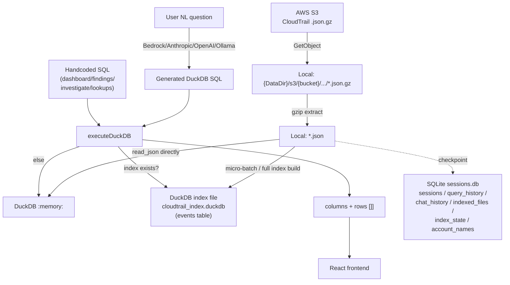
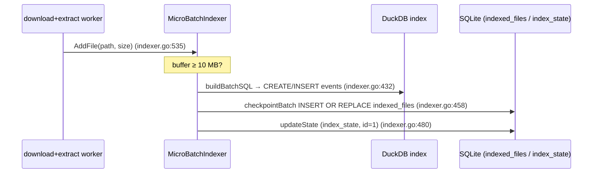
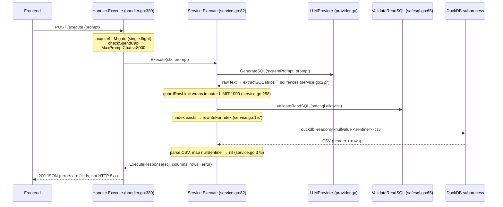
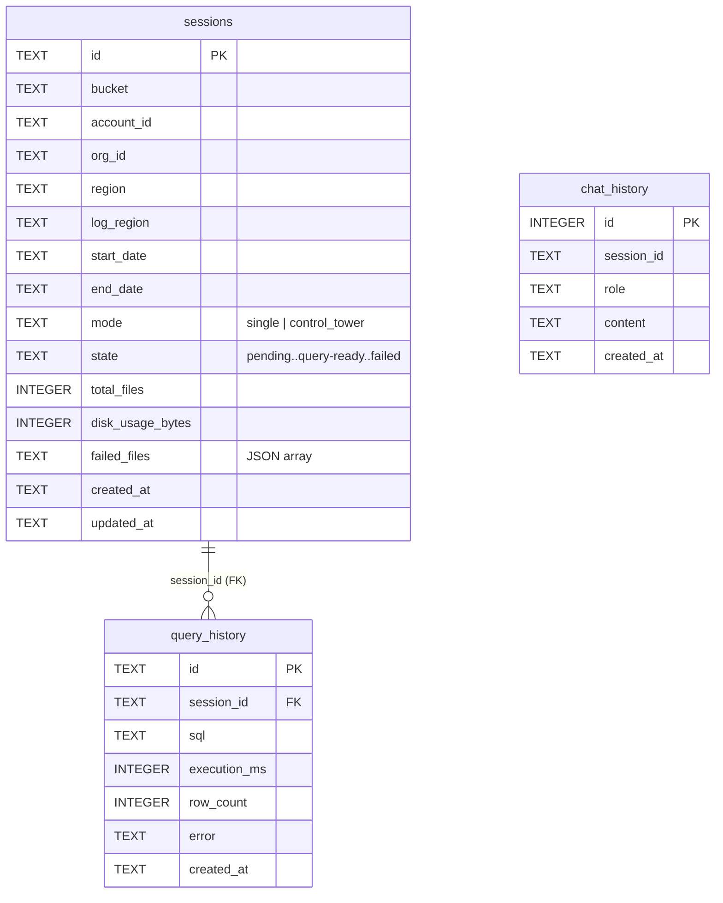

# 06 — Data Flow

**Audience + purpose:** New engineers and open-source contributors who need to follow a CloudTrail event from raw S3 object all the way to a rendered query result — and trace the parallel path where a natural-language question becomes SQL. Each transformation point is cited with `file:line` so you can open the exact code that performs it.

## Table of Contents

1. [Big picture](#1-big-picture)
2. [Ingest path: S3 `.json.gz` → local `.json` → DuckDB index](#2-ingest-path-s3-jsongz--local-json--duckdb-index)
3. [Query path A: handcoded SQL (dashboard / findings / investigate / lookups)](#3-query-path-a-handcoded-sql)
4. [Query path B: natural language → Bedrock → SQL → DuckDB](#4-query-path-b-natural-language--bedrock--sql--duckdb)
5. [The `events` table schema (DuckDB)](#5-the-events-table-schema-duckdb)
6. [SQLite tables (app metadata)](#6-sqlite-tables-app-metadata)
7. [Where the two engines meet (and why)](#7-where-the-two-engines-meet-and-why)
8. [Known limitations of the data model](#8-known-limitations-of-the-data-model)

Sibling docs: [04-HIGH-LEVEL-DESIGN.md](04-HIGH-LEVEL-DESIGN.md) for component layout, [05-LOW-LEVEL-DESIGN.md](05-LOW-LEVEL-DESIGN.md) for per-module internals, [07-API-FLOW.md](07-API-FLOW.md) for the HTTP routes named here, and [10-SECURITY.md](10-SECURITY.md) for the injection/traversal guards referenced throughout.

---

## 1. Big picture

There are **two storage engines** and **two query paths**.

- **SQLite** (`{DataDir}/sessions.db`) is the source of truth for *app metadata*: sync sessions, query history, chat history, the index checkpoint, and the account-name cache. Opened in `internal/database/sqlite.go:22`.
- **DuckDB** is *query-only* for the *CloudTrail events themselves* — either reading the raw extracted `.json` files directly via `read_json(...)`, or reading a prebuilt index file `{DataDir}/cloudtrail_index.duckdb` (`internal/features/nlquery/indexer.go:21`).



The frontend does not talk to DuckDB or SQLite directly — it only consumes JSON from the Go API ([04-HIGH-LEVEL-DESIGN.md](04-HIGH-LEVEL-DESIGN.md)).

---

## 2. Ingest path: S3 `.json.gz` → local `.json` → DuckDB index

A *session* (one bucket + account + region + date range, see [§6](#6-sqlite-tables-app-metadata)) drives the whole pipeline. Triggered by `POST /api/sessions/{id}/process` → `Handler.StartProcess` (`internal/features/processor/handler.go:35`), which spawns a detached goroutine running `Service.StartProcessing` (`internal/features/processor/service.go:119`).

### Step 1 — List objects in S3

`listObjects` (`internal/features/processor/downloader.go:35`) walks the session's date range **day by day**, building an S3 prefix for each date via `constructS3Prefix` (`internal/features/processor/downloader.go:219`) and paginating `ListObjectsV2`, keeping only keys ending in `.json.gz`.

- Standard mode prefix: `AWSLogs/{accountID}/CloudTrail/{logRegion}/{YYYY/MM/DD}/` (`downloader.go:227`).
- Control Tower mode prefix: `{orgID}/AWSLogs/{orgID}/{accountID}/CloudTrail/{logRegion}/{YYYY/MM/DD}/` (`downloader.go:223`).

> Caveat (documented in code): CloudTrail partitions by *delivery date* (the UTC day the file was written to S3), **not** event time. Events near UTC midnight may land in the next day's partition, so a tight sync window can miss boundary events (`downloader.go:22-34`, summarized in the processor slice notes).

### Step 2 — Disk pre-check

`Service.estimateDisk` (`internal/features/processor/service.go:506`) requires `2.5 ×` the S3 size (compressed + extracted + overhead) and compares to `getAvailableDiskSpace` via `syscall.Statfs` (`service.go:519`, falls back to 100 GB if statfs fails).

### Step 3 — Pipelined download + extract

`Service.downloadAndExtract` (`internal/features/processor/service.go:286`) runs a worker pool. Each worker downloads **and immediately** extracts in the same goroutine:

| Transformation | Where | Output |
|---|---|---|
| Local path computed | `constructLocalPath` (`downloader.go:241`) | `{DataDir}/s3/{bucket}/{s3Key}` |
| **Path-traversal guard (zip-slip, N25)** | `hasUnsafeKeySegment` (`downloader.go:250`) — rejects keys starting with `/` or containing `..` | safe path under data dir |
| S3 object written atomically | `downloadSingleFile` (`downloader.go:172`) — temp file then rename | `*.json.gz` on disk |
| **gzip → JSON, byte-capped** | `extractSingleFileWithLimit` (`internal/features/processor/extractor.go:111`) | `*.json` on disk |
| Per-extracted-file callback | `onExtracted` → `OnFileExtracted` → `MicroBatchIndexer.AddFile` | enqueued for indexing |

The extract step is the most security-relevant transform: it wraps the gzip reader in `io.LimitReader(reader, limit)` (`extractor.go:136`) with a **256 MB per-file cap** (`maxPerFileBytes`, `extractor.go:26`) and a **4 GB per-run total cap** (`maxTotalExtractBytes`, `extractor.go:28`) to defend against decompression bombs. The per-file cap is deliberately kept in lockstep with DuckDB's `maxObjectSize` of 256 MB on the read side (`extractor.go:16-25`, mirrored in `indexer.go:24-28`).

Extraction is idempotent at three levels: skip if `.json` already exists (`extractor.go:64`), skip the `.gz` download if it already exists with matching size, and resume mid-run on restart (processor slice notes).

### Step 4 — Verify

`verifyFiles` (`internal/features/processor/verifier.go:17`) walks the session dir, counts `.json` files, and confirms each parses as JSON via `validateJSONFile` (`verifier.go:66`). Failed paths are stored as a JSON array in `sessions.failed_files` by `updateSessionResults` (`service.go:575`). Final state becomes `query-ready` or `partially-verified` (the stored values are hyphenated; see the state constants in `internal/features/sessions/models.go:8-18`).

### Step 5 — Indexing into the DuckDB `events` table

There are two ways files reach the index, both serialized by `Indexer.writeMu` (`indexer.go:79`) because DuckDB takes a process-level write lock:

1. **Micro-batch (live):** `MicroBatchIndexer.AddFile` (`indexer.go:535`) buffers extracted paths and auto-flushes once the buffer reaches **10 MB** (`microBatchSizeThreshold`, `indexer.go:521`). This makes data queryable within seconds of extraction starting.
2. **Full / incremental build:** `POST /api/nlquery/index` → `BuildIndexIncremental` (`indexer.go:132`) scans the filesystem, diffs against the SQLite `indexed_files` checkpoint, groups deltas into ~100 MB batches (`batchSizeThreshold`, `indexer.go:22`), and processes each.

Both call `buildBatchSQL` (`indexer.go:432`), which is **the core ingest→DuckDB transform**:

- First batch → `CREATE TABLE events AS SELECT unnest(Records) as r FROM read_json([...paths], maximum_object_size=256MB, columns={Records: 'STRUCT(<recordsSchema>)[]'})` (`indexer.go:444-448`).
- Subsequent batches → `INSERT INTO events SELECT unnest(Records) ...` (`indexer.go:451-455`).
- Each file path is escaped via `quoteSQLLiteral` before being embedded in the array literal (H6 SQL-injection defense, `indexer.go:439`).

The CloudTrail `Records[]` array is unnested into one row per event, stored in a single column `r`. After all batches, secondary indexes are created on `event_name`, `event_source`, and `error_code` (wired in `cmd/analyzer/main.go:243-248`).



---

## 3. Query path A: handcoded SQL

The dashboard, security findings, investigate scenarios, and lookups do **not** call the LLM. They build deterministic, read-only SQL from templates and run it through the same executor.

| Surface | Route | SQL builder | Count |
|---|---|---|---|
| Dashboard | `GET /api/dashboard` | `buildEventsExpr` (`internal/features/nlquery/dashboard.go:232`) | 7 parallel panels |
| Findings | `GET /api/dashboard/findings` | `BuildFindingQueries` (`internal/features/nlquery/findings.go:28`) | 18 findings (summary + detail SQL each) |
| Investigate | `POST /api/investigate/run` | `buildSQL` (`internal/features/nlquery/investigate.go:241`) | 40 scenarios |
| Lookups | `GET /api/lookups` | `GetLookups` (`internal/features/nlquery/lookups.go:28`) | 5 autocomplete lists |

All four read from the same unnested-events table-expression and apply the same scoping rules:

- **Data path** comes from `buildDataPath` (e.g. `dashboard.go:244`), mirroring the S3 layout under `{DataDir}/s3/...`. In single-account mode it points at the account folder; in `control_tower` mode with `OrgID` it points at the org root; with multiple member accounts selected it broadens to the bucket/org root.
- **Member-account scope (N33)** is appended by `memberAccountScope` (`lookups.go:119`) as `AND r.recipientAccountId IN (...)` when more than one account is selected — IDs validated by `isValidAccountID` (12 digits) and quoted via `quoteSQLLiteral`.
- Investigate also applies **toolbar filters** (time window + account list) uniformly via `buildFilteredEventsExpr` (`investigate.go:193`).

These templates run through the same executor as the LLM path: all four call `Service.executeDuckDB`, which validates every query with `ValidateReadSQL` (`service.go:273`) before invoking DuckDB. They are generated by trusted code rather than the LLM, but they still pass the read-only allowlist, and they use the same escaping discipline (`quoteSQLLiteral` / `escapeSQLLiteral`) so config-derived values cannot break out of the literal.

---

## 4. Query path B: natural language → Bedrock → SQL → DuckDB

This is the headline feature. Entry point: `POST /api/nlquery/execute` → `Handler.Execute` (`internal/features/nlquery/handler.go:380`).



### Transformation points, in order

1. **Prompt → system prompt + SQL.** `generateSQL` (`service.go:118`) builds the system prompt via `buildSystemPrompt` (`service.go:415`), which embeds the escaped data path (`escapeSQLLiteral`, H6, `service.go:421`), the `unnest(Records)` + `read_json(...)` query pattern, the account/region scope, and critically the note that variant fields (`requestParameters`, `responseElements`, `additionalEventData`, `serviceEventDetails`, `addendum`, `resources`, `tlsDetails`) are **JSON strings, not STRUCT** and must be read with `json_extract_string` (`service.go:454-459`). The provider (Bedrock default model `us.anthropic.claude-sonnet-4-20250514-v1:0`, `provider.go:89`) returns text, and `extractSQL` (`service.go:227`) unwraps any ```` ```sql ```` code fence.

2. **Bound the result.** `guardRowLimit` (`service.go:258`) wraps the generated query as `SELECT * FROM (<query>) LIMIT 1000` (`maxFreeFormRows`) so a missing `LIMIT` can't stream an unbounded result (N29). A smaller user/LLM `LIMIT` still wins.

3. **Validate.** `executeDuckDB` (`service.go:267`) calls `ValidateReadSQL` (`internal/features/nlquery/safesql.go:65`) first: strips comments and string literals, rejects multi-statement queries, enforces the first keyword is `SELECT`/`WITH`, and rejects banned tokens (`read_csv`, `attach`, `insert`, `create`, `drop`, …). This is defense-in-depth on top of DuckDB's `-readonly` flag (`service.go:268-280`).

4. **Rewrite to the index, if present.** If `BuildIndexedDataSource` finds the index file (`indexer.go:615`), `executeDuckDB` switches the DB target from `:memory:` to the index file and calls `rewriteForIndex` (`service.go:157`). This excises the `read_json(...)` call and replaces the inner subquery with `SELECT r FROM events`, **re-applying the configured account scope** as a real `WHERE r.recipientAccountId IN (...)` (H5) — because the index spans all synced accounts, dropping the path glob without re-scoping would silently widen a single-account question (`service.go:150-156`). The detection regex `unnestReadJSONRe` (`service.go:144`) is case-insensitive and whitespace-tolerant on purpose.

5. **Execute + parse.** The DuckDB CLI runs with a scrubbed environment (`scrubbedEnv()` strips AWS creds from the subprocess, N23, `service.go:323`) and `-nullvalue <sentinel>` so a real SQL `NULL` is distinguishable from an empty string. On lock conflict (concurrent index build) it retries up to 5× at 400 ms (H11, `service.go:319-340`). The CSV header becomes `columns`; each cell equal to `nullSentinel` is mapped back to Go `nil` (`service.go:375`).

6. **Surface errors gracefully.** Query failures return HTTP **200** with `error`/`error_hint`/`error_detail` fields populated (`service.go:101-109`), the hint coming from `classifyDuckDBError` (`service.go:391`). The handler additionally redacts config-derived values (bucket, account IDs) from the error string before returning (`handler.go:442`).

**Summarize** is the one other LLM path: `POST /api/nlquery/summarize` sends up to 50 result rows (`MaxSummarizeRows`) to the LLM and runs the response through `validateSummary` (`summarize.go:291`) to flag hallucinated ARNs/IPs/account-IDs/access-keys not present in the source rows.

---

## 5. The `events` table schema (DuckDB)

The index stores exactly one column, `r`, holding the unnested CloudTrail record. Its shape is fixed by the `recordsSchema` constant (`internal/features/nlquery/indexer.go:419-430`). Fields are split into scalar (`VARCHAR`), nested (`STRUCT`), and variant (`JSON`) groups:

| Field | DuckDB type | Access |
|---|---|---|
| `awsRegion`, `errorCode`, `errorMessage`, `eventCategory`, `eventID`, `eventName`, `eventSource`, `eventTime`, `eventType`, `eventVersion`, `managementEvent`, `readOnly`, `recipientAccountId`, `requestID`, `sharedEventID`, `sourceIPAddress`, `userAgent`, `apiVersion`, `sessionCredentialFromConsole`, `vpcEndpointAccountId`, `vpcEndpointId` | `VARCHAR` | dot: `r.eventName` |
| `userIdentity` (incl. nested `sessionContext.sessionIssuer`, `attributes`) | `STRUCT` | dot: `r.userIdentity.arn`, `r.userIdentity."type"` (reserved word, must be quoted) |
| `requestParameters`, `responseElements`, `additionalEventData`, `serviceEventDetails`, `addendum`, `resources`, `tlsDetails` | `JSON` | `json_extract_string(r.requestParameters, '$.roleArn')` |

Notes:
- `eventTime` is a `VARCHAR`, so date filtering is lexicographic string comparison (e.g. `r.eventTime >= '2026-05-06'`), which is why the frontend emits full RFC3339 timestamps for boundary precision (`service.go:450`; frontend `useToolbarState` note N7).
- The variant fields are intentionally typed as `JSON`, **not** `STRUCT`, to avoid schema explosion across thousands of API shapes (`indexer.go:408-417`). The system prompt and templates rely on `json_extract*` accordingly.
- **Any top-level CloudTrail field not in `recordsSchema` is silently dropped at index time** — adding a new field requires editing the constant (`indexer.go:416-418`).

When **no index exists**, the same logical row shape is produced on the fly by `read_json('...**/*.json', maximum_object_size=268435456, auto_detect=true, union_by_name=true)` against the extracted `.json` files (`service.go:437-440`). In that mode `auto_detect` infers types, so a variant field may arrive as a STRUCT rather than JSON — a difference the index rewrite deliberately accounts for (`service.go:141-143`).

---

## 6. SQLite tables (app metadata)

Defined across three idempotent migrations run by `RunMigrations` (`internal/database/sqlite.go:60`). All use `IF NOT EXISTS`.

### `001_initial.sql` — sessions + history



- **`sessions`** (`migrations/001_initial.sql:1-17`) is the lifecycle source of truth for the ingest pipeline. State machine: `pending → downloading → verifying → query-ready` (or `partially-verified` / `failed` / `interrupted`); the named states are defined in `internal/features/sessions/models.go:8-18` (stored values are hyphenated, e.g. `query-ready`). `failed_files` holds a JSON array of relative paths. Indexed on `state` and `created_at DESC`.
- **`query_history`** (`001_initial.sql:19-28`) records NLQ executions with a foreign key to `sessions`. Indexed on `session_id` and `created_at DESC`.
- **`chat_history`** (`001_initial.sql:30-36`) stores conversation turns (role + content).

> The `bucket`, `org_id`, and `log_region` columns carry `DEFAULT ''` because they were added after the first schema version; `ensureSessionColumns` (`internal/database/sqlite.go:117`) backfills them on databases created before the change, ignoring "duplicate column" errors.

### `002_indexed_files.sql` — index checkpoint

- **`indexed_files`** (`migrations/002_indexed_files.sql:1-7`): one row per file already folded into the DuckDB index (`file_path` PK, `file_size`, `mod_time`, `batch_id`). Written by `checkpointBatch` (`indexer.go:458`) and read back by `BuildIndexIncremental` to compute the delta so re-indexing only processes new files.
- **`index_state`** (`002_indexed_files.sql:11-21`): a **singleton** row (`id=1`, enforced by `CHECK (id = 1)`) tracking overall build progress: `status`, `total_bytes`, `processed_bytes`, `total_files`, `processed_files`, `last_batch_id`, timestamps. Seeded with `status='idle'` via `INSERT OR IGNORE` (`002_indexed_files.sql:23`). Updated by `updateState` (`indexer.go:480`) and surfaced over SSE on `GET /api/nlquery/index/progress`.

### `003_account_cache.sql` — account-name cache

- **`account_names`** (`migrations/003_account_cache.sql:5-11`): caches AWS account-ID → friendly-name mappings. Composite PK `(account_id, source)` where `source` is constrained to `organizations` or `manual` (`CHECK`). Both rows are kept on purpose so an Organizations refresh cannot silently overwrite a deliberate manual override; the resolver merges them at read time with precedence **manual > org > unresolved** (`migrations/003_account_cache.sql:1-4`; resolver logic `mergeEntry` in `internal/features/accounts/resolver.go:486`).

---

## 7. Where the two engines meet (and why)

The single point of coupling between SQLite metadata and the DuckDB index is **indexing**:

- The processor's `OnFileExtracted` and `OnSyncComplete` callbacks (wired in `cmd/analyzer/main.go:230` and `:235`) feed the `MicroBatchIndexer`, which writes events into DuckDB **and** checkpoints file metadata into SQLite (`indexed_files`, `index_state`). `OnSyncComplete` also flushes the remaining buffer and creates the secondary indexes (`main.go:235-249`).
- At query time, `executeDuckDB` consults the *filesystem* (does `cloudtrail_index.duckdb` exist? `indexer.go:615`) to decide whether to read the index or the raw JSON — it does not consult SQLite for this decision.

Why split storage at all (an "unusual choice" flagged in the entry-config slice): DuckDB is treated as a disposable, rebuildable query accelerator over the `.json` files, while SQLite holds durable single-user state (sessions, history, account names) that must survive index rebuilds and app restarts.

---

## 8. Known limitations of the data model

Grounded in code comments and the slice fact base — stated plainly per the no-flattery rule:

- **Schema drift is manual.** New top-level CloudTrail fields are dropped from the index until `recordsSchema` is updated (`indexer.go:416-418`).
- **`eventTime` is text, not a timestamp.** All time filtering is lexicographic string comparison; correctness depends on RFC3339 formatting on both sides (`service.go:450`, frontend N7).
- **Off-hours findings hardcode UTC.** The UBA off-hours finding uses 00:00–06:59 UTC constants with no per-timezone config (`findings.go` `offHoursStartUTC/EndUTC`, nlquery slice note 7).
- **Spend tracking is estimated, not billed.** `SessionSpend` records estimated cost (4-chars/token heuristic in `cost_estimator.go`), resets on restart, and is not persistent (nlquery slice notes 2–3).
- **No test coverage on the ingest pipeline.** Per [.ground-truth.md](.ground-truth.md): `internal/features/processor` is at **0.0%**, and `internal/features/nlquery` at **31.8%** — there are no tests for `listObjects`, `downloadSingleFile`, `extractSingleFileWithLimit`, or `verifyFiles`.
- **Two open Critical security findings** touch this flow (raw `read_json` file read; `CreateSession` `os.RemoveAll`): see [10-SECURITY.md](10-SECURITY.md) and `reports/2026-06-24-comprehensive/`.
