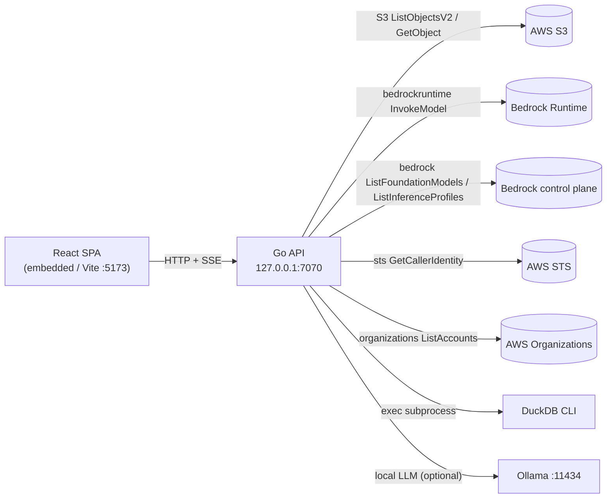
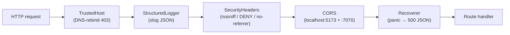
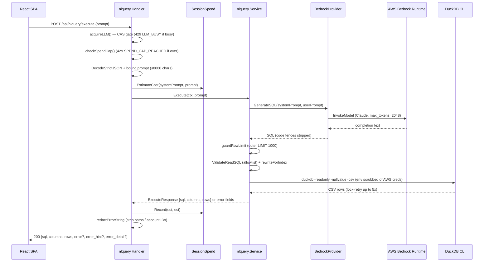
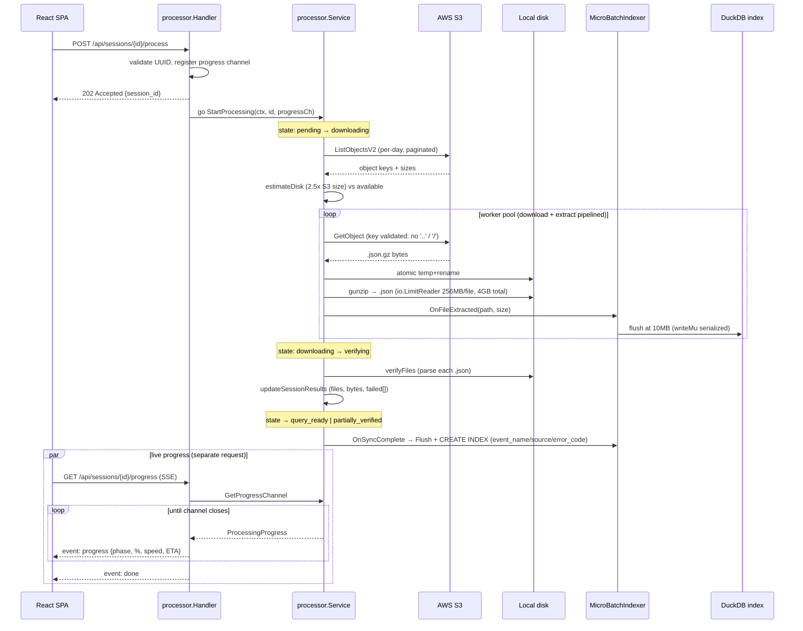

# 07 — API Flow

**Audience + purpose:** New engineers and open-source contributors who need to understand the two API surfaces — the AWS APIs this tool *calls* (S3, Bedrock, STS, Organizations) and the HTTP API it *exposes* — including request/response shapes and the end-to-end execute and process flows.

---

## Table of Contents

1. [Two API surfaces at a glance](#1-two-api-surfaces-at-a-glance)
2. [APIs the system CALLS (outbound, AWS)](#2-apis-the-system-calls-outbound-aws)
   - [2.1 S3 — list / download CloudTrail logs](#21-s3--list--download-cloudtrail-logs)
   - [2.2 Bedrock Runtime — NL → SQL generation](#22-bedrock-runtime--nl--sql-generation)
   - [2.3 STS — caller identity](#23-sts--caller-identity)
   - [2.4 Organizations — account name resolution](#24-organizations--account-name-resolution)
   - [2.5 Bedrock (control plane) — model discovery](#25-bedrock-control-plane--model-discovery)
   - [2.6 Credential chain (how AWS calls authenticate)](#26-credential-chain-how-aws-calls-authenticate)
3. [APIs the system EXPOSES (inbound, HTTP)](#3-apis-the-system-exposes-inbound-http)
   - [3.1 Middleware stack each request passes through](#31-middleware-stack-each-request-passes-through)
   - [3.2 Route map](#32-route-map)
   - [3.3 Response conventions (JSON, errors, SSE)](#33-response-conventions-json-errors-sse)
   - [3.4 Selected request/response shapes](#34-selected-requestresponse-shapes)
4. [Sequence diagram: NL query execute flow](#4-sequence-diagram-nl-query-execute-flow)
5. [Sequence diagram: S3 sync (process) flow](#5-sequence-diagram-s3-sync-process-flow)
6. [Cross-references](#6-cross-references)
7. [Claims I could not fully verify](#7-claims-i-could-not-fully-verify)

---

## 1. Two API surfaces at a glance

This is a single-binary local tool. It has exactly two API boundaries:

- **Outbound (AWS):** It calls AWS S3, Bedrock (runtime + control plane), STS, and Organizations using the AWS SDK for Go v2 (`go.mod:1-52`). These are the only network egress points.
- **Inbound (HTTP):** It exposes a REST + Server-Sent-Events (SSE) API on `cfg.Host:cfg.Port` (default `127.0.0.1:7070`) via a Chi router (`cmd/analyzer/main.go:326-338`). The embedded React SPA is the only intended client.



The system also shells out to the **DuckDB CLI** as a subprocess (not an HTTP API) and may call a local **Ollama** server or the public **Anthropic / OpenAI** HTTP APIs when those LLM providers are selected — see [04-HIGH-LEVEL-DESIGN.md](04-HIGH-LEVEL-DESIGN.md) and [06-DATA-FLOW.md](06-DATA-FLOW.md) for component and data-flow detail.

---

## 2. APIs the system CALLS (outbound, AWS)

All AWS clients are constructed from an `aws.Config` produced by a per-feature credential loader (see [§2.6](#26-credential-chain-how-aws-calls-authenticate)). Below, each AWS operation is grounded in its concrete call site.

### 2.1 S3 — list / download CloudTrail logs

CloudTrail `.json.gz` objects are enumerated and fetched during a sync.

- **`ListObjectsV2`** (paginated) is used to enumerate objects for a session's date range. The download path builds a `ListObjectsV2Input` and drives `NewListObjectsV2Paginator` (`internal/features/processor/downloader.go:53`, `downloader.go:58`). The settings package reuses the same paginator for bucket-structure detection, account discovery, region discovery, and log verification (`internal/features/settings/service.go:179`, `:234`, `:327`, `:378`, `:446`).
- **`GetObject`** downloads a single object's bytes, called from the single write chokepoint that also enforces the zip-slip guard (`internal/features/processor/downloader.go:184`). The S3 client itself is constructed in the processor service with custom options (`internal/features/processor/service.go:163`).
- **`HeadBucket`** verifies bucket accessibility for the "validate bucket" settings action (`internal/features/settings/service.go:104-105`).

> CloudTrail partitions objects by **delivery date** (UTC day written to S3), not event time; events near UTC midnight can be delivered into the next day, so the sync window may need widening for boundary completeness (`internal/features/processor/downloader.go:24-34`, the comment block above `listObjects`).

### 2.2 Bedrock Runtime — NL → SQL generation

When the configured provider is Bedrock (the default), natural-language prompts and summarization requests are sent to a Claude model via **`InvokeModel`**.

- Client: `bedrockruntime.NewFromConfig(awsCfg)` (`internal/features/nlquery/provider.go:75`).
- Call: `client.InvokeModel(ctx, &bedrockruntime.InvokeModelInput{...})` (`internal/features/nlquery/provider.go:92`).
- Request body is the Anthropic-on-Bedrock schema: `anthropic_version: "bedrock-2023-05-31"`, `max_tokens: 2048`, a `system` prompt, and a single user `messages` entry (`provider.go:77-84`).
- Model ID comes from `cfg.Bedrock.ModelID`; if empty it falls back to the hardcoded default `us.anthropic.claude-sonnet-4-20250514-v1:0` (`provider.go:87-90`).
- The provider maps 6+ specific error substrings (`ExpiredToken`, `AccessDenied`/`not authorized`, `ResourceNotFoundException`, `ThrottlingException`/`TooManyRequests`, `on-demand throughput isn`) to actionable remediation hints (`provider.go:99-128`), and warns when `stop_reason == "max_tokens"` because the SQL may be truncated (`provider.go:147-150`).

The same `LLMProvider.GenerateSQL` interface (`provider.go:25-28`) is implemented by Anthropic, OpenAI, and Ollama providers selected via `cfg.LLM.Provider` (`provider.go:30-41`). The non-Bedrock providers are plain HTTP clients bounded by `llmHTTPTimeout` (120s floor, `provider.go:51-59`); they are outside the AWS surface.

### 2.3 STS — caller identity

The "who am I" check uses **`GetCallerIdentity`**.

- Client: `sts.NewFromConfig(awsCfg)` (`internal/features/settings/service.go:138`).
- Call: `client.GetCallerIdentity(ctx, &sts.GetCallerIdentityInput{})` returning account, ARN, and user ID (`service.go:139`, response type `CallerIdentityResponse` at `internal/features/settings/models.go:73`).

### 2.4 Organizations — account name resolution

Friendly account names (12-digit ID → name) are learned from **`ListAccounts`**.

- Client: `organizations.NewFromConfig(awsCfg)` (`internal/features/accounts/resolver.go:399`).
- Call: paginated `client.ListAccounts(ctx, &organizations.ListAccountsInput{NextToken: token})` (`resolver.go:404`).
- This requires `organizations:ListAccounts` on the calling principal; a log-archive role typically **lacks** this permission by design, so the resolver gracefully falls back to manual name overrides and records the failure as sticky-vs-transient (`resolver.go:4-5`, `:234`). See [04-HIGH-LEVEL-DESIGN.md](04-HIGH-LEVEL-DESIGN.md) for the resolver's precedence model (manual > organizations > unresolved).

### 2.5 Bedrock (control plane) — model discovery

The LLM settings screen lists available models by merging two control-plane calls.

- Client: `bedrock.NewFromConfig(awsCfg)` (`internal/features/settings/service.go:670`).
- **`ListFoundationModels`** returns on-demand-eligible models (`service.go:672`).
- **`ListInferenceProfiles`** (paginated) appends Cross-Region Inference (CRIS) profiles that `ListFoundationModels` does not return — important for Opus/Sonnet-4.x that require CRIS (`service.go:744`, rationale at `:650-657`, `:728-738`).

### 2.6 Credential chain (how AWS calls authenticate)

Both the processor (`internal/features/processor/service.go:595`, per the fact base) and settings (`internal/features/settings/service.go:49-87`) build `aws.Config` by switching on `cfg.Auth.Method`:

| `auth.method` | Source of credentials |
|---|---|
| `session_credentials` | Process env vars `AWS_ACCESS_KEY_ID` / `AWS_SECRET_ACCESS_KEY` / `AWS_SESSION_TOKEN` (applied via the UI, not persisted to `config.json`) |
| `static` | Long-lived keys stored in `config.json` |
| `imds` | EC2 Instance Metadata Service (default chain; EC2-only) |
| `sso` | Shared-config profile (`WithSharedConfigProfile`) |

The Bedrock provider implements the same switch in `provider.go:154-197`. The settings service exports `LoadAWSConfig` so the accounts resolver reuses one credential path rather than duplicating it (`cmd/analyzer/main.go:171`). Note: STS session tokens are deliberately scrubbed from `config.json` on startup if a prior build leaked them (`cmd/analyzer/main.go:40-58`).

---

## 3. APIs the system EXPOSES (inbound, HTTP)

All routes are registered in `main()` (`cmd/analyzer/main.go:147-264`). The router is Chi v5 (`cmd/analyzer/main.go:137`).

### 3.1 Middleware stack each request passes through

Order matters — `TrustedHost` runs **first** so a DNS-rebinding request is rejected with 403 before any handler or even request logging runs (`cmd/analyzer/main.go:139-145`):



- `TrustedHost` validates the `Host` header against the allowlist (`internal/middleware/trustedhost.go:21-39`, backed by `config.TrustedHostAllowed`).
- `StructuredLogger` logs method/path/status/duration as JSON (`internal/middleware/logging.go:57-73`).
- `SecurityHeaders` sets `X-Content-Type-Options`, `X-Frame-Options: DENY`, `Referrer-Policy: no-referrer` (CSP intentionally omitted — `internal/middleware/logging.go:109-117`).
- `CORS` allows only the Vite dev origin and the analyzer itself (`internal/middleware/logging.go:77-102`).
- `Recoverer` turns panics into 500 JSON responses (`internal/middleware/logging.go:122-150`).

### 3.2 Route map

| Method | Path | Handler | Notes |
|---|---|---|---|
| GET | `/api/health` | inline (`main.go:148-157`) | status, version, uptime, startup checks, `frontend_embedded` |
| GET | `/api/settings/` | `settings.GetSettings` | `secret_access_key` redacted to `********` (`settings/handler.go:121`) |
| PUT | `/api/settings/` | `settings.UpdateSettings` | validates path-bearing fields |
| POST | `/api/settings/validate-bucket` | `settings.ValidateBucket` | S3 `HeadBucket` |
| GET | `/api/settings/accounts` | `settings.ListAccounts` | Control Tower member discovery |
| POST | `/api/settings/validate-credentials` | `settings.ValidateCredentials` | tests auth method |
| POST | `/api/settings/apply-session-credentials` | `settings.ApplySessionCredentials` | sets env vars only; fires auth-changed observers |
| GET | `/api/settings/caller-identity` | `settings.GetCallerIdentity` | STS |
| POST | `/api/settings/detect-structure` | `settings.DetectStructure` | single-account vs Control Tower |
| POST | `/api/settings/discover-regions` | `settings.DiscoverRegions` | |
| POST | `/api/settings/verify-logs` | `settings.VerifyLogs` | |
| POST | `/api/settings/bedrock-models` | `settings.ListBedrockModels` | merges 2 Bedrock calls |
| GET | `/api/accounts/resolve?ids=…` | `accounts.Resolve` | comma-separated IDs |
| GET | `/api/accounts/status` | `accounts.Status` | resolver state for UI hints |
| GET | `/api/accounts/discoverable` | `accounts.ListDiscoverable` | toolbar account picker |
| POST | `/api/accounts/refresh` | `accounts.RefreshOrg` | force Organizations refresh |
| GET | `/api/accounts/manual` | `accounts.ListManual` | |
| PUT | `/api/accounts/manual/{id}` | `accounts.UpsertManual` | empty name → use DELETE |
| DELETE | `/api/accounts/manual/{id}` | `accounts.DeleteManual` | idempotent |
| GET | `/api/sessions/` | `sessions.ListSessions` | ordered by `created_at DESC` |
| POST | `/api/sessions/` | `sessions.CreateSession` | 201 on success |
| GET | `/api/sessions/{id}` | `sessions.GetSession` | UUID validated |
| DELETE | `/api/sessions/{id}` | `sessions.DeleteSession` | removes DB row + local files |
| POST | `/api/sessions/{id}/process` | `processor.StartProcess` | **202 Accepted**, async |
| POST | `/api/sessions/{id}/cancel` | `processor.CancelProcess` | |
| GET | `/api/sessions/{id}/progress` | `processor.StreamProgress` | **SSE** |
| GET | `/api/sessions/{id}/progress/snapshot` | `processor.GetProgress` | REST polling fallback |
| GET | `/api/prompts/` | `prompts.ListPrompts` | templates + categories |
| GET | `/api/prompts/system-prompt` | `prompts.GetSystemPrompt` | with config substitutions |
| GET | `/api/prompts/{id}` | `prompts.GetPrompt` | rendered template |
| POST | `/api/nlquery/execute` | `nlquery.Execute` | paid LLM; gated |
| POST | `/api/nlquery/estimate` | `nlquery.Estimate` | pre-flight cost, no LLM call |
| POST | `/api/nlquery/summarize` | `nlquery.Summarize` | paid LLM; gated |
| GET | `/api/nlquery/spend` | `nlquery.Spend` | session spend snapshot |
| DELETE | `/api/nlquery/spend` | `nlquery.ResetSpend` | reset spend counter |
| POST | `/api/nlquery/index` | `nlquery.BuildIndex` | **202 Accepted**, async |
| GET | `/api/nlquery/index/status` | `nlquery.IndexStatus` | |
| GET | `/api/nlquery/index/progress` | `nlquery.StreamIndexProgress` | **SSE** |
| POST | `/api/nlquery/index/cancel` | `nlquery.CancelIndex` | |
| GET | `/api/dashboard` | `nlquery.GetDashboard` | 7 panels |
| GET | `/api/dashboard/findings` | `nlquery.GetFindings` | finding counts |
| GET | `/api/dashboard/findings/{id}` | `nlquery.GetFindingDetail` | drill-down |
| GET | `/api/lookups` | `nlquery.GetLookups` | autocomplete values |
| GET | `/api/investigate/scenarios` | `nlquery.ListScenarios` | scenario metadata |
| POST | `/api/investigate/run` | `nlquery.RunScenario` | run a scenario |
| (any) | non-`/api/*` paths | SPA fallback (`main.go:276-321`) | serves `index.html`; unknown `/api/*` → JSON 404 |

Route sources: `cmd/analyzer/main.go:148-264`, `internal/features/nlquery/handler.go:53-65`, `internal/features/settings/handler.go:53-68`, `internal/features/accounts/handler.go:27-37`, `internal/features/sessions/handler.go:27-36`, `internal/features/prompts/handler.go:26-32`. The `{id}/process`, `{id}/cancel`, and progress routes are registered directly on the root router rather than mounted (`main.go:216-219`), as are the dashboard/lookups/investigate routes (`main.go:253-264`).

### 3.3 Response conventions (JSON, errors, SSE)

- **Success** responses use `render.JSON(w, status, data)` which sets `Content-Type: application/json` and encodes the body (`internal/render/render.go:18-24`).
- **Errors** use `render.Error(...)` producing the `APIError` schema `{code, message, details?}` (`internal/render/render.go:10-15`, `:28-40`).
- **Request bodies** (POST/PUT) are decoded with `render.DecodeStrictJSON`: requires `application/json`, caps the body at 1 MiB, disallows unknown fields, and rejects trailing junk (`internal/render/decode.go:30-57`). Path/ID params are UUID-validated where applicable via `render.IsValidUUID` (`internal/render/decode.go:23-25`).
- **SSE** endpoints (`/api/sessions/{id}/progress`, `/api/nlquery/index/progress`) stream `event: progress` / `event: done` frames; if the `http.Flusher` is unavailable they degrade to a single JSON snapshot. SSE works because the middleware `responseWriter` implements `Flush()` (`internal/middleware/logging.go:48-52`).

> **Notable convention:** A failed *query* is not an HTTP error. `nlquery.Execute` returns **HTTP 200** with `error` / `error_hint` / `error_detail` fields populated when the generated SQL fails in DuckDB (`internal/features/nlquery/handler.go:431-446`). Only pre-LLM failures (bad body, oversized prompt, gate rejection) return non-200 codes.

### 3.4 Selected request/response shapes

**`POST /api/nlquery/execute`** (`internal/features/nlquery/handler.go:366-378`):

```jsonc
// Request (ExecuteRequest)
{ "prompt_id": "optional-diagnostic-id", "prompt": "who deleted S3 buckets last week?" }

// Response (ExecuteResponse), HTTP 200 even on query failure
{
  "sql": "SELECT ...",
  "columns": ["eventTime", "eventName", "..."],
  "rows": [["2026-06-01T...","DeleteBucket","..."]],
  "error": "",            // populated + REDACTED on DuckDB failure
  "error_hint": "",       // user-facing hint from classifyDuckDBError
  "error_detail": ""      // raw engine output, redacted of paths/IDs
}
```

Gate behavior before the model is billed (`handler.go:380-409`): a concurrent LLM call returns **429** `LLM_BUSY` (`handler.go:84-91`); an over-cap session returns **429** `SPEND_CAP_REACHED` with `current_spend_usd`/`cap_usd` (`handler.go:102-127`); an empty prompt returns **400** `missing_prompt` (`handler.go:396-399`); a prompt over `MaxPromptChars` (8000) returns **413** `prompt_too_large` (`handler.go:405-409`).

**`POST /api/sessions/`** (`internal/features/sessions/models.go:40-48`): body `CreateSessionRequest` `{account_id, org_id?, log_region, start_date, end_date}` (bucket/region/mode are read from saved config, not the request); returns **201** with the created `Session` or **400** `VALIDATION_ERROR`.

**`GET /api/prompts/{id}`** (`internal/features/prompts/handler.go:41-46`): returns `GetPromptResponse` `{template, rendered_prompt, substitutions, data_path}`.

Other shapes (the 7 dashboard `QueryPanel` fields, investigate scenario result, summarize structured output) are documented in [06-DATA-FLOW.md](06-DATA-FLOW.md).

---

## 4. Sequence diagram: NL query execute flow

End-to-end for `POST /api/nlquery/execute` (`handler.go:380-447` → `service.go:82-116`). The Bedrock call is the only network egress; DuckDB runs as a local subprocess with AWS credentials scrubbed from its environment.



Key guards on this path: single-flight concurrency gate (`handler.go:84-96`), spend cap (`handler.go:102-127`), SQL allowlist `ValidateReadSQL` (`safesql.go:65-112`), defensive outer `LIMIT 1000` (`service.go:251-265`), index rewrite preserving account scope (`service.go:146-185`), and error redaction (`handler.go:436-446`).

---

## 5. Sequence diagram: S3 sync (process) flow

End-to-end for `POST /api/sessions/{id}/process` (`processor/handler.go:35` → `processor/service.go:119`). The handler returns **202 immediately**; the pipeline runs in a detached `context.Background()` goroutine, and the UI tracks it via SSE progress.



Notable points:
- `StartProcess` spins a detached goroutine and returns 202 (`processor/handler.go:35`), registering/deregistering the progress channel in `service.active`/`service.progress` maps.
- Path-traversal (zip-slip) is blocked at the single write chokepoint `downloadSingleFile` via `hasUnsafeKeySegment` (`processor/downloader.go:172`, `:250`).
- Decompression-bomb defense uses `io.LimitReader` (`processor/extractor.go:136`) bounded by the `maxPerFileBytes` 256 MB/file cap (`extractor.go:26`) and a `maxTotalExtractBytes` 4 GB run total (`extractor.go:28`).
- Micro-batch indexing is wired through callbacks in `main()`: `OnFileExtracted` enqueues, `OnSyncComplete` flushes and creates B-tree indexes (`cmd/analyzer/main.go:229-249`).
- **Cancel** (`POST …/cancel`) calls the context `CancelFunc`, marks the session `interrupted`, and clears the snapshot (`processor/service.go:433`). **Graceful shutdown** cancels all active pipelines before `server.Shutdown`, which also unblocks any in-flight SSE handler (`cmd/analyzer/main.go:360-373`).

A parallel index-only build (`POST /api/nlquery/index`, also 202) shares the same DuckDB write path serialized by `writeMu` and exposes its own SSE progress at `/api/nlquery/index/progress`.

---

## 6. Cross-references

- [04-HIGH-LEVEL-DESIGN.md](04-HIGH-LEVEL-DESIGN.md) — system topology, credential model, resolver precedence.
- [05-LOW-LEVEL-DESIGN.md](05-LOW-LEVEL-DESIGN.md) — DuckDB SQL generation, index rewrite, safesql allowlist internals.
- [06-DATA-FLOW.md](06-DATA-FLOW.md) — data-flow detail and remaining response shapes (dashboard/findings/investigate/summarize).
- [10-SECURITY.md](10-SECURITY.md) — DNS-rebind defense, SQL injection escaping (H6), credential scrubbing, error redaction, and the live security review findings.

---

## 7. Claims I could not fully verify

- I confirmed the **route registrations** and **request/response struct shapes** I cited directly from source (`main.go`, the six `Routes()` methods, `ExecuteRequest`/`ExecuteResponse`, `CreateSessionRequest`, `GetPromptResponse`). I did **not** re-open each handler body for the non-`nlquery` settings/accounts endpoints; their detailed request/response field lists in [§3.2](#32-route-map) rely on the shared fact base rather than a fresh line-by-line read of each handler, so individual field names there should be treated as fact-base-sourced.
- The DuckDB CLI invocation flags (`-readonly -nullvalue -csv`) and lock-retry (5×/400ms) in the execute diagram are confirmed against `service.go` in this pass: `duckDBLockRetries = 5` and `duckDBLockRetryDelay = 400ms` are at `service.go:38-39`, the flag list is built at `service.go:304-308`, and the full `executeDuckDB` body spans `service.go:267-385`.
- The processor credential loader (`internal/features/processor/service.go:595`) is confirmed in this pass: `loadAWSConfig` switches on `s.cfg.Auth.Method` (`service.go:596`) with `session_credentials`/`imds`/`sso`/`static` cases, matching the settings loader. S3/STS/Organizations/Bedrock client construction sites were also confirmed directly.
