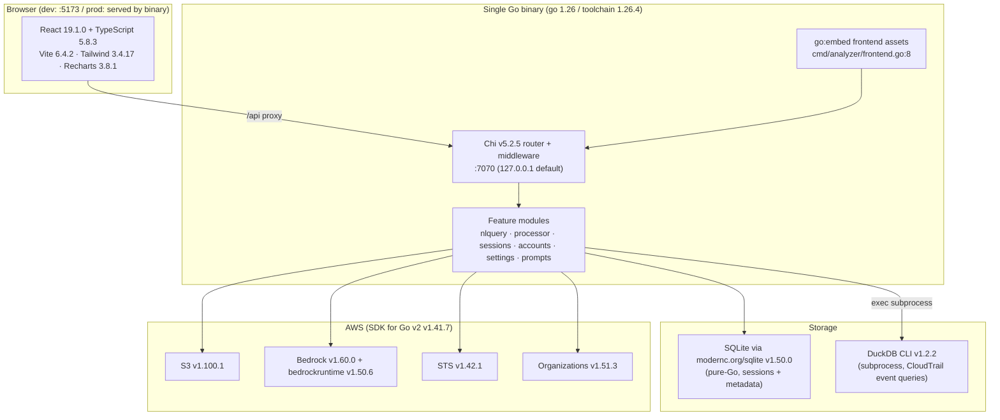
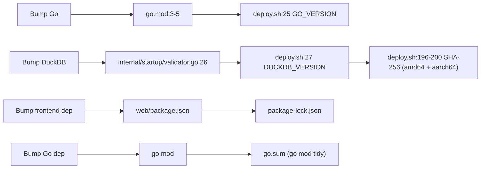

# 08 — Technology Stack

**Audience + purpose:** New engineers and open-source contributors who need a single, versioned map of the technology stack in CloudTrail Security Insights — what layer each piece lives in, the exact pinned version, and *why* it was chosen — so you can read, build, and extend the project with confidence. Versions are cited to `go.mod` or `web/package.json`.

---

## Table of contents

1. [How to read this doc](#1-how-to-read-this-doc)
2. [Stack at a glance (diagram)](#2-stack-at-a-glance)
3. [Backend — Go runtime & web framework](#3-backend--go-runtime--web-framework)
4. [Storage — SQLite (modernc) + DuckDB CLI](#4-storage--sqlite-modernc--duckdb-cli)
5. [AWS SDK for Go v2](#5-aws-sdk-for-go-v2)
6. [Supporting Go libraries](#6-supporting-go-libraries)
7. [Frontend — React 19 + Vite + Tailwind](#7-frontend--react-19--vite--tailwind)
8. [Build & deploy tooling](#8-build--deploy-tooling)
9. [Indirect / transitive dependencies](#9-indirect--transitive-dependencies)
10. [Version-bump checklist](#10-version-bump-checklist)

---

## 1. How to read this doc

- **Versions are pinned in two files only.** Go and its dependencies live in [`go.mod`](../../go.mod); the frontend lives in [`web/package.json`](../../web/package.json). Two more versions are pinned in code/scripts: the DuckDB CLI (`internal/startup/validator.go:26`, `deploy.sh:27`) and the Go/Node toolchain for the deploy host (`deploy.sh:25-26`).
- **Every row cites a `file:line`.** If a number here ever disagrees with the source file, the source file wins — re-check it.
- **"Direct" vs "indirect"** follows the `go.mod` split: direct deps are the ones the code imports explicitly (lines 7–22); indirect deps (lines 24–52) are pulled in transitively and are listed in [§9](#9-indirect--transitive-dependencies).

For how these pieces fit together at runtime, see [04-HIGH-LEVEL-DESIGN.md](04-HIGH-LEVEL-DESIGN.md). For the request lifecycle through the middleware stack, see [05-LOW-LEVEL-DESIGN.md](05-LOW-LEVEL-DESIGN.md). For the security posture of the choices below, see [10-SECURITY.md](10-SECURITY.md).

---

## 2. Stack at a glance

Sources: frontend versions from `web/package.json:13-32`; Go toolchain from `go.mod:3-5`; Chi from `go.mod:17`; SQLite from `go.mod:21`; DuckDB version from `internal/startup/validator.go:26`; AWS SDK versions from `go.mod:8-15`; embed from `cmd/analyzer/frontend.go:8-9`; default host/port from `internal/config/config.go:195-196`.

---

## 3. Backend — Go runtime & web framework

| Layer | Technology | Version | Source | Why |
|---|---|---|---|---|
| Language/runtime | Go | `go 1.26` (toolchain `go1.26.4`) | `go.mod:3-5` | Single statically-linked binary, fast cross-compilation (`make build-all` targets linux/arm64+amd64), strong stdlib HTTP server, and `go:embed` to ship the frontend inside the binary. |
| HTTP router | `github.com/go-chi/chi/v5` | `v5.2.5` | `go.mod:17` | Lightweight, stdlib-`net/http`-compatible router. Used for sub-routers (`/api/settings`, `/api/sessions`, `/api/nlquery`, …) and URL params; middleware chain is composed on top (`cmd/analyzer/main.go:137-145`). |
| Config (env overlay) | `github.com/kelseyhightower/envconfig` | `v1.4.0` | `go.mod:20` | Implements the third tier of the config hierarchy (defaults → `config.json` → env vars) in `LoadConfig` (`internal/config/config.go:230-269`). |
| Validation | `github.com/go-playground/validator/v10` | `v10.22.1` | `go.mod:18` | Struct-tag validation for request/config structs. |
| IDs | `github.com/google/uuid` | `v1.6.0` | `go.mod:19` | Session and query-history IDs; validated on the way back in via `IsValidUUID` (`internal/render/decode.go:23-25`). |

**Web server posture.** The HTTP server binds `cfg.Host:cfg.Port` (default `127.0.0.1:7070`, `internal/config/config.go:195-196`) with conservative timeouts: `ReadHeaderTimeout 10s`, `ReadTimeout 30s`, `IdleTimeout 120s`, and `WriteTimeout 0` so SSE streams (sync progress, index progress) are not cut off mid-stream (`cmd/analyzer/main.go:326-338`). Handlers manage their own deadlines for long streams via `http.ResponseController`.

**Middleware order matters.** `TrustedHost` runs first (DNS-rebinding defense), then `StructuredLogger`, `SecurityHeaders`, `CORS`, `Recoverer` (`cmd/analyzer/main.go:137-145`). Custom response-writer wrappers implement `http.Flusher` so SSE keeps working through the chain (`internal/middleware/logging.go:16-53`).

---

## 4. Storage — SQLite (modernc) + DuckDB CLI

Two engines, two jobs. SQLite is the **source of truth** for app state; DuckDB is a **query-only analytics engine** over CloudTrail JSON.

| Layer | Technology | Version | Source | Why |
|---|---|---|---|---|
| App metadata DB | `modernc.org/sqlite` | `v1.50.0` | `go.mod:21` | **Pure-Go SQLite driver — no cgo.** This is what keeps `make build` producing a single statically-linked binary with no C toolchain on the build host. Holds sessions, query/chat history, indexed-file checkpoints, and the account-name cache. Opened with WAL mode + foreign keys (`internal/database/sqlite.go:22-56`). |
| Event analytics engine | DuckDB **CLI** (external binary) | `1.2.2` | `internal/startup/validator.go:26`, `deploy.sh:27` | DuckDB reads CloudTrail `*.json` directly via `read_json(...)` and runs the LLM-generated and hand-coded analytics SQL. It is invoked as a **subprocess** (`exec.Command`), not linked as a library — see note below. |

### Why DuckDB is a CLI subprocess, not a Go library

The project shells out to the `duckdb` binary (`-readonly -nullvalue <sentinel> -csv`) rather than embedding a DuckDB Go binding. Consequences worth knowing as a contributor:

- **It must be on `PATH`.** Startup validation checks for it; if missing and auto-install is opted into, it downloads DuckDB **v1.2.2** from GitHub releases, verifies the published **SHA-256** before extracting, and installs to `/usr/local/bin` or `~/.local/bin` (`internal/startup/validator.go:222-279`, `359-451`). Auto-install is **fail-closed / opt-in** (defaults off).
- **Credential isolation.** AWS credential env vars are scrubbed from the subprocess environment before exec (`internal/features/nlquery/subprocess.go:32-57`).
- **SQL safety is enforced in Go, not by the engine.** Free-form (LLM) SQL passes through `ValidateReadSQL` — an allowlist that rejects multi-statement queries, requires a leading `SELECT`/`WITH`, and bans tokens like `attach`, `read_csv`, `insert`, `create`, `drop` (`internal/features/nlquery/safesql.go:65-112`). Config-derived path values are escaped before interpolation into `read_json('…')` literals (`safesql.go:167-182`).
- **Version coupling.** The DuckDB version is pinned in **two** places that must move together: `internal/startup/validator.go:26` (Go auto-install) and `deploy.sh:27` plus the hard-coded checksums for amd64/aarch64 (`deploy.sh:196-200`). The per-file extract cap (256 MB, `internal/features/processor/extractor.go`) is intentionally aligned with DuckDB's `maxObjectSize`.

### Schema / migrations

SQLite schema lives in `migrations/*.sql`, applied in alphabetical order at startup, each idempotent (`IF NOT EXISTS`): `001_initial.sql` (sessions, query_history, chat_history), `002_indexed_files.sql` (DuckDB index bookkeeping), `003_account_cache.sql` (account-name cache). See [04-HIGH-LEVEL-DESIGN.md](04-HIGH-LEVEL-DESIGN.md) and [06-DATA-FLOW.md](06-DATA-FLOW.md) for how data moves through these tables.

---

## 5. AWS SDK for Go v2

All AWS access uses **AWS SDK for Go v2** (`github.com/aws/aws-sdk-go-v2 v1.41.7`, `go.mod:8`). Each service client is a separately versioned module:

| AWS service | Module | Version | Source | Used for |
|---|---|---|---|---|
| Core SDK | `aws-sdk-go-v2` | `v1.41.7` | `go.mod:8` | Base config, request signing, credential providers. |
| Config | `aws-sdk-go-v2/config` | `v1.32.17` | `go.mod:9` | Building `aws.Config` per auth method (`loadAWSConfig`). |
| Credentials | `aws-sdk-go-v2/credentials` | `v1.19.16` | `go.mod:10` | Static, env (session), and EC2-role credential providers. |
| Bedrock (control plane) | `aws-sdk-go-v2/service/bedrock` | `v1.60.0` | `go.mod:11` | `ListFoundationModels` + `ListInferenceProfiles` for the model picker. |
| Bedrock Runtime | `aws-sdk-go-v2/service/bedrockruntime` | `v1.50.6` | `go.mod:12` | `InvokeModel` for NLQ SQL generation and result summarization (`internal/features/nlquery/provider.go`). |
| Organizations | `aws-sdk-go-v2/service/organizations` | `v1.51.3` | `go.mod:13` | `ListAccounts` to map account IDs → names (falls back to manual mappings when the role lacks permission). |
| S3 | `aws-sdk-go-v2/service/s3` | `v1.100.1` | `go.mod:14` | Listing + downloading CloudTrail `.json.gz` objects, bucket-structure detection. |
| STS | `aws-sdk-go-v2/service/sts` | `v1.42.1` | `go.mod:15` | `GetCallerIdentity` for the active principal. |
| SDK plumbing | `aws/smithy-go` | `v1.25.1` | `go.mod:16` | Smithy runtime + typed API errors (e.g. classifying `AccessDenied` vs throttling in the accounts resolver). |

**Auth methods.** `imds | session_credentials | sso | static`, dispatched in `loadAWSConfig` (`internal/features/settings/service.go:49-87`); default method is `imds` (`internal/config/config.go:209`).

**Bedrock default model.** The configured default model ID is `us.anthropic.claude-sonnet-4-20250514-v1:0` (`internal/config/config.go:213`), and the provider's hard-coded fallback when no model is set is the same CRIS-prefixed ID (`internal/features/nlquery/provider.go:89`). Bedrock is **disabled by default** (`Enabled: false`, `internal/config/config.go:214`) and must be turned on in settings. The model picker also surfaces Cross-Region Inference (CRIS) profiles so tightly-scoped roles can still reach Opus/Sonnet variants. See [04-HIGH-LEVEL-DESIGN.md](04-HIGH-LEVEL-DESIGN.md) for the NLQ flow.

> The LLM layer is provider-pluggable (Bedrock, Anthropic API, OpenAI-compatible, local Ollama) behind the `LLMProvider` interface (`internal/features/nlquery/provider.go:25-28`). Only Bedrock uses the AWS SDK; the others are plain HTTP clients.

---

## 6. Supporting Go libraries

These are direct dependencies that support the libraries above (transitively listed in `go.mod` but imported by direct deps, not the app's own packages):

| Library | Version | Source | Role |
|---|---|---|---|
| `github.com/go-playground/locales` | `v0.14.1` | `go.mod:39` | Locale data for validator/v10. |
| `github.com/go-playground/universal-translator` | `v0.18.1` | `go.mod:40` | Translation backing for validator/v10. |
| `github.com/leodido/go-urn` | `v1.4.0` | `go.mod:41` | URN validation used by validator/v10. |
| `github.com/gabriel-vasile/mimetype` | `v1.4.3` | `go.mod:38` | MIME detection (validator/v10 dependency). |

The full SQLite-runtime support chain (`modernc.org/libc`, `modernc.org/memory`, `modernc.org/mathutil`, etc.) is in [§9](#9-indirect--transitive-dependencies).

---

## 7. Frontend — React 19 + Vite + Tailwind

The frontend is a TypeScript single-page app built by Vite and **embedded into the Go binary** via `go:embed dist/*` (`cmd/analyzer/frontend.go:8-9`). In dev, Vite runs on `:5173` and proxies `/api` to the backend on `:7070` (`web/vite.config.ts:9-16`).

### Runtime dependencies

| Layer | Technology | Version | Source | Why |
|---|---|---|---|---|
| UI library | `react` | `19.1.0` | `web/package.json:16` | Core SPA framework. |
| DOM renderer | `react-dom` | `19.1.0` | `web/package.json:17` | React DOM bindings. |
| Charts | `recharts` | `3.8.1` | `web/package.json:20` | Dashboard hourly-volume bar chart + identity-types pie chart. |
| Icons | `lucide-react` | `1.14.0` | `web/package.json:15` | Icon set across nav, toolbars, badges. |
| Resizable panels | `react-resizable-panels` | `4.11.0` | `web/package.json:19` | Split-pane layouts (e.g. investigate workbench). |
| i18n core | `i18next` | `26.1.0` | `web/package.json:13` | 350+ English keys in `web/src/i18n.ts`. |
| i18n React bindings | `react-i18next` | `17.0.7` | `web/package.json:18` | `useTranslation` across components. |
| Stable JSON | `json-stable-stringify` | `1.3.0` | `web/package.json:14` | Deterministic stringify (e.g. comparing config state in settings). |

### Build / dev dependencies

| Layer | Technology | Version | Source | Why |
|---|---|---|---|---|
| Bundler / dev server | `vite` | `6.4.2` | `web/package.json:31` | Dev server + production build (`tsc -b && vite build`, `web/package.json:8`) emitting to `dist/`. |
| React plugin | `@vitejs/plugin-react` | `4.4.1` | `web/package.json:26` | JSX/Fast-Refresh for Vite. |
| Language | `typescript` | `5.8.3` | `web/package.json:30` | Strict mode on (`strict`, `noUnusedLocals`, `noUncheckedIndexedAccess`, `web/tsconfig.json:18-23`), bundler module resolution, `react-jsx` transform. |
| CSS framework | `tailwindcss` | `3.4.17` | `web/package.json:29` | Utility-first styling; class-based dark mode (`darkMode: 'class'`, `web/tailwind.config.ts:4`). |
| CSS post-processor | `postcss` | `8.5.10` | `web/package.json:28` | Tailwind/autoprefixer pipeline (note: bumped to 8.5.10 for CVE-2026-41305 per recent commit history). |
| Vendor prefixing | `autoprefixer` | `10.4.21` | `web/package.json:27` | Browser-prefix CSS. |
| Test runner | `vitest` | `3.1.4` | `web/package.json:32` | Installed and wired to a `test` script but **currently unused** — there are 0 frontend test files (see honesty note below). |
| Types | `@types/react` `19.1.6`, `@types/react-dom` `19.1.5`, `@types/json-stable-stringify` `1.1.0` | — | `web/package.json:24-25,23` | Type definitions. |

> **Honest gap:** The frontend has **0 test files and 0% coverage** despite `vitest` being installed and a `test` script existing (`.ground-truth.md` lines 6, 25; `web/package.json:10,32`). Treat the frontend as untested when changing it; the only safety net today is TypeScript strict mode. See [09-TEST-COVERAGE.md](09-TEST-COVERAGE.md).

---

## 8. Build & deploy tooling

| Concern | Tool | Version | Source | Notes |
|---|---|---|---|---|
| Task runner | `make` | — | `Makefile` | `make dev` (Vite + Go together), `make build` (single binary `dist/cloudtrail-analyzer`), `make build-all` (linux arm64+amd64), `make test`, `make lint`, `make clean`. |
| Frontend build | npm + Vite | (Vite `6.4.2`) | `web/package.json:8`, `Makefile` | `npm run build` → `tsc -b && vite build` → `dist/`; assets embedded via `go:embed`. If you skip the frontend build, the binary still compiles but logs a runtime warning (only a `.gitkeep` is embedded) — `cmd/analyzer/frontend.go:23-32`, `cmd/analyzer/main.go:85-100`. |
| Go build | `go build` | toolchain `go1.26.4` | `go.mod:5` | Produces the embedded single binary. |
| Deploy host runtime — Go | Go | `1.26.4` | `deploy.sh:25` | Must match the `go.mod` toolchain pin; downloaded tarball is SHA-256-verified, fail-closed on mismatch (`deploy.sh:104-114`). |
| Deploy host runtime — Node | Node.js | major `20` | `deploy.sh:26` | Installed via distro packages or NodeSource for the frontend build step. |
| Deploy host — DuckDB | DuckDB CLI | `1.2.2` | `deploy.sh:27` | Same version as the in-app auto-installer; checksums for amd64/aarch64 hard-coded at `deploy.sh:196-200`. |
| Service manager | systemd | — | `deploy.sh` | Creates `cloudtrail-analyzer` service running as user `cloudtrail` on Amazon Linux 2023. |

For the end-to-end build-and-embed pipeline and how `make dev` differs from a production build, see the [`Makefile`](../../Makefile) and [`deploy.sh`](../../deploy.sh).

---

## 9. Indirect / transitive dependencies

Listed in `go.mod:24-52` and not imported directly by the app's own packages. The two notable clusters:

- **AWS SDK internals** (`go.mod:25-36`): `eventstream`, `feature/ec2/imds`, `configsources`, `endpoints/v2`, `v4a`, `accept-encoding`, `checksum`, `presigned-url`, `s3shared`, `signin`, `sso`, `ssooidc`. These back the S3/Bedrock/STS/Organizations clients and the SSO/IMDS auth paths.
- **Pure-Go SQLite runtime** (`go.mod:49-51`): `modernc.org/libc v1.72.0`, `modernc.org/mathutil v1.7.1`, `modernc.org/memory v1.11.0`, plus `github.com/remyoudompheng/bigfft` (`go.mod:44`) and `github.com/ncruces/go-strftime v1.0.0` (`go.mod:43`). These are why `modernc.org/sqlite` needs no cgo.
- **Go extended stdlib** (`go.mod:45-48`): `golang.org/x/crypto v0.52.0`, `golang.org/x/net v0.55.0`, `golang.org/x/sys v0.45.0`, `golang.org/x/text v0.37.0`.
- Misc: `github.com/dustin/go-humanize v1.0.1` (`go.mod:37`), `github.com/mattn/go-isatty v0.0.20` (`go.mod:42`).

> **Security note (honest):** `govulncheck` reports the code paths reach **4 Go stdlib vulnerabilities**, attributed to a local-toolchain mismatch (local `go1.26.2` vs the `go.mod` pin `go1.26.4`), not an application dependency that needs upgrading (`.ground-truth.md:29`). Building with the pinned `1.26.4` toolchain is the intended remediation. See [10-SECURITY.md](10-SECURITY.md).

---

## 10. Version-bump checklist

When upgrading a pinned version, update **all** of its locations or the build/runtime will drift:

- **Go toolchain:** `go.mod:3-5` *and* `deploy.sh:25`. A mismatch makes the deploy host silently download a different toolchain or fail (`deploy.sh` comment at line 22).
- **DuckDB:** `internal/startup/validator.go:26` (auto-installer) *and* `deploy.sh:27` *and* the hard-coded checksums at `deploy.sh:196-200`. The auto-installer verifies SHA-256 before writing the binary, so a stale checksum fails closed.
- **Node major:** `deploy.sh:26` (`NODE_MAJOR`).
- **Frontend deps:** `web/package.json` + regenerate `package-lock.json`.

---

*Cross-links:* [04-HIGH-LEVEL-DESIGN.md](04-HIGH-LEVEL-DESIGN.md) · [05-LOW-LEVEL-DESIGN.md](05-LOW-LEVEL-DESIGN.md) · [06-DATA-FLOW.md](06-DATA-FLOW.md) · [07-API-FLOW.md](07-API-FLOW.md) · [09-TEST-COVERAGE.md](09-TEST-COVERAGE.md) · [10-SECURITY.md](10-SECURITY.md)
