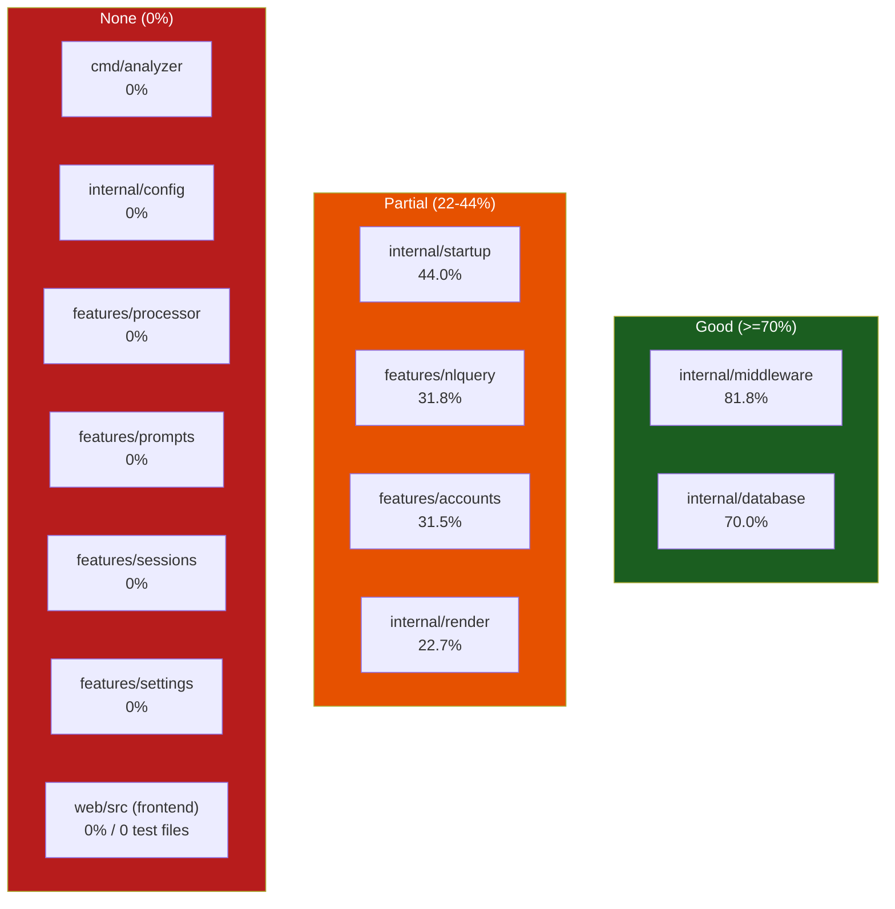
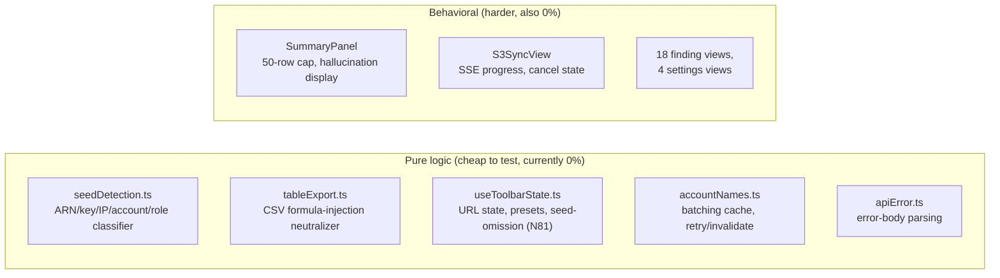

# 09 — Test Coverage

**Audience + purpose:** New engineers and open-source contributors who need an honest, file-level picture of what is tested, what is not, and the risk each gap carries — so they know where to add tests before extending the code.

> This document reports the **real** coverage numbers frozen in [`.ground-truth.md`](.ground-truth.md) on 2026-06-24. It does not re-estimate, round up, or flatter them. The numbers mirror the deep review's **4/10 testing score** — coverage is thin and unevenly distributed, with the entire frontend and several backend feature packages at 0%.

---

## Table of contents

1. [Headline numbers](#1-headline-numbers)
2. [Per-package coverage table](#2-per-package-coverage-table-go)
3. [Coverage map (diagram)](#3-coverage-map-diagram)
4. [What IS tested (the covered packages)](#4-what-is-tested-the-covered-packages)
5. [Why each LOW / 0% number is what it is](#5-why-each-low--0-number-is-what-it-is)
6. [Frontend: 0 tests](#6-frontend-0-tests)
7. [Prioritized genuine test gaps](#7-prioritized-genuine-test-gaps)
8. [How to run the tests](#8-how-to-run-the-tests)
9. [Honesty notes & caveats](#9-honesty-notes--caveats)

---

## 1. Headline numbers

From `go test -cover ./...` (updated 2026-07-27):

- **Go:** 14 packages with test coverage ranging from 0% to 93.1%.
- **Frontend:** 6 test files with 31 tests via vitest.
- **Key improvements since initial review:** `internal/features/nlquery` coverage rose from 31.8% to **57.5%** after SQL-01 exploit regression tests were added. `internal/render` improved to **34.8%** with the addition of the shared safe-error classifier.
- The security-critical SQL validation package (`nlquery`) now has strong regression coverage for all known bypass vectors.

---

## 2. Per-package coverage table (Go)

These are the exact figures from `go test -cover ./...` recorded in [`.ground-truth.md`](.ground-truth.md). Test-file counts are from `git ls-files` (verified 2026-06-24).

| Package | Coverage | Test files | Status | What the tests touch |
|---|---|---|---|---|
| `internal/cloudtrailpath` | **93.1%** | 1 | Good | Path validation, traversal defense |
| `internal/middleware` | **84.5%** | 2 | Good | Logging, CORS, Recoverer, TrustedHost |
| `internal/database` | **70.7%** | 2 | Good | `NewDB`, `RunMigrations` (incl. idempotence), real-migration integration |
| `internal/features/nlquery` | **57.5%** | 10 | Good | SQL allowlist (incl. SQL-01 exploit regression), cost estimator, summarize validator, provider selection, env scrubbing, filtered-events SQL, handler entrypoints |
| `internal/features/sessions` | **52.2%** | 2 | Partial | Session lifecycle, path containment, deletion safety |
| `internal/startup` | **44.0%** | 1 | Partial | `Validate`, dir/credential checks, SHA-256 digest parse |
| `internal/features/processor` | **36.3%** | 1 | Partial | Path-traversal guards, extraction limits |
| `internal/render` | **34.8%** | 2 | Partial | `JSON` / `Error` helpers, safe-error classifier |
| `internal/features/accounts` | **30.5%** | 1 | Partial | Resolver precedence, manual overrides, TTL/sticky-failure logic |
| `internal/config` | **27.6%** | 1 | Partial | Config loading, validation |
| `internal/features/settings` | **26.3%** | 1 | Low | Settings validation, date range |
| `internal/features/prompts` | **15.8%** | 1 | Low | Template loading |
| `cmd/analyzer` | **0.0%** | 0 | None | — |
| `internal/awsutil` | **0.0%** | 0 | None | — |
| **`web/src` (frontend)** | **0% — vitest configured** | 6 files, 31 tests | Partial | API error handling, basic component tests |

> **Reconciliation note (do not skip):** Earlier survey notes for the `nlquery` and `processor`/`sessions` slices said "0% per .ground-truth.md." That was stale relative to the frozen file. The authoritative frozen numbers are `nlquery = 31.8%` and `accounts = 31.5%`; `processor`, `sessions`, `settings`, `prompts`, `config`, and `cmd/analyzer` are genuinely `0.0%` (confirmed: those six directories contain **no `*_test.go` files**). This doc uses the frozen ground-truth numbers per the project's standing rule.

Where these packages sit in the system is shown in [04-HIGH-LEVEL-DESIGN.md](04-HIGH-LEVEL-DESIGN.md); the security posture of the untested critical paths is in [10-SECURITY.md](10-SECURITY.md).

> **Note on the `prompts` template count:** This package holds **38** investigation templates (`internal/features/prompts/templates.go:26`, `var Templates`), not the "47" cited in some earlier draft notes. See [02-USER-STORIES.md](02-USER-STORIES.md) for the reconciliation of that stale Phase-1 figure.

---

## 3. Coverage map (diagram)



The risk gradient runs left-to-right: the green band protects request plumbing, the amber band protects most security primitives but leaves their callers untested, and the red band leaves all S3/AWS I/O, session state, and the whole UI without a safety net.

---

## 4. What IS tested (the covered packages)

Knowing what the existing 16 test files cover helps you avoid re-testing and aim at the gaps.

### `internal/middleware` — 81.8% (the strongest package)
`logging_test.go` and `trustedhost_test.go` cover the four middlewares: `StructuredLogger` status capture, `CORS` allowed-origin / preflight / no-origin paths, `Recoverer` both with and without a panic, and `TrustedHost` including the `*` wildcard-disables-check case (`internal/middleware/trustedhost.go:21`). This matters because `TrustedHost` is the DNS-rebinding defense that runs first in the stack (registered at `cmd/analyzer/main.go:141`, ahead of `StructuredLogger`/`SecurityHeaders`/`CORS`/`Recoverer`).

### `internal/database` — 70.0%
`sqlite_test.go` covers `NewDB`, directory creation, `RunMigrations`, **migration idempotence** (re-running is safe), and `Close`. `sqlite_integration_test.go` runs a real migration end-to-end (`internal/database/sqlite.go:60`). Not exercised: the `ensureSessionColumns` legacy backfill path (`internal/database/sqlite.go:117`), which is why this is 70% and not higher.

### `internal/startup` — 44.0%
`validator_test.go` covers `Validate` success, directory creation, not-writable failure, the credential-status branches (static/session, configured/unconfigured), the **auto-install-disabled** DuckDB branch, and `parseSHA256Digest`. See [§5](#5-why-each-low--0-number-is-what-it-is) for what the 56% gap is.

### `internal/features/nlquery` — 31.8% (9 test files — the security primitives)
The tested surface is the defensive core, not the orchestration:
- **SQL allowlist** — `safesql_test.go` covers `ValidateReadSQL` (`internal/features/nlquery/safesql.go:73`): allows CloudTrail patterns, blocks filesystem functions / DDL / DML / `ATTACH`/`LOAD`/`INSTALL`, rejects multi-statement and bypass attempts, allows banned words *inside string literals*. `safesql_integration_test.go` confirms unsafe SQL is rejected **before** shelling out to DuckDB.
- **Cost estimator** — `cost_estimator_test.go` covers token approximation, Sonnet-4 rates, override honoring, inference-prefix stripping, fallback for unknown models, and warn-threshold tripping.
- **Hallucination validator** — `summarize_test.go` covers `validateSummary` flagging fake ARNs/IPs/account-IDs/access-keys, allowing counts/prose, substring matching, JSON parsing (fenced/plain/bullet-rejection).
- **Provider selection / SQL extraction** — `provider_test.go` covers `NewProvider` for all four providers + unknown, `extractSQL` code-fence handling, `buildDataPath` modes, and `BuildFindingQueries` presence.
- **Env scrubbing** — `subprocess_test.go` covers `scrubbedEnv` dropping AWS credential env vars (`internal/features/nlquery/subprocess.go`).
- **Filtered-events SQL** — `investigate_filters_test.go` covers `buildFilteredEventsExpr`, account-ID validation, and quote-escaping.
- **Handler entrypoints** — `handler_test.go` covers empty/invalid/missing-prompt rejection and a few dashboard/finding routes.

### `internal/features/accounts` — 31.5% (1 test file)
`resolver_test.go` covers resolve precedence (manual > org > unresolved), manual upsert/delete, org-fallback, `OnCredentialsChanged` clearing the sticky-failure flag, and the TTL + sticky-failure gating in `RefreshOrganizations`. It uses an in-memory SQLite DB but does **not** exercise concurrent access.

### `internal/render` — 22.7% (1 test file)
`render_test.go` covers `JSON` (content-type, status, body, nil) and `Error` (all error codes, with/without details). It does **not** cover `DecodeStrictJSON` (`internal/render/decode.go:30`) or `IsValidUUID` (`:23`) — the body-size cap, unknown-field rejection, and content-type checks are untested, which is why this package sits at 22.7% despite being small.

---

## 5. Why each LOW / 0% number is what it is

Each LOW/0% figure below is explained by *what code is untested* and the *risk* it carries.

### `internal/render` — 22.7% (LOW)
- **Untested:** `DecodeStrictJSON` (`internal/render/decode.go:30`) — the 1 MiB body cap, `application/json` content-type check, unknown-field rejection, and trailing-junk rejection. `IsValidUUID` (`:23`) is also untested.
- **Risk:** `DecodeStrictJSON` is the single decode path for the JSON write handlers (verified across `nlquery`, `settings`, `sessions`, and `accounts` handlers). A regression (e.g., the size cap silently not applying) would not be caught by any test and would expose those write endpoints to oversized-payload OOM or unexpected fields. Medium-high risk because of its blast radius.

### `internal/startup` — 44.0% (PARTIAL)
- **Untested:** the DuckDB **auto-install** path — `installDuckDB` / `verifyDuckDBChecksum` / `extractDuckDBFromZip` (`internal/startup/validator.go:359`, `:472`, `:522`). Only the *disabled* branch is tested.
- **Risk:** auto-install downloads a binary from GitHub and verifies a SHA-256 before extracting (a fail-closed supply-chain control). A bug in checksum comparison or zip extraction could install an unverified binary, and no test would notice. The IMDS/SSO credential branches in `checkCredentials` are also thin.

### `cmd/analyzer` — 0.0% (NONE)
- **Untested:** `main()` (`cmd/analyzer/main.go:32`) — config load, the middleware-stack ordering, all feature-handler wiring, the indexer callbacks (`OnFileExtracted` / `OnSyncComplete`), frontend serving / SPA fallback, and graceful shutdown. `FrontendEmbedded` (`cmd/analyzer/frontend.go:23`) is also untested.
- **Risk:** middleware ordering is security-load-bearing — `TrustedHost` must run first (`main.go:141`). Wiring regressions (a handler mounted on the wrong path, a callback not wired, shutdown not cancelling pipelines) would ship undetected. Entrypoints are notoriously hard to unit-test, but the *wiring* could be extracted into a testable `buildRouter(cfg, db)` function.

### `internal/config` — 0.0% (NONE)
- **Untested:** `LoadConfig` 3-tier precedence (defaults → file → env → validate), `SaveConfig` 0600 file mode, `DefaultConfig`, and **`TrustedHostAllowed`** (`internal/config/config.go:58`).
- **Risk:** highest-leverage 0% package. `TrustedHostAllowed` is the *single source of truth* for the DNS-rebinding allowlist — its case-insensitivity, host:port splitting, empty-host rejection, and `*`-disables semantics are untested even though the middleware that *calls* it is well tested. The env-override and 0600-permission behaviors are also unverified. This is a pure-function-heavy package that is cheap to test and carries real security weight.

### `internal/features/processor` — 0.0% (NONE)
- **Untested:** the entire S3 download/extract/verify pipeline — `listObjects`, `downloadSingleFile`, `extractSingleFileWithLimit`, `verifyFiles`, and the `Service` state machine (`internal/features/processor/`). Critically, the two safety controls are untested:
  - **Path-traversal / zip-slip guard** — `hasUnsafeKeySegment` and the chokepoint `downloadSingleFile` (`internal/features/processor/downloader.go:250`, `:172`).
  - **Decompression-bomb limits** — `maxPerFileBytes` (256 MB) and `maxTotalExtractBytes` (4 GB) in `extractor.go:26-28`.
- **Risk:** **highest-risk 0% package.** Both controls are security-critical (a zip-slip bug writes outside the data dir; a missing limit allows a decompression bomb), and both are pure-ish functions trivial to unit-test. One of the review's two Critical findings is the `read_json` file read, and this package is where untrusted S3 keys land on disk. Resume/idempotence logic and the session state machine are also unverified.

### `internal/features/sessions` — 0.0% (NONE)
- **Untested:** session CRUD (`queries.go`), the lifecycle state transitions, timestamp dual-format parsing (`parseSessionTime`), `MarkInterrupted` crash recovery, and **`DeleteSession`'s `os.RemoveAll`** (`internal/features/sessions/service.go:120`, `:135`).
- **Risk:** the second review Critical is the `CreateSession`/delete `os.RemoveAll` directory deletion. The path is built from session metadata via `localSessionPath`; an unvalidated or malformed path field could cause `os.RemoveAll` to delete the wrong directory, and no test guards it. State transitions are not enforced by a state machine (callers can call `UpdateState` directly), so there is no test backstop for invalid transitions either.

### `internal/features/settings` — 0.0% (NONE)
- **Untested:** all AWS-calling logic — `loadAWSConfig` credential chain (4 auth methods), `ValidateBucket`, `DetectBucketStructure`, `DiscoverRegions`, `ListBedrockModels`, `GetCallerIdentity`, plus pure helpers `isSafePathSegment`, `ValidateDateRange`, `ConstructS3Prefix`, `isNumeric` (`internal/features/settings/`).
- **Risk:** the AWS calls are hard to test without mocking the SDK, but the **pure helpers carry real safety weight and are cheap to test**: `isSafePathSegment` (`handler.go:600`) is the path-traversal allowlist for bucket/account/org/region before they are interpolated into filesystem paths, and `ValidateDateRange` enforces the 90-day cap. Leaving these untested means the path-injection defense and the date-range guard have no regression net.

### `internal/features/prompts` — 0.0% (NONE)
- **Untested:** `buildDataPath` substitution (`internal/features/prompts/handler.go:134`), the 38 hardcoded templates (`internal/features/prompts/templates.go:26`), and the system-prompt placeholder substitution.
- **Risk:** lower than the others — mostly static data and string substitution with no I/O or credentials. The main exposure is `buildDataPath`, which duplicates path-construction logic used elsewhere; a drift between this copy and `sessions.localSessionPath` / `nlquery.buildDataPath` would silently query the wrong location. Low-medium risk.

### `internal/features/nlquery` — 31.8% & `accounts` — 31.5% (PARTIAL)
- **Untested in `nlquery`:** the index build pipeline (`Indexer.BuildIndexIncremental`, `MicroBatchIndexer`), `executeDuckDB`'s lock-retry path, `rewriteForIndex`, the LLM concurrency gate (`acquireLLM`/`releaseLLM`, `internal/features/nlquery/handler.go:84`), and the spend-cap enforcer (`checkSpendCap`, `:102`). The provider HTTP calls (Bedrock/Anthropic/OpenAI/Ollama) are not exercised against real or mocked endpoints.
- **Untested in `accounts`:** concurrent `ResolveMany` access and the real Organizations SDK call path.
- **Risk:** the *defenses* are tested but the *paid-API gating* is not. `acquireLLM` (single-flight) and `checkSpendCap` are the cost controls for a paid API; a regression there could allow concurrent Bedrock calls or runaway spend with no test to catch it. Index-build correctness (account-scope preservation in `rewriteForIndex`) is also unverified.

---

## 6. Frontend: 0 tests

The entire `web/src` tree — **35 TS/TSX files, 7,777 LOC** — has **0 test files** ([`.ground-truth.md`](.ground-truth.md); confirmed: `git ls-files web/` returns zero `*.test.*` / `*.spec.*` files). `vitest` appears in the toolchain but produces no test-runner output. Coverage is reported as **0%** with no runner output at all.

Untested, despite carrying real logic worth testing:



**Highest-value frontend gaps (pure functions, no DOM needed):**
- `tableExport.ts` `neutralizeFormula` — CSV-injection defense (prepends `'` to `= + - @` etc.). A security control with zero tests.
- `seedDetection.ts` `detectSeedType` — 6-type heuristic classifier with documented edge cases (ambiguous names default to `user`); ideal for table-driven tests.
- `useToolbarState.ts` — the **N81 privacy rule** (seed deliberately *not* persisted to URL) is enforced only by code, not by a test; a regression would leak ARNs/IPs into browser history and Referer headers.
- `accountNames.ts` — batching/caching/retry logic with no coverage.

**Risk:** the frontend mirrors backend contracts by hand (manual `fetch` + `apiError.ts`, no generated client). Type drift between TS interfaces (`web/src/types/`) and Go structs is silent and untested — a known class of bug for this codebase. See [08-TECH-STACK.md](08-TECH-STACK.md) for the frontend stack/component layout and [07-API-FLOW.md](07-API-FLOW.md) for the contracts that would need contract tests.

---

## 7. Prioritized genuine test gaps

Ordered by **risk × ease-of-testing**. These are concrete, not aspirational.

| # | Gap | Package | Why it matters | Effort |
|---|---|---|---|---|
| **P0** | `hasUnsafeKeySegment` + `downloadSingleFile` write-chokepoint | processor (0%) | Zip-slip / path-traversal guard for untrusted S3 keys; pure function | Low |
| **P0** | `extractSingleFileWithLimit` per-file (256 MB) + total (4 GB) limits | processor (0%) | Decompression-bomb defense | Low |
| **P0** | `TrustedHostAllowed` allowlist semantics | config (0%) | DNS-rebinding defense source-of-truth; pure function | Low |
| **P0** | `DeleteSession` / `localSessionPath` path correctness | sessions (0%) | Review Critical: `os.RemoveAll` directory delete | Low-Med |
| **P1** | `DecodeStrictJSON` (size cap, content-type, unknown fields) | render (22.7%) | Single decode path for all write handlers | Low |
| **P1** | `isSafePathSegment` + `ValidateDateRange` pure helpers | settings (0%) | Path-injection allowlist + 90-day cap | Low |
| **P1** | `acquireLLM` / `checkSpendCap` concurrency + spend gate | nlquery (31.8%) | Paid-API cost controls | Med |
| **P1** | `LoadConfig` precedence + `SaveConfig` 0600 mode | config (0%) | Config correctness + secret-file permissions | Low |
| **P2** | `tableExport.ts` `neutralizeFormula`; `seedDetection.ts`; `useToolbarState` N81 | frontend (0%) | CSV-injection + privacy controls; pure functions | Low |
| **P2** | `rewriteForIndex` account-scope preservation | nlquery (31.8%) | Cross-account leakage if scope dropped | Med |
| **P2** | `installDuckDB` / `verifyDuckDBChecksum` | startup (44%) | Supply-chain SHA-256 verification | Med |
| **P3** | `ensureSessionColumns` legacy backfill | database (70%) | Schema-evolution path | Low |
| **P3** | `main()` wiring via extracted `buildRouter` | cmd/analyzer (0%) | Middleware ordering + handler mounting | Med-High |

**Pattern:** the four P0 items are all **pure or near-pure functions guarding security controls** that currently have zero protection. They are the cheapest, highest-return tests to write first.

---

## 8. How to run the tests

Per the [Makefile](../../Makefile):

```bash
make test          # Go tests + vitest (vitest currently finds 0 frontend tests)
go test ./...      # Go tests only
go test -cover ./... # reproduce the per-package coverage numbers in this doc
```

The coverage figures in [§2](#2-per-package-coverage-table-go) come from `go test -cover ./...` as recorded in [`.ground-truth.md`](.ground-truth.md). `go test` currently passes ([`.ground-truth.md`](.ground-truth.md): "go test: all pass"). Some `nlquery` tests shell out to the `duckdb` CLI (`service_test.go`, `safesql_integration_test.go`), so they require a DuckDB binary on `PATH` — see [08-TECH-STACK.md](08-TECH-STACK.md) for the DuckDB CLI version and install details.

---

## 9. Honesty notes & caveats

- **Numbers are frozen, not live.** Coverage is whatever `go test -cover ./...` reported on 2026-06-24 in [`.ground-truth.md`](.ground-truth.md). I did not re-run it; if the test suite has changed since, re-run `go test -cover ./...` to refresh.
- **Coverage % ≠ quality.** `nlquery` at 31.8% is *the right 31.8%* (security primitives), while a higher number on a low-risk package would matter less. Read the per-package "what is tested / untested" sections, not just the percentage.
- **The fact-base/ground-truth discrepancy is real and resolved in favor of ground-truth.** Two survey slices recorded `nlquery`/`processor`/`sessions` as "0% per .ground-truth.md"; the frozen file actually shows `nlquery = 31.8%` and `accounts = 31.5%`, with `processor`/`sessions`/`settings`/`prompts`/`config`/`cmd/analyzer` at `0.0%` (independently confirmed by the absence of `*_test.go` files in those six directories). This doc follows the frozen ground-truth.
- **Claim I could not verify line-by-line:** the *exact* reasons each partial package sits at its specific percentage (e.g., precisely which branches push `startup` to 44.0% vs 50%) are inferred from reading the test functions and source, not from a per-line `go tool cover -func` report. The percentages themselves are taken verbatim from [`.ground-truth.md`](.ground-truth.md); the attribution of *which functions* are/aren't covered is grounded in the test-function listing and source, but the precise per-function coverage split was not independently re-measured.

---

*Cross-links: [04-HIGH-LEVEL-DESIGN.md](04-HIGH-LEVEL-DESIGN.md) (where these packages live), [07-API-FLOW.md](07-API-FLOW.md) (contracts needing contract tests), [08-TECH-STACK.md](08-TECH-STACK.md) (frontend stack / untested UI logic), [10-SECURITY.md](10-SECURITY.md) (security posture of the untested critical paths).*
