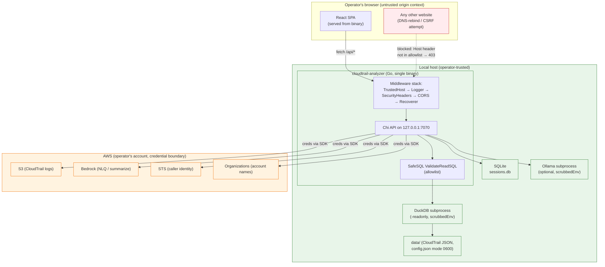
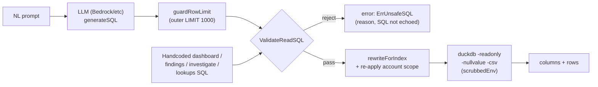

# 10 — Security Posture

**Audience + purpose:** New engineers and open-source contributors who need to understand *how* CloudTrail Security Insights is secured as-built — its authentication model, trust boundaries, secrets/data handling, and SQL-injection defenses — so they can extend it without weakening those controls. This document describes posture only; the live security findings (including the 2 Criticals) are linked, not re-enumerated, below.

> **Important:** This is a sample/reference implementation intended for educational and demonstration purposes. It is not intended for production use without additional security review, hardening, and compliance validation.

## Table of contents

- [1. Threat model in one paragraph](#1-threat-model-in-one-paragraph)
- [2. Trust boundaries (diagram)](#2-trust-boundaries-diagram)
- [3. No app-level user auth: loopback + TrustedHost rationale](#3-no-app-level-user-auth-loopback--trustedhost-rationale)
- [4. AWS authentication methods](#4-aws-authentication-methods)
- [5. Secrets handling](#5-secrets-handling)
- [6. Data handling](#6-data-handling)
- [7. The SafeSQL allowlist (LLM SQL defense)](#7-the-safesql-allowlist-llm-sql-defense)
- [8. Other defensive controls](#8-other-defensive-controls)
- [9. Known gaps and where findings live](#9-known-gaps-and-where-findings-live)
- [10. Extending the app safely](#10-extending-the-app-safely)

---

## 1. Threat model in one paragraph

CloudTrail Security Insights is a **single-user, local tool**. It binds to loopback by default ([cmd/analyzer/main.go](../../cmd/analyzer/main.go); host default `127.0.0.1` set in `internal/config/config.go:196`), holds the operator's own AWS credentials, downloads CloudTrail logs from S3 into a local `data/` directory, and queries them with DuckDB. The operator *is* the trusted principal — there is no multi-tenant separation to enforce. The interesting attack surface is therefore: (a) a malicious website in the operator's browser trying to reach the loopback API (DNS-rebinding / CSRF), (b) **LLM-generated SQL** that could be coaxed into reading files outside the dataset, (c) **untrusted S3 object keys / gzip contents** during sync (path traversal, decompression bombs), and (d) leakage of the operator's credentials into subprocesses, logs, or API responses. The controls below map to each of those.

---

## 2. Trust boundaries (diagram)

The two boundaries that matter most:

1. **Browser ↔ binary** — defended by loopback binding + the TrustedHost middleware (Section 3). No app-level login crosses this boundary.
2. **Binary ↔ AWS** — the operator's AWS credentials are the trust token. The binary is designed not to re-expose raw secrets back over the API or to child processes (Sections 4–5).

See [04-HIGH-LEVEL-DESIGN.md](04-HIGH-LEVEL-DESIGN.md) for the full component architecture and [07-API-FLOW.md](07-API-FLOW.md) for the route inventory these boundaries protect.

---

## 3. No app-level user auth: loopback + TrustedHost rationale

There is **no username/password, session cookie, or bearer-token auth** in the application. This is a deliberate posture for a single-user local tool, defended in depth by three layers:

### Layer 1 — Loopback bind by default
`Host` defaults to `127.0.0.1` (`internal/config/config.go:196`), with the field comment explaining the intent: a single-user local tool should not be reachable from the LAN (`internal/config/config.go:24-27`). The server binds `Host:Port` directly (HTTP server config wired in `cmd/analyzer/main.go`, timeouts described in `main.go:326-338`). An operator who sets `Host` to `0.0.0.0` is opting out of this layer explicitly.

### Layer 2 — TrustedHost middleware (DNS-rebinding defense)
A browser that visits a malicious site can be made to issue requests to `http://127.0.0.1:7070`, but the attacker cannot control the `Host` header the browser sends for a rebound DNS name. The `TrustedHost` middleware runs **first** in the chain so untrusted Host headers are rejected with `403` before any handler or even the logger runs (`internal/middleware/trustedhost.go:21-39`; ordering wired at `cmd/analyzer/main.go:137-145`).

The allow decision is centralized in one function, `Config.TrustedHostAllowed` (`internal/config/config.go:58-96`):

- `localhost`, `127.0.0.1`, and `::1` are **always** allowed (with or without a port) — `config.go:74-77`.
- Additional names come from the `trusted_hosts` config allowlist (`config.go:79-94`) — intended for fronting the app behind an authenticating reverse proxy (`config.go:28-34`).
- An empty `Host` header is **always rejected** (`config.go:59-63`) — every real browser sends one.
- A single entry `"*"` disables the check entirely (`config.go:84-86`); the config comment marks this "not recommended."
- Matching is case-insensitive and strips a trailing dot and `host:port` (`config.go:68-71`); IPv6 literals like `[::1]:7070` are handled by `splitHostPort` (`config.go:101-131`).

### Layer 3 — SecurityHeaders + dev-scoped CORS
`SecurityHeaders` middleware sets `X-Content-Type-Options: nosniff`, `X-Frame-Options: DENY`, and `Referrer-Policy: no-referrer` on each response it wraps (`internal/middleware/logging.go:109-117`). **CSP is intentionally omitted** because the React bundle uses inline styles and dynamic Vite assets that a strict CSP would break without careful tuning (`logging.go:104-108`). CORS is development-scoped: it allows only `localhost:5173` (Vite dev server) and `localhost:7070` (the analyzer itself), and answers OPTIONS preflight (`logging.go:77-102`).

> **Implication for contributors:** Because there is no per-request auth, *every* API route is reachable by anything that clears the TrustedHost gate. Do not add a route that performs a destructive or expensive action assuming "only the logged-in admin can call it" — there is no login. The processor's `/api/sessions` endpoints, for example, are noted as open (no per-route auth) in the processor slice review.

---

## 4. AWS authentication methods

The app obtains AWS credentials through one of four methods, selected by `config.Auth.Method`. The credential-chain logic is centralized in `internal/features/settings/service.go:49-87` (`loadAWSConfig`, exported as `LoadAWSConfig` at `service.go:44-47` so the accounts resolver and processor reuse it):

| Method | Source | Where built | Persisted? |
|---|---|---|---|
| `imds` | EC2 Instance Metadata Service v2 (instance role) | `service.go:49-87`; tested via `tryIMDS` (`service.go:518-534`) | No — role creds are fetched at runtime (default for EC2/systemd deploy) |
| `session_credentials` | Process env vars (`AWS_ACCESS_KEY_ID` / `AWS_SECRET_ACCESS_KEY` / `AWS_SESSION_TOKEN`) | `trySessionCredentials` (`service.go:541-569`) | **No** — applied to process env only (Section 5) |
| `sso` | Shared-config SSO profile | `trySSO` (`service.go:572-609`) | Profile reference only; tokens managed by AWS CLI cache |
| `static` | Hardcoded access keys in config | `tryStatic` (`service.go:612-641`) | Yes — stored in `config.json` (mode `0600`) |

The processor uses the same switch independently in `internal/features/processor/service.go:595` (`loadAWSConfig`) for the S3 download path. `ResolveCredentials` (`internal/features/settings/service.go:480-516`) tests whichever method is configured without mutating config, returning a per-source `CredentialStatus` for the UI.

Default auth method is `imds` (`internal/config/config.go:209`), matching the systemd-on-EC2 deployment shape (see [08-TECH-STACK.md](08-TECH-STACK.md)).

The full set of AWS APIs the credentials reach: **S3** (download logs), **Bedrock / bedrockruntime** (NLQ + summarize), **STS** (caller identity), and **Organizations** (account-name resolution; gracefully degrades to manual mapping when the principal lacks `ListAccounts`) — per [.ground-truth.md](.ground-truth.md).

---

## 5. Secrets handling

The app holds three classes of secret: AWS static keys, STS session tokens, and third-party LLM API keys. Each is handled defensively.

### Session credentials are not persisted
STS tokens are short-lived and are designed not to survive a restart. When `session_credentials` is the method, `ApplySessionCredentials` writes them to the **process environment only** via `os.Setenv` (`internal/features/settings/handler.go:357-413`) — not to `config.json`. As a belt-and-suspenders measure, on startup `main()` scrubs any session tokens that an older insecure build may have written to disk, then rewrites the file (`cmd/analyzer/main.go:44-58`). After a restart the operator re-applies credentials through Settings → Credentials.

### Secrets are redacted in API responses
`GetSettings` is designed not to return a raw secret. The secret access key is replaced with `"********"` when present (`internal/features/settings/handler.go:120-122`), and the LLM API key is collapsed to a boolean `has_key` flag (`handler.go:111-116`, `handler.go:79`). The response uses a dedicated `redactedAuthConfig` struct (`handler.go:128-135`) rather than serializing the live `AuthConfig` (which does carry `SecretAccessKey` / `SessionToken` fields — `internal/config/config.go:148-157`).

### config.json is owner-only and excluded from deploys
`SaveConfig` writes `config.json` with mode `0600` (owner read/write only) and creates its parent dir at `0700` (`internal/config/config.go:271-293`, dir-mode note at `config.go:283`). The deploy rsync excludes `config.json`, `.env`, `.aws`, `.git`, credentials, and `*.db` so an operator's local secrets do not propagate to the production deploy directory (`deploy.sh:268-287`).

### Credentials are stripped from subprocess environments
DuckDB and Ollama subprocesses inherit the parent environment by default, which would leak the operator's live STS credentials into a child process that has no need for them. `scrubbedEnv` (`internal/features/nlquery/subprocess.go:32-57`) removes all AWS credential-bearing variables — `AWS_ACCESS_KEY_ID`, `AWS_SECRET_ACCESS_KEY`, `AWS_SESSION_TOKEN`, `AWS_SECURITY_TOKEN`, `AWS_PROFILE`, `AWS_WEB_IDENTITY*`, `AWS_CONTAINER*`, `AWS_SHARED_CREDENTIALS_FILE`, and the `AWS_CREDENTIAL*` family (prefix list at `subprocess.go:15-25`) — while deliberately preserving non-credential settings like `AWS_REGION`. This is applied at the DuckDB exec site in `internal/features/nlquery/service.go:267-385`.

### Error details are redacted before reaching the client
The NLQ `Execute` handler runs `redactErrorString` over the error fields it returns so config-derived values (bucket, account IDs, paths) do not leak into the API response (`internal/features/nlquery/handler.go:380-447`, redaction at `handler.go:442`). Several handlers (sessions delete, accounts org-refresh) log raw errors server-side but return only a generic message to the client (e.g. `internal/features/sessions/handler.go:117-138`, `internal/features/accounts/resolver.go:114-119`).

---

## 6. Data handling

CloudTrail logs are operator data downloaded into the local filesystem; the controls focus on keeping writes inside the data dir and surviving hostile inputs.

- **Path-traversal (zip-slip) guard on S3 keys.** Every download routes through the single write chokepoint `downloadSingleFile`, which rejects keys that are absolute or contain `..` segments via `hasUnsafeKeySegment` before writing (`internal/features/processor/downloader.go:172`, guard at `downloader.go:250`). Writes go to a temp file and are atomically renamed, so nothing escapes `{dataDir}/s3/{bucket}/`.
- **Decompression-bomb limits.** Gzip extraction is capped per file (`maxPerFileBytes` = 256 MB) and across a run (`maxTotalExtractBytes` = 4 GB) using `io.LimitReader` (`internal/features/processor/extractor.go:111`, `extractor.go:34`). The per-file cap is kept in sync with DuckDB's `maxObjectSize` (256 MB) so the index reader and extractor agree (note at `extractor.go:16-25`).
- **Path-segment validation on config inputs.** Settings fields that get interpolated into filesystem/S3 paths (bucket, account_id, org_id, log_region, member accounts) are checked by `isSafePathSegment`, which rejects `/`, `\`, `..`, a leading `.`, null bytes, and control chars (`internal/features/settings/handler.go:600-616`, applied in `UpdateSettings` at `handler.go:137-282`).
- **Account-ID shape validation.** Account IDs used to build SQL scope predicates must be exactly 12 digits (`isValidAccountID`, used in `memberAccountScope` at `internal/features/nlquery/lookups.go:119-135` and the investigate filters).
- **Request-body limits and strict decoding.** All JSON bodies are capped at 1 MiB, must declare `application/json`, disallow unknown fields, and reject trailing junk (`DecodeStrictJSON`, `internal/render/decode.go:30-57`; cap at `decode.go:16`). Session/history IDs are validated as canonical UUIDs (`IsValidUUID`, `decode.go:23-25`).
- **Storage split.** SQLite (`{dataDir}/sessions.db`) is the source of truth for session/chat/query metadata and is opened with foreign keys + WAL (`internal/database/sqlite.go:22-56`); DuckDB is query-only over the extracted JSON. Neither persists AWS secrets.
- **Privacy in URLs (frontend).** The Investigate toolbar persists the time window and account filters to the URL for bookmarking, but **deliberately omits the seed** (ARN/IP/access-key/identity) so sensitive identifiers do not leak into browser history or `Referer` headers (`web/src/features/query/useToolbarState.ts:15`, marker N81).
- **CSV-injection neutralization (frontend).** Table exports prepend a single quote to cells beginning with `=`, `+`, `-`, `@`, tab, or CR so a spreadsheet opening the file does not execute a formula (`web/src/features/query/tableExport.ts`).

---

## 7. The SafeSQL allowlist (LLM SQL defense)

The most security-sensitive flow is natural-language → LLM → DuckDB SQL → execution. The defense lives in `internal/features/nlquery/safesql.go` and is applied to **every** query that reaches DuckDB via `executeDuckDB` (`internal/features/nlquery/service.go:267-385`), including handcoded dashboard/findings/investigate/lookups SQL — not just LLM output.

`ValidateReadSQL` (`safesql.go:65-112`) is a **pattern-based denylist + statement-shape allowlist** (no full SQL parser), applied in order:

1. **Reject empty** queries (`safesql.go:74-76`).
2. **Strip comments** (`/* */` and `--`) so a banned token cannot hide inside one (`safesql.go:79-80`, regexes at `safesql.go:60-61`).
3. **Strip single-quoted string literals** (handling `''` escapes) so a banned word inside a string doesn't trip the scan (`safesql.go:85`, `stripStringLiterals` at `safesql.go:116-142`).
4. **Reject multi-statement** queries — a semicolon followed by more content is blocked; a single trailing `;` is fine (`safesql.go:88-90`, `hasMultipleStatements` at `safesql.go:146-160`).
5. **Enforce the leading keyword** is `SELECT` or `WITH` (`safesql.go:95-98`, allowlist at `safesql.go:50-55`).
6. **Reject any whole-word banned token** via a word-boundary scan, so `created_at` does not match the `create` rule (`safesql.go:102-109`).

The banned set (`safesql.go:33-48`) blocks the known DuckDB escape hatches: arbitrary-file readers (`read_csv*`, `read_parquet`, `read_blob`, `read_text*`, `read_ndjson*`, `read_json_objects`, `sniff_csv`, `parquet_*`), directory enumeration (`glob`, `list_files`, `directory_contents`), **dynamic SQL execution** (`query`, `query_table` — which could hide an unscoped SELECT inside a stripped string literal, bypassing account-scope restrictions), extension/attach (`attach`, `detach`, `install`, `load`, `pragma`), file-writing/import (`copy`, `export`, `import`), and all DDL/DML (`create`, `drop`, `insert`, `update`, `delete`, `merge`, etc.) as defense-in-depth on top of DuckDB's `-readonly` flag.

**Known residual risk — documented, not closed:** `read_json` and `read_json_auto` are **intentionally not banned at the base level** because the handcoded scenario/dashboard/lookups queries depend on them (`safesql.go:28-38`). They ARE banned by `ValidateIndexedSQL` and `ValidateGeneratedSQL`. The code comment acknowledges that an LLM hallucinating a non-data-dir path inside `read_json('...')` could read a local JSON file, with `-readonly` as the mitigating layer.

> **Note (2026-07-27):** The `query()` dynamic-SQL bypass (SQL-01) that could escape the account-scoped view has been closed. `query` and `query_table` are now banned at the base `ValidateReadSQL` level, preventing any model-generated SQL from using DuckDB's dynamic execution functions to reach the unscoped `events` table.

### Supporting defenses on the same path
- **Single-flight LLM gate.** `acquireLLM` uses an `atomic.Bool` so only one paid LLM call runs at a time; a concurrent call gets `429` (`internal/features/nlquery/handler.go:84`).
- **Spend cap.** `checkSpendCap` rejects with `429` once the per-session estimated spend reaches the configured cap (`handler.go:102`; default `MaxSessionSpendUSD` = 5.00 at `internal/config/config.go:218`; Ollama is exempt because it is free). Note: the cap is enforced on **estimated** spend, since provider responses do not surface token counts (`internal/features/nlquery/session_spend.go:12-81`).
- **Prompt size bound.** Free-form prompts are capped at `MaxPromptChars` = 8000 before reaching the paid LLM (`handler.go:380-447`).
- **Row-limit guard.** `guardRowLimit` wraps generated queries in an outer `LIMIT 1000` so a missing `LIMIT` cannot stream unbounded results (`service.go:251-265`).
- **SQL-literal escaping (H6).** Wherever config-derived values are interpolated into a `read_json('...')` path or an `IN (...)` list, they pass through `escapeSQLLiteral` / `quoteSQLLiteral`, which double embedded single quotes so a value cannot break out of the literal (`safesql.go:173-182`).
- **Account-scope preservation (H5).** When the global index is used, `rewriteForIndex` re-applies the configured account scope as a `WHERE recipientAccountId IN (...)` predicate so a single-account question stays single-account even against the cross-account index (`service.go:146-185`).
- **LLM summary hallucination check.** `validateSummary` extracts ARNs, IPs, account IDs, and access-key prefixes from the model's prose and flags any not present in the source rows (`internal/features/nlquery/summarize.go:291-336`).

See [06-DATA-FLOW.md](06-DATA-FLOW.md) for the end-to-end query flow this protects.

---

## 8. Other defensive controls

- **Panic isolation.** The `Recoverer` middleware turns panics into a `500` JSON response with a logged stack trace, preventing a crash loop (`internal/middleware/logging.go:122-150`).
- **Verified, opt-in binary auto-install.** Auto-downloading the DuckDB CLI is gated behind `AllowAutoInstall`, which **defaults to false** — the server will not fetch-and-execute installers on its own (`internal/config/config.go:36-42`). When enabled, the DuckDB download verifies a SHA-256 checksum against the published `.sha256` *before* extracting or writing the binary (fail-closed) (`internal/startup/validator.go:472-495`, `installDuckDB` at `validator.go:359-451`). **Ollama auto-install has been removed (SUPPLY-01, 2026-07-27):** the server no longer downloads or executes third-party installers for Ollama. A missing Ollama binary returns clear remediation instructions directing the operator to install it manually from https://ollama.com/download.
- **Pinned, checksum-verified toolchain in deploy.** `deploy.sh` installs Go, Node.js, and DuckDB from pinned versions with SHA-256 verification. Node.js is installed from the official pinned binary archive (no third-party setup scripts are downloaded or executed). DuckDB uses hardcoded checksums for both amd64 and arm64 architectures.
- **DuckDB runs read-only with a scrubbed env.** The query subprocess is invoked with `-readonly` and `scrubbedEnv()` (`internal/features/nlquery/service.go:267-385`).
- **Conservative HTTP timeouts.** `ReadHeaderTimeout` 10s, `ReadTimeout` 30s, `IdleTimeout` 120s; `WriteTimeout` is 0 because SSE streams manage their own deadlines via `http.ResponseController` (`cmd/analyzer/main.go:327-338`, note at `main.go:330-337`).

---

## 9. Known gaps and where findings live

This document covers posture. The **live security review** — including findings classified by severity with reproduction and remediation — lives in:

- **[../../reports/2026-06-24-comprehensive/](../../reports/2026-06-24-comprehensive/)** — the comprehensive review set ([01-security.md](../../reports/2026-06-24-comprehensive/01-security.md), [09-data-privacy-csr.md](../../reports/2026-06-24-comprehensive/09-data-privacy-csr.md), and the [executive summary](../../reports/2026-06-24-comprehensive/00-executive-summary.md)).
- **[13-live-dynamic-testing.md](../../reports/2026-06-24-comprehensive/13-live-dynamic-testing.md)** — live dynamic testing of the running app.

**Two Critical findings are tracked in that report set** — the `read_json` arbitrary-file-read residual risk (Section 7) and a `CreateSession` / `os.RemoveAll` directory-delete issue in the sessions handler — per [.ground-truth.md](.ground-truth.md); refer to those reports for status and remediation rather than treating this posture document as the finding tracker.

Posture-level gaps worth flagging for contributors (not a finding list):

- **No app-level auth** by design (Section 3) — every route is reachable by anything past the TrustedHost gate.
- **Spend cap is estimate-based**, not billing-accurate (Section 7).
- **`read_json` is allowlisted at the base level** with `ValidateIndexedSQL`/`ValidateGeneratedSQL` and `-readonly` as the mitigating layers (Section 7).
- **Off-hours UBA finding uses hard-coded UTC 00:00–06:59** with no per-org timezone knob (`internal/features/nlquery/findings.go`); non-UTC orgs get false positives. The prompt text now correctly describes this as a timing observation, not a compromise indicator (TRUTH-01, fixed 2026-07-27).
- **Error responses use a shared classifier** (`internal/render/safeerror.go`) to prevent raw internal errors from leaking to clients (ERR-01, fixed 2026-07-27). Operational failures return stable codes and safe messages; full diagnostics are logged server-side.
- **Test coverage has improved** on security-critical paths: `internal/features/nlquery` is now at **57.5%** (up from 31.8%), covering the SQL-01 exploit regression tests. See [09-TEST-COVERAGE.md](09-TEST-COVERAGE.md).

Scanner ground truth as of 2026-06-24: gitleaks clean (98 commits), semgrep 0 findings, `go vet` clean; `govulncheck` reports 4 stdlib advisories attributable to a local toolchain/`go.mod` pin mismatch rather than app code ([.ground-truth.md](.ground-truth.md)).

---

## 10. Extending the app safely

If you add code, preserve these invariants:

1. **Any new SQL path must go through `ValidateReadSQL`** before it touches DuckDB — including handcoded queries. Interpolate config/user values only via `quoteSQLLiteral` / `escapeSQLLiteral`, never raw.
2. **Any handler that calls a paid API needs the LLM gate + spend cap** (`acquireLLM` + `checkSpendCap`), even for a single-user tool.
3. **Any new filesystem write from untrusted input** (S3 keys, uploaded paths) must validate with the zip-slip guard pattern in `downloadSingleFile` / `isSafePathSegment`.
4. **Never serialize the live `AuthConfig` or LLM API key back over the API** — use the `redactedAuthConfig` / `has_key` pattern.
5. **Never persist STS session credentials to disk** — env-only, matching `ApplySessionCredentials`.
6. **Spawn subprocesses with `scrubbedEnv()`**, not the raw parent environment.
7. **Custom `ResponseWriter` wrappers must implement `Flush()`** or SSE endpoints break (see the `responseWriter` wrapper at `internal/middleware/logging.go:16-44`).
8. **Never put `err.Error()` in an HTTP response body.** Use `render.ClassifyError(err)` or `render.ClassifyDuckDBError(err)` from `internal/render/safeerror.go` to produce client-safe messages. Log the full diagnostic server-side with `slog`.
9. **Account-ID filters must fail closed.** A non-empty list of account IDs where all entries are invalid must return HTTP 400, never silently broaden to an unfiltered query.

See [05-LOW-LEVEL-DESIGN.md](05-LOW-LEVEL-DESIGN.md) and [06-DATA-FLOW.md](06-DATA-FLOW.md) for where these patterns already live.
